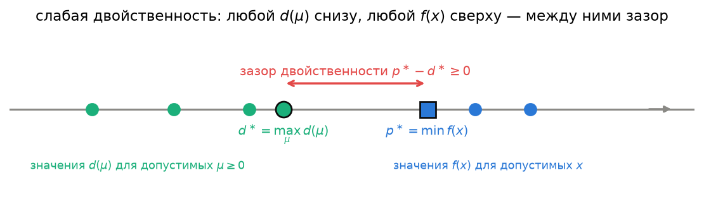
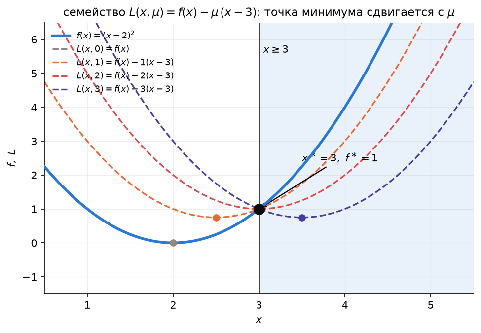
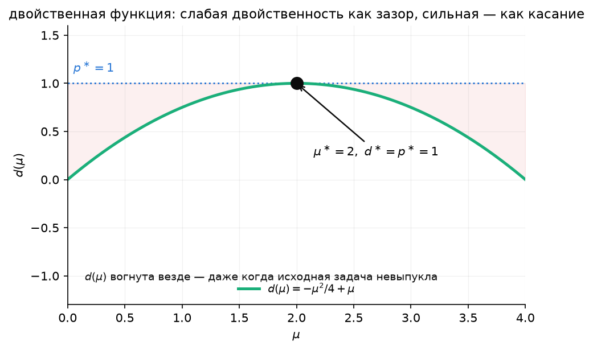
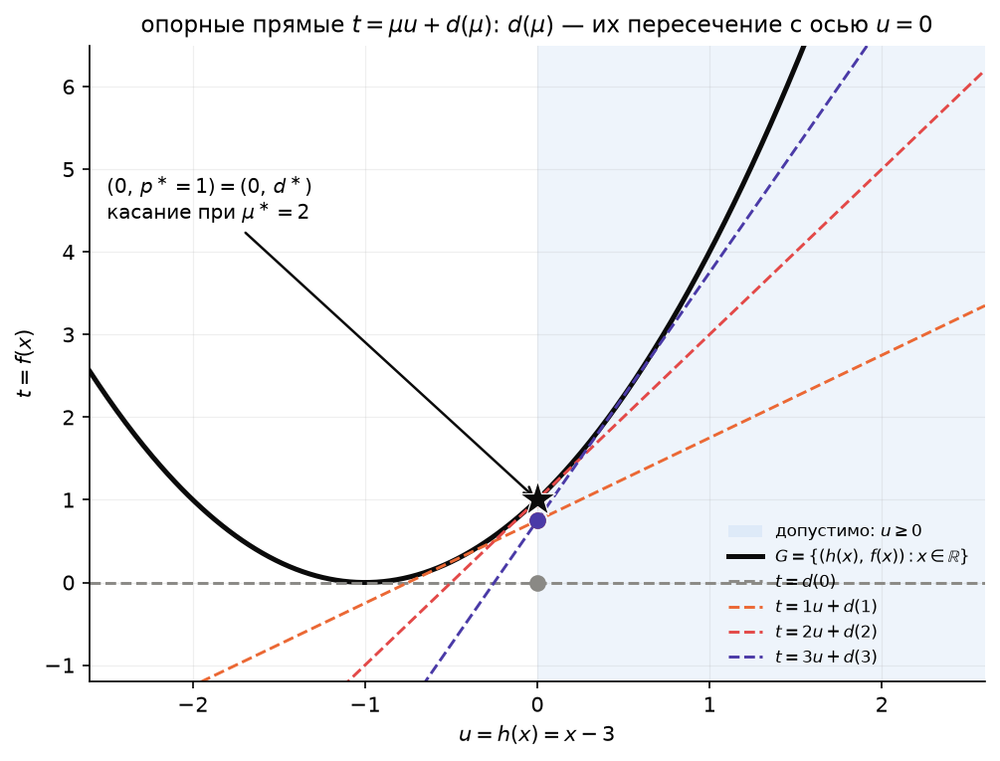
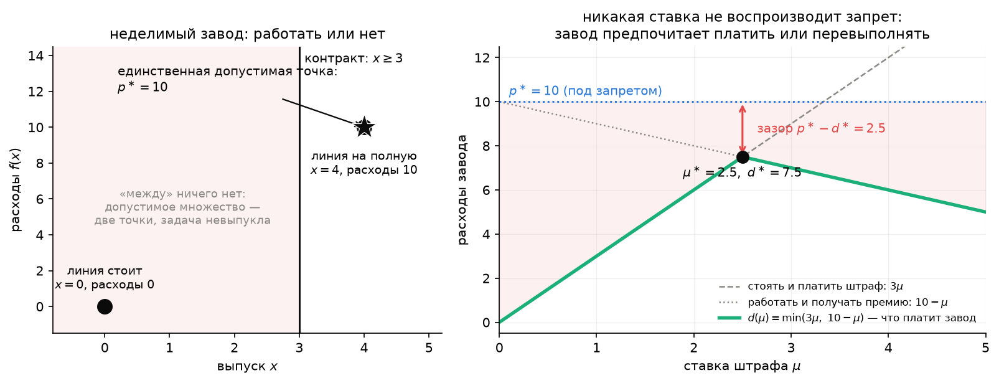

# Заготовка: двойственность Лагранжа

*Материал, первоначально написанный для лекции 3 (сентябрь 2026) и отложенный: двойственность решено давать позже — в части IV (лекции 10–11, ККТ и LP/QP), когда у студентов уже будет опыт с множителями как силами и ценами (лекция 3) и с методами для равенств (лекции 8–9). Текст самодостаточен; ссылки «раздел N» относятся к нумерации этого файла. Сквозная история — «цена вместо запрета» (завод и контракт). Картинки строятся `make_figures_duality.py`, демо — `build_demo_duality.py` → `demo_duality.ipynb`, ответы к упражнениям — `exercises_duality.md`.*

Опирается на главу 4 лекционных заметок М. Диля (*Lecture Notes on Numerical Optimization*, 2017) и главу 5 книги Boyd & Vandenberghe.

---

## 2. Функция Лагранжа

**История, которая пройдёт через всю лекцию.** Завод выпускает $x$ единиц продукции; себестоимость — $(x-2)^2$: дешевле всего делать две единицы, любое отклонение стоит денег. Но есть контракт с заказчиком: **не меньше трёх**. Задача завода —

$$
\min_x (x-2)^2 \quad\text{при}\quad x\ge 3,
$$

и ответ виден без вычислений: делать ровно $3$, себестоимость $p^\ast = 1$. Больше — дороже, меньше — запрещено.

Теперь заказчик меняет правила. **Вместо запрета — цена.** За каждую недопоставленную единицу завод платит штраф $\mu$ рублей, за каждую единицу сверх трёх получает премию $\mu$ рублей. Никаких запретов больше нет, завод свободен и минимизирует

$$
\underbrace{(x-2)^2}_{\text{себестоимость}} + \underbrace{\mu\,(3-x)}_{\text{штраф или премия}} .
$$

Это и есть функция Лагранжа. Обозначив ограничение как $h(x) = x-3 \ge 0$, получаем $(x-2)^2 - \mu\,h(x)$: **себестоимость минус ограничение, умноженное на его цену**. Общее определение — просто то же самое для любого числа ограничений.

**Определение.** Для задачи в стандартной форме лекции 1, $\min_x f(x)$ при $g(x)=0$, $h(x)\ge0$, функция Лагранжа

$$
L(x, \lambda, \mu) \;=\; f(x) - \lambda^\top g(x) - \mu^\top h(x),
$$

где $\mu \in \mathbb{R}^m_{\ge 0}$ — цены неравенств (**обязательно** $\mu \ge 0$), $\lambda \in \mathbb{R}^p$ — цены равенств (знак любой). Читать так: $f$ — «себестоимость», каждое ограничение получает свою цену, и вместо задачи с запретами мы смотрим на свободную задачу «себестоимость плюс штрафы».

Почему $\mu \ge 0$ — не формальность. В нашем соглашении $h(x) \ge 0$ означает «условие выполнено», $h(x) < 0$ — нарушение. При $\mu\ge0$ слагаемое $-\mu h(x)$ **наказывает** нарушение (оно положительно при $h<0$) и **поощряет** запас (отрицательно при $h>0$). Отрицательная цена делала бы наоборот — платила бы заводу за нарушение контракта, и никакой связи с исходной задачей не осталось бы. У равенства $g(x)=0$ нарушение в любую сторону одинаково плохо, поэтому у $\lambda$ знак свободен: это «цена отклонения», а в какую сторону — решает знак самого $\lambda$.

Запомните одно неравенство: при $\mu \ge 0$ и **допустимом** $x$ (все $h_i(x)\ge0$, $g(x)=0$) штрафы неположительны, значит

$$
L(x,\lambda,\mu) \;\le\; f(x) \qquad\text{на допустимых } x .
$$

Завод, который выполняет контракт, штрафов не платит, а премию может и получить. Это неравенство — сердце всего, что будет дальше сегодня.

Как это соотносится с записью Бойда ($f_i(x) \le 0$)?

Boyd & Vandenberghe пишут неравенства как $f_i(x) \le 0$ с множителями $\lambda_i \ge 0$ и $L = f_0 + \sum_i \lambda_i f_i + \nu^\top h$. Поскольку наше $h(x) = -f_i(x)$ (лекция 2, замечание о соглашениях), $L_{\text{Boyd}} = f - \lambda^\top(-h) + \nu^\top g = f - \lambda^\top h + \nu^\top g$ — то же самое с точностью до переименования $\lambda \leftrightarrow \mu$, $\nu \leftrightarrow -\lambda$. При чтении Boyd или документации солверов держите это в голове.

**Пример с пятью ценами (планирование производства, лекция 1, §7.2).** $\min(-3x_1 - 5x_2)$ при $h(x) = (4 - x_1,\ 12 - 2x_2,\ 18 - 3x_1 - 2x_2,\ x_1,\ x_2) \ge 0$ — пять неравенств, значит пять цен $\mu = (\mu_1,\dots,\mu_5) \ge 0$:

$$
L(x,\mu) = -3x_1 - 5x_2 - \mu_1(4 - x_1) - \mu_2(12 - 2x_2) - \mu_3(18 - 3x_1 - 2x_2) - \mu_4 x_1 - \mu_5 x_2 .
$$

Здесь $\mu_1$ — цена часа первого цеха, $\mu_2$ — второго, $\mu_3$ — третьего. Мы вернёмся к этому примеру в разделе 8, и все пять цен будут посчитаны — а раздел 5 покажет, что три из них видны прямо на картинке многоугольника.

## 3. Двойственная функция и слабая двойственность

**Определение.** Двойственная функция

$$
d(\lambda, \mu) \;=\; \inf_{x} L(x, \lambda, \mu) .
$$

По-заводски: $d(\mu)$ — **сколько заплатит завод при ценах $\mu$, если он свободен и ведёт себя оптимально**. Инфимум берётся по **всем** $x$, даже недопустимым, — именно потому, что запретов больше нет: завод может недопоставить и заплатить штраф, если так дешевле. Это же делает $d$ вычислимой: свободная минимизация часто берётся в явном виде, даже когда исходная задача с ограничениями была неудобной.

**Теорема (слабая двойственность).** Для любых $\lambda$ и $\mu \ge 0$

$$
d(\lambda, \mu) \;\le\; p^\ast ,
$$

где $p^\ast = \min\{f(x) : g(x)=0,\ h(x)\ge 0\}$ — оптимальное значение исходной («примальной») задачи. **Это верно всегда — выпуклая задача или нет.**

*Почему это очевидно.* **Свобода не дороже принуждения.** Завод, которому вместо запрета назначили цену, всегда может поступить так же, как поступал под запретом: выпустить $x^\ast$. Контракт при этом выполнен, штрафов нет (премия разве что), расходы — не больше $p^\ast$. А раз завод выбирает лучшее из возможного, он заплатит не больше этого: $d(\mu) \le p^\ast$. Ни выпуклость, ни гладкость не использованы.

*Доказательство (то же самое формулами).* Пусть $\bar x$ — любая допустимая точка ($g(\bar x)=0$, $h(\bar x)\ge 0$) и $\mu \ge 0$. Тогда

$$
L(\bar x, \lambda, \mu) = f(\bar x) - \lambda^\top \underbrace{g(\bar x)}_{=\,0} - \mu^\top \underbrace{h(\bar x)}_{\ge\, 0} \;\le\; f(\bar x)
$$

— неравенство раздела 2. А $d(\lambda,\mu) = \inf_x L(x,\lambda,\mu) \le L(\bar x,\lambda,\mu)$, потому что инфимум не больше значения в одной конкретной точке. Значит $d(\lambda,\mu) \le f(\bar x)$ для **любой** допустимой $\bar x$, в частности для оптимальной: $d(\lambda,\mu) \le p^\ast$. $\blacksquare$

**Две стороны одной сделки.** Завод ищет, как заплатить меньше, — любая допустимая точка $\bar x$ даёт число $f(\bar x)$ *сверху* от $p^\ast$. Заказчик ищет цены, при которых завод заплатит больше, — любые $\mu\ge0$ дают число $d(\mu)$ *снизу* от $p^\ast$. Настоящий ответ зажат между ними. И если два числа **совпали**, $f(\bar x) = d(\mu)$, то дальше искать нечего: $\bar x$ — точное решение, и это доказано без всякого перебора. Это и есть обещанный в лекции 2 **сертификат оптимальности**: предъявите $\bar x$ и $\mu$, и любой проверит ответ, не решая задачу заново.

## 4. Пример на пальцах: одномерная задача

Досчитаем историю раздела 2 до конца. Задача $\min (x-2)^2$ при $x\ge3$, ответ $x^\ast=3$, $p^\ast=1$. Функция Лагранжа с одной ценой $\mu\ge0$ ($h(x)=x-3$):

$$
L(x,\mu) = (x-2)^2 - \mu(x-3).
$$

**Что делает завод при ставке $\mu$.** При фиксированном $\mu$ это по-прежнему парабола по $x$, только с другой вершиной; минимум — школьной производной: $\dfrac{\partial L}{\partial x} = 2(x-2) - \mu = 0 \Rightarrow x(\mu) = 2 + \dfrac{\mu}{2}$. Чем выше цена, тем ближе к контрактным трём единицам подъезжает завод. Подставляем обратно и получаем, сколько он платит:

$$
d(\mu) = \Big(\frac{\mu}{2}\Big)^2 - \mu\Big(\frac{\mu}{2} - 1\Big) = -\frac{\mu^2}{4} + \mu .
$$

На картинке: с ростом ставки вершина параболы $L(x,\mu)$ едет вправо, и при $\mu=2$ встаёт ровно на стенку $x=3$. Три ставки числами:

| Ставка $\mu$ | Что делает завод | Расходы $d(\mu)$ |
|---|---|---|
| $1$ (мало) | выпускает $2.5$ — дешевле недопоставить и заплатить штраф $0.5$ | $0.25 + 0.5 = 0.75$ |
| $2$ (в самый раз) | выпускает ровно $3$ — отклоняться в любую сторону невыгодно | $1 = p^\ast$ |
| $3$ (много) | выпускает $3.5$ — ради премии $1.5$ за перевыполнение | $2.25 - 1.5 = 0.75$ |

Все три $\le p^\ast = 1$, как и обещала теорема раздела 3 (а также $d(0)=0$: без штрафа завод делает две единицы и платит $0$). При $\mu=2$ — **равенство**: правильно назначенная цена **заменяет** запрет, завод добровольно делает то, что требовал контракт, и платит ровно $p^\ast$. Это и называется сильной двойственностью; когда она есть, а когда нет — разделы 6–7.

**Почему $d(\mu)$ горбом.** Слишком низкая ставка — заводу выгодно недопоставлять; слишком высокая — перевыполнять ради премии. И то и другое уводит расходы *ниже* $p^\ast$; максимум ровно там, где ни то ни другое не выгодно. Формально: $d(\mu)$ — вогнутая функция от $\mu$ (парабола вниз), и это общий факт, не зависящий от выпуклости исходной задачи: $\inf_x$ семейства функций, линейных по $(\lambda,\mu)$, всегда вогнут (ср. лекцию 2, раздел 5: максимум выпуклых выпукл — здесь то же с обратным знаком). Значит, **искать лучшую цену — всегда задача выпуклой оптимизации**, даже если исходная задача была невыпуклой. Здесь: $d'(\mu) = -\mu/2 + 1 = 0 \Rightarrow \mu^\ast = 2$, $d^\ast = 1$.

Заметьте, чему равна лучшая цена: $\mu^\ast = 2 = f'(3)$ — на столько дорожает единица продукции на границе контракта. Сдвиньте требование с $3$ на $3.01$ — себестоимость вырастет примерно на $2\cdot0.01$. Правильная цена ограничения — это **цена его ослабления** (раздел 10 сделает это точным).

## 5. Геометрическая интерпретация: плоскость $(h, f)$ и опорная прямая

Второй взгляд — для тех, кому интересно, почему слабая двойственность верна для *любой* задачи, а сильная — только для выпуклых. При первом чтении его можно пропустить.

**Шаг 1: множество $G$.** Для *каждого* $x$ (всех, не только допустимых) поставим точку с координатами $(u, t) = (h(x), f(x))$ — «насколько выполнено ограничение» по горизонтали, «чему равна цель» по вертикали. В одномерном примере $u = x-3$, $t = (x-2)^2 = (u+1)^2$:

| $x$ | $1$ | $2$ | $3$ | $4$ |
|---|---|---|---|---|
| $(u,t)$ | $(-2,\,1)$ | $(-1,\,0)$ | $(0,\,1)$ | $(1,\,4)$ |

Когда $x$ пробегает все числа, точки образуют параболу — это и есть

$$
G = \{(u,t) : u = h(x),\ t = f(x),\ x \in \mathbb{R}^n\} \subset \mathbb{R}^{m+1}
$$

(для простоты — только неравенства).

**Шаг 2: где $p^\ast$.** Допустимые точки — те, что в правой полуплоскости $u\ge0$. $p^\ast$ — самая **низкая** из них; для параболы это $(0,1)$.

**Шаг 3: линейка под кривой.** Функция Лагранжа $L = f - \mu h = t - \mu u$. Множество $\{t - \mu u = c\}$ — прямая $t = \mu u + c$ с наклоном $\mu$, пересекающая вертикальную ось на высоте $c$. Минимизировать $L$ по $x$ — значит найти наименьшее $c$, при котором прямая ещё касается $G$: положите линейку под наклоном $\mu$ **ниже** всей параболы и поднимайте, пока она не упрётся. Высота, на которой линейка пересекает ось $u=0$, — это $d(\mu)$ (**опорная прямая**). Проверка: при $\mu=0$ горизонтальная линейка упирается в дно $(-1,0)$ — $d(0)=0$; при $\mu=2$ касание в $(0,1)$ — $d(2)=1$; при $\mu=3$ касание в $u=0.5$, на оси $0.75$ — $d(3)=0.75$. Те же числа, что в таблице раздела 4.

**Шаг 4: слабая двойственность.** Линейка лежит под всем $G$, и при $\mu\ge0$ она вправо не опускается. Значит, любая допустимая точка (справа от оси) выше линейки, а линейка справа — не ниже своей высоты на оси. Каждая допустимая точка выше $d(\mu)$, в том числе самая низкая: $p^\ast \ge d(\mu)$. (Здесь и видно, зачем $\mu\ge0$: с отрицательным наклоном линейка справа уходит вниз, и рассуждение ломается.)

**Шаг 5: сильная двойственность.** Крутим линейку, чтобы точка на оси поднялась как можно выше. Если $G$ без вмятин (выпуклая задача), в какой-то момент линейка коснётся $G$ ровно в $(0,p^\ast)$ — у нас при $\mu=2$. Дальше поднять нельзя: прямая пересечёт параболу и перестанет быть опорной.

**Шаг 6: когда не получается.** Если у $G$ около оси **вмятина** — точка $(0,p^\ast)$ на дне ямки, а по бокам $G$ ниже, — прямая линейка в ямку не пролезает: упрётся в края и пройдёт *под* дном. При любом наклоне высота на оси меньше $p^\ast$. Это и есть зазор (раздел 6).

> **Слабая двойственность — это то, что опорная прямая идёт не выше $G$.** **Сильная двойственность** ($d^\ast=p^\ast$) — это то, что нашлась опорная прямая, касающаяся $G$ *ровно в допустимой точке минимума*.

## 6. Двойственная задача и зазор двойственности

**Определение (двойственная задача).** Заказчик ищет лучшую цену:

$$
d^\ast = \max_{\lambda,\ \mu \ge 0} d(\lambda,\mu).
$$

Это **всегда задача выпуклой оптимизации** (раздел 4: $d$ вогнута, множество $\mu\ge 0$ выпукло), даже когда исходная («примальная») задача невыпукла. Разность

$$
p^\ast - d^\ast \;\ge\; 0
$$

называется **зазором двойственности** (duality gap): насколько даже лучшая цена не дотягивает до запрета. Слабая двойственность (раздел 3) гарантирует, что зазор неотрицателен, но не гарантирует, что он равен нулю.

**Пример: неделимый завод.** Пусть линию нельзя нагрузить частично: она либо стоит ($x=0$, расходы $0$), либо работает на полную ($x=4$, расходы $10$). Ничего между — допустимое множество из двух точек, задача невыпукла. Контракт «не меньше 3» заставляет включить линию: $p^\ast = 10$.

Теперь цена вместо запрета. При ставке $\mu$ завод выбирает из двух вариантов: стоять и платить штраф $3\mu$ за три недопоставленные единицы — или работать за $10$ и получить премию $\mu$ за одну лишнюю. Он берёт меньшее:

$$
d(\mu) = \min(3\mu,\ 10 - \mu).
$$

Лучшая ставка для заказчика — где две ветки равны: $\mu^\ast = 2.5$, $d^\ast = 7.5$. А $p^\ast = 10$: **зазор $2.5$**. Никакая ставка не воспроизводит запрет — при любой цене заводу выгоднее либо стоять и платить, либо работать; «ровно три» он сделать не может, а посередине ничего нет.

Мораль: **цена умеет указывать только на точки, до которых можно «доехать плавно»**. Невыпуклость — это неделимость, и с ней цены не справляются. По этой же причине трудны целочисленные задачи: их непрерывная релаксация (та самая, что даёт двойственную оценку) может стоять далеко от настоящего ответа. Геометрически (раздел 5) это вмятина у $G$: опорная прямая не пролезает в ямку и остаётся под дном. Проверка числами — demo_duality, часть (d).

**Бывает и хуже: бесконечный зазор.** Возьмём функцию $-x_1x_2$ — ту самую невыпуклую функцию из «прямоугольника в круге» (ДЗ 2, задача 1) — на многоугольном множестве:

$$
\min_x -x_1x_2 \quad\text{при}\quad x_1+x_2\le 1,\ x_1\ge 0,\ x_2\ge 0 .
$$

По неравенству о средних, при фиксированной сумме $x_1+x_2=s$ произведение $x_1x_2$ максимально при $x_1=x_2=s/2$ и растёт с $s$; лучший вариант — $s=1$. Значит, $p^\ast = -1/4$ при $x^\ast=(0.5,0.5)$ (проверено численно в demo_duality.ipynb). А цена вместо запрета здесь не работает вовсе: Лагранжиан $L(x,\mu) = -x_1x_2 - \mu_1(1-x_1-x_2) - \mu_2 x_1 - \mu_3 x_2$ — квадратичная форма от $x$ с матрицей $\begin{pmatrix} 0 & -1/2 \\ -1/2 & 0\end{pmatrix}\!\cdot 2$, собственные числа $\pm 1$, **индефинитная** при любых $\mu$. Линейные штрафы не могут удержать функцию, которая уходит вниз квадратично: по диагонали $x_1=x_2=t\to\infty$ имеем $L\to-\infty$ (demo_duality, часть d). Отсюда $d(\mu)\equiv -\infty$, $d^\ast=-\infty$, зазор бесконечен — двойственная функция не говорит о решении ничего.

Мораль та же, только резче: невыпуклость цели, не «выключенная» ограничениями, делает *релаксацию* Лагранжа бесполезной — свободная минимизация по всем $x\in\mathbb{R}^n$ теряет всю информацию, которую давали ограничения. (В ДЗ 2 та же функция $-x_1x_2$ на **круге** $x_1^2+x_2^2=1$ вела себя иначе и вовсе не давала зазора — раздел 14.5; это не противоречие: единственное квадратичное равенство — особый, «почти выпуклый» случай.)

## 7. Условие Слейтера и сильная двойственность

Итак, когда правильная цена **существует**? Раздел 5.1 дал половину ответа: если задача выпукла и в $x^\ast$ есть баланс сил $\nabla f = \sum\mu_i\nabla h_i$ с $\mu\ge0$, то зазора нет. Остаётся гарантировать сам баланс — что стенки не зажимают точку так, что сила реакции обязана быть бесконечной. Для этого внутри области должен быть **запас**.

**Условие Слейтера.** Существует **строго допустимая** точка $\tilde x$: $g(\tilde x)=0$ и $h_i(\tilde x) > 0$ для всех $i$, у которых $h_i$ **нелинейна**. (Если $h_i$ аффинно — $h_i(x) = a_i^\top x - b_i$, — для него достаточно обычной допустимости $h_i(\tilde x)\ge 0$, строгость не нужна: плоские стенки и так «ведут себя хорошо».)

**Теорема (сильная двойственность).** Если задача **выпукла** ($f$ выпукла, $g$ аффинно, $h_i$ вогнуты — чек-лист лекции 2, раздел 6) и выполнено условие Слейтера, то

$$
d^\ast = p^\ast
$$

(зазора нет), и максимум в двойственной задаче достигается — существует пара $(\lambda^\ast,\mu^\ast)$ с $d(\lambda^\ast,\mu^\ast)=p^\ast$.

Половину доказательства вы уже видели: набросок раздела о силах лекции 3 показывает, что из баланса сил следует $d(\mu^\ast)=p^\ast$. Вторая половина — существование $\mu^\ast$ — требует теоремы отделимости выпуклых множеств (Diehl, гл. 4; Boyd & Vandenberghe, §5.3.2) и в курсе не разбирается; геометрически (раздел 5) строго внутренняя точка не даёт множеству $G$ «прижаться» к оси $u=0$ настолько, чтобы опорная прямая не смогла его нащупать.

**Следствие (комплементарная нежёсткость).** Если $x^\ast$ решает примальную, а $(\lambda^\ast,\mu^\ast)$ — двойственную задачу и $d^\ast=p^\ast$, то в цепочке неравенств доказательства раздела 3 **всюду равенство**, в частности

$$
\mu_i^\ast\, h_i(x^\ast) = 0 \quad\text{для каждого } i .
$$

То есть **для каждого ограничения хотя бы одно из двух — цена или запас — равно нулю**. По-заводски: за ограничение, которое не жмёт, платить не нужно. По-физически: стенка, которой точка не касается, не давит (лекция 3, раздел о силах). На картинке: круг из задачи В раздела 1 и нули в `marginals` у сторон, которых он не касается. Активное ограничение может иметь ненулевой множитель, неактивное — обязано иметь нулевой; сегодня мы будем проверять это на числах в разделах 8–9.

**Связь с условием оптимальности лекции 2.** Соберём вместе то, что появилось в разделе о силах лекции 3. Для выпуклой задачи с ограничениями $h\ge0$ два утверждения эквивалентны:

- геометрическое (лекция 2, раздел 7): $\nabla f(x^\ast)^\top(y-x^\ast)\ge0$ для всех допустимых $y$ — ни одно допустимое направление не ведёт вниз;
- в терминах множителей: существуют $\mu^\ast\ge0$ с $\nabla f(x^\ast) = \sum_i \mu_i^\ast\nabla h_i(x^\ast)$ и $\mu_i^\ast h_i(x^\ast)=0$ — тяга уравновешена реакцией активных стенок.

Первое удобно проверять, когда $\Omega$ простое и допустимые направления видны глазами (проекции на шар и параллелепипед в лекции 2). Второе работает для любых $h$ — нужно лишь решить линейную систему на $\mu$ — и именно оно даёт числа: цены ресурсов, силы реакции, чувствительность к данным. Это половина условий ККТ; лекция 10 добавит равенства $g$, снимет требование выпуклости и покажет, как эту систему решают численно.

**Три наших примера удовлетворяют условиям теоремы.** LP из §7.2 лекции 1 — выпукла (всё аффинно), любая точка внутри многоугольника, например $(1,1)$, строго допустима — Слейтер выполнен автоматически, как и для *любой* задачи, у которой все ограничения линейны (раздел 14.4). Диета из ДЗ 1 — та же история. Ящик из демо к лекции 2 ($f$ — выпуклая QP с $Q\succ 0$, ограничения — линейные) — тоже. Поэтому для всех трёх ниже мы гарантированно найдём $d^\ast=p^\ast$ — и проверим это на числах.

## 8. Двойственность LP

**Купить завод.** Вернёмся к планированию производства: $\max\ 3x_1+5x_2$ при $x_1\le4$, $2x_2\le12$, $3x_1+2x_2\le18$, $x\ge0$; ответ $36$ в вершине $(2,6)$. Приходит покупатель и хочет **выкупить всё время трёх цехов**: $4$ часа первого, $12$ второго, $18$ третьего, по ценам $y_1, y_2, y_3$ за час. Владелец продаст час только если это не хуже, чем самому делать продукцию. Продукт 1 съедает час цеха 1 и три часа цеха 3 и приносит $3$ — значит, нужно $y_1 + 3y_3 \ge 3$; продукт 2 — два часа цеха 2 и два часа цеха 3 за $5$ — нужно $2y_2 + 2y_3 \ge 5$. Покупатель хочет заплатить как можно меньше: $\min\ 4y_1 + 12y_2 + 18y_3$.

- **Слабая двойственность:** любое предложение, которое владелец примет, стоит покупателю не меньше $36$ — иначе владелец просто работал бы сам. Проверьте: $y=(3,\ 2.5,\ 0)$ приемлемо ($3\ge3$, $5\ge5$) и стоит $12+30 = 42$.
- **Сильная двойственность:** есть предложение ровно за $36$: $y^\ast=(0,\ 1.5,\ 1)$ — приемлемо ($0+3\ge3$, $3+2\ge5$), стоит $0+18+18=36$. Час первого цеха оценён в **ноль**: цех и так наполовину простаивает ($x_1^\ast=2<4$), его время никому не нужно. Час второго стоит $1.5$, третьего — $1$. Это «настоящая стоимость» ресурсов — те самые коэффициенты разложения градиента прибыли по нормалям активных стенок из раздела о силах лекции 3.

Тот же вывод без экономики — **сложить ограничения с весами**. Хотим доказать, что прибыль не больше какого-то числа, не решая задачу. Из $x_1\le4$ следует $3x_1\le12$; из $2x_2\le12$ следует $5x_2\le30$; складываем: $3x_1+5x_2\le42$. Верно для любой допустимой точки, но грубо (веса $(3,\ 2.5,\ 0)$). Умнее: $1.5\cdot(2x_2\le12)$ плюс $1\cdot(3x_1+2x_2\le18)$ даёт ровно $3x_1+5x_2\le36$ — веса $(0,\ 1.5,\ 1)$, и оценка достигается в $(2,6)$. Двойственная LP — это задача «подобрать веса, при которых оценка минимальна»; двойственность утверждает, что минимальная оценка совпадает с настоящим максимумом.

**То же самое формулами.** Возьмём LP в форме «$\max$» (как у нас в примерах): $\max_x c^\top x$ при $Ax \le b$, $x \ge 0$. В нашей стандартной форме это $\min(-c^\top x)$ при $h(x) = (b-Ax,\ x) \ge 0$. Лагранжиан с множителями $y\ge 0$ на первые $m$ строк ($Ax\le b$) и $s\ge 0$ на $x\ge 0$:

$$
L(x,y,s) = -c^\top x - y^\top(b-Ax) - s^\top x = (A^\top y - c - s)^\top x - b^\top y .
$$

Это **линейно по $x\in\mathbb{R}^n$** (никакой квадратичной части — сравните с разделом 4, там была парабола). Инфимум линейной функции по всему пространству равен $-\infty$, если только коэффициент при $x$ не равен нулю: $d(y,s) = -b^\top y$, если $A^\top y - c - s = 0$, и $-\infty$ иначе. Условие $s\ge 0$ вместе с $A^\top y - c = s$ означает просто $A^\top y \ge c$. Убирая бесполезную $s$, получаем классическую пару:

| Примальная (max) | Двойственная (min) |
|---|---|
| $\max_x c^\top x$ | $\min_y b^\top y$ |
| $Ax \le b$ | $A^\top y \ge c$ |
| $x \ge 0$ | $y \ge 0$ |

Слейтер для LP выполнен всегда, когда допустимое множество непусто (раздел 14.4) — значит, **для любой разрешимой LP зазора нет**, безусловно. Числа $y_i^\ast$ называют **теневыми ценами** (shadow prices): $y_i^\ast$ — это то, насколько вырастет $p^\ast$, если ослабить $i$-е ограничение на единицу (раздел 10 покажет это явно).

**Пример 1: планирование производства.** Решаем `linprog`:

$$
x^\ast = (2,6), \quad p^\ast = 36, \quad y^\ast = (0,\ 1.5,\ 1).
$$

Комплементарная нежёсткость на числах: ограничение 1 ($x_1\le 4$) в оптимуме неактивно (запас $4-2=2>0$) — и его множитель $y_1^\ast=0$, как и обещано следствием раздела 7: за час простаивающего цеха не платят, стенка, которой не касаются, не давит. Ограничения 2 и 3 активны (касание в вершине) — их множители положительны, и $c = 1.5\,a_2 + 1\,a_3$ (раздел о силах лекции 3, панель (в)).

**Пример 2: диета (ДЗ 1).** Здесь примальная задача — минимизация, $\min c^\top x$ при $Ax\ge b$, $x\ge 0$; проделав то же рассуждение (или просто переобозначив $h = (Ax-b,\ x)\ge 0$), двойственная — $\max_y b^\top y$ при $A^\top y \le c$, $y\ge 0$. Для данных ДЗ 1 ($c=(2,3,1.5,4)$, три вещества, $b=(12,8,6)$):

$$
x^\ast = (2.4,\ 0,\ 0,\ 3.2), \quad p^\ast = 17.6, \quad y^\ast = (1.2,\ 0.4,\ 0).
$$

Экономический смысл двойственных переменных диеты — та же сделка, что «купить завод», только с другой стороны прилавка: представьте продавца синтетических таблеток, который предлагает вещество $i$ по цене $y_i$ за единицу. Чтобы конкурировать с настоящими продуктами, для каждого продукта $j$ должно быть $\sum_i A_{ij} y_i \le c_j$ (иначе покупатель предпочтёт продукт) — это ровно двойственное ограничение $A^\top y \le c$! Максимальная выручка такого продавца ($\max b^\top y$) равна минимальным расходам покупателя ($\min c^\top x$) — потому и нет зазора. Ограничение 3 (третье вещество) не активно (запас $0.4$) — его цена $y_3^\ast=0$: если продукт и так в избытке, за него не переплачивают.

## 9. Двойственность QP

Возьмём QP с линейными неравенствами: $\min_x \tfrac12 x^\top Q x + c^\top x$ при $Ax\le b$, $Q\succ 0$. Лагранжиан $L(x,\mu) = \tfrac12 x^\top Qx + c^\top x - \mu^\top(b-Ax) = \tfrac12 x^\top Qx + (c+A^\top\mu)^\top x - \mu^\top b$. В отличие от LP, здесь по $x$ — снова **квадратичная** функция с той же $Q\succ 0$ (не зависит от $\mu$!) — инфимум всегда конечен и берётся явно, как в разделе 4:

$$
x(\mu) = -Q^{-1}(c+A^\top\mu), \qquad d(\mu) = -\tfrac12(c+A^\top\mu)^\top Q^{-1}(c+A^\top\mu) - \mu^\top b .
$$

Двойственная задача $\max_{\mu\ge 0} d(\mu)$ — это **тоже QP** (максимизация вогнутой квадратичной функции с простым ограничением $\mu\ge 0$), обычно меньшей или структурно более простой размерности; на этом факте построены целые семейства методов (активных множеств, лекция 11).

**Пример: ящик из демо к лекции 2.** $Q=\begin{pmatrix}2 & 0.5\\0.5&1\end{pmatrix}$, $c=(-3,-1)$, ограничения $-1\le x_i\le 1$ (четыре неравенства $h=(1-x_1,\,1+x_1,\,1-x_2,\,1+x_2)\ge 0$). Решение уже известно (лекция 2, демо часть c): $x^\ast=(1,\,0.5)$, $f^\ast=-2.125$ — единственная активная грань $x_1=1$.

Максимизируя $d(\mu)$ по четырём $\mu\ge 0$ (демо03, часть b), получаем $\mu^\ast=(0.75,\,0,\,0,\,0)$ и $d^\ast=-2.125=f^\ast$ — сильная двойственность подтверждена численно. Число $0.75$ вы уже видели в разделе о силах лекции 3: это сила, с которой грань $x_1=1$ держит точку, $\nabla f(x^\ast) = 0.75\,\nabla h_1$. Два совершенно разных вычисления — максимизация $d(\mu)$ и баланс сил — дают одно и то же число, как и должно быть при сильной двойственности. Комплементарная нежёсткость видна мгновенно на столбчатой диаграмме: положителен только множитель активного ограничения $x_1\le 1$, у трёх неактивных — ровно ноль.

## 10. Что это даёт численно

**`scipy.optimize.linprog` уже решает двойственную задачу за вас.** Поле `res.ineqlin.marginals` — это в точности (со знаком минус для задачи на максимум, см. демо03) теневые цены $y^\ast$: не нужно составлять и решать двойственную LP отдельно, как мы делали выше «для проверки», — солвер отдаёт множители вместе с решением одним вызовом.

**Чувствительность — это наклон.** Если решить LP из §8 для разных значений $b_2$ (мощность второго цеха) и построить $f^\ast(b_2)$, получится кусочно-линейная функция, наклон которой на каждом участке — это в точности теневая цена соответствующего ограничения:

При $b_2=12$ наклон равен $y_2^\ast=1.5$ — ровно то число, что мы получили из двойственной задачи. За пределами текущего диапазона (при $b_2<6$ или $b_2>18$) в игру вступает другое ограничение, наклон меняется — множители $y^\ast$ верны **локально**, пока не сменился набор активных ограничений (подробно — лекция 14).

**Сертификат остаётся сертификатом и без сильной двойственности.** Даже если задача невыпукла и зазор не гарантированно нулевой, *любая* допустимая пара $(\lambda,\mu)$, $\mu\ge0$, даёт законную нижнюю границу $d(\lambda,\mu)\le p^\ast$ (раздел 3) — полезно, например, чтобы оценить, насколько найденное локальным методом решение может быть далеко от глобального оптимума, даже не находя его.

## 11. Итоги лекции

1. Функция Лагранжа $L=f-\lambda^\top g-\mu^\top h$ ($\mu\ge0$) — «себестоимость плюс штрафы по ценам $\lambda,\mu$»: цена вместо запрета превращает задачу с ограничениями в свободную. Двойственная функция $d(\lambda,\mu)=\inf_x L$ — сколько платит свободный завод; она всегда вогнута.
2. Слабая двойственность $d(\lambda,\mu)\le p^\ast$ — «свобода не дороже принуждения» — верна безусловно, для любой задачи, выпуклой или нет; отсюда прямой сертификат оптимальности: совпали число завода и число заказчика — ответ доказан.
3. Множитель — это сила стенки: в решении $\nabla f(x^\ast)=\sum_i\mu_i^\ast\nabla h_i(x^\ast)$, $\mu^\ast\ge0$ — тяга $-\nabla f$ уравновешена реакцией активных стенок, а стационарность Лагранжиана по $x$ и есть этот баланс. Это то же условие оптимальности, что в лекции 2, только записанное через множители. (Второй геометрический взгляд: $d(\mu)$ — высота опорной прямой наклона $\mu$ к множеству $G=\{(h(x),f(x))\}$ на оси $u=0$.)
4. Двойственная задача $d^\ast=\max_{\mu\ge0}d$ — поиск лучшей цены — всегда выпуклая; зазор $p^\ast-d^\ast\ge0$ появляется, когда «нельзя доехать плавно»: у невыпуклых задач он бывает положительным (неделимый завод) и даже бесконечным ($-x_1x_2$).
5. Выпуклость плюс условие Слейтера (внутри есть запас) $\Rightarrow$ сильная двойственность $d^\ast=p^\ast$: правильная цена заменяет запрет. Следствие — комплементарная нежёсткость $\mu_i^\ast h_i(x^\ast)=0$: за то, что не жмёт, не платят.
6. Для LP и QP двойственная задача выписывается явно (LP $\to$ LP, QP $\to$ QP), а множители — это теневые цены: коэффициенты разложения градиента цели по нормалям активных стенок и наклон $f^\ast$ по параметрам ограничений; `linprog` считает их бесплатно вместе с решением.

## 12. Что дальше

Этой лекцией заканчивается **часть I** курса (лекции 1–3: постановка задачи, выпуклость, двойственность) — три способа смотреть на любую задачу оптимизации ещё до того, как мы начали её *решать*. **Часть II** (лекции 4–7) — про то, как это делать: с лекции 4 начинается безусловная оптимизация (условия оптимальности без ограничений, градиентный спуск, скорость сходимости), а к лекции 7 мы дойдём до Ньютона и BFGS. Множители Лагранжа вернутся всерьёз в части III (лекции 8–9) — уже не только для неравенств, а полная система условий ККТ, объединяющая всё сказанное сегодня с условиями для равенств, — в лекции 10. Параметрическая чувствительность, которую мы увидели в разделе 10 на одном примере, станет отдельной темой лекции 14.

**Домашнее задание 3** выдаётся 7 октября (после лекции 5) — тема градиентный спуск, Ньютон, BFGS: реализация и сравнение (см. [программу курса](../../syllabus.md#4-домашние-задания)).

**Литература к лекции.** Diehl, глава 4 (Duality); Boyd & Vandenberghe, глава 5 (Duality); Поляк, гл. 1; Нестеров, гл. 3.

## 13. Практика на занятии

Вторая половина пары, около 40–45 минут (лекция сегодня длиннее обычного — часть I курса собирается воедино). Всё, что нужно, — ноутбук [`demo_duality.ipynb`](demo_duality.ipynb).

| Время | Что делаем |
|-------|-----------|
| 10 мин | `demo_duality.ipynb`, часть (a) вживую: одномерный пример раздела 4 — считаем $d(\mu)$ в коде, сверяем с формулой, рисуем семейство $L(x,\mu)$. |
| 10 мин | Часть (b): двойственность QP на ящике из лекции 2 — максимизируем $d(\mu)$ численно, сверяем $\mu^\ast$ и $d^\ast$ с уже известным $x^\ast$, комплементарная нежёсткость на числах; тот же $\mu^\ast$ из баланса сил $\nabla f(x^\ast)=\mu\nabla h(x^\ast)$. |
| 10 мин | Часть (c): LP планирования производства и диеты — `res.ineqlin.marginals` против ручного решения двойственной LP и против разложения $c$ по нормалям активных ограничений; упражнение 14.2 у доски. |
| 10–15 мин | Часть (d): два невыпуклых примера раздела 6 — неделимый завод (зазор $2.5$) и $-x_1x_2$ на треугольнике ($d\equiv-\infty$) — и «скрытая выпуклость» прямоугольника в круге из ДЗ 2 (упражнение 14.5): обсуждение, когда двойственности можно доверять. |

## 14. Упражнения

Для разбора на занятии и самостоятельно. Подробный разбор с проверкой кодом — ноутбук `build_demo_duality.py`, краткие ответы — [`exercises_duality.md`](exercises_duality.md).

**14.1.** Для задачи $\min_x x^2$ при $x\ge 2$ выпишите $L(x,\mu)$, найдите $d(\mu)$ в явном виде, вычислите $d(0), d(2), d(4)$ и убедитесь, что все они $\le p^\ast$. Найдите $\mu^\ast=\arg\max_\mu d(\mu)$ и проверьте $d^\ast=p^\ast$.

**14.2.** В LP планирования производства (раздел 8) увеличьте мощность третьего цеха с $18$ до $b_3$. Найдите (аналитически или перебором по `linprog`) значение $b_3$, при котором набор активных ограничений меняется, и новые теневые цены сразу после этой точки. Почему теневая цена ограничения 3 обязана обратиться в ноль ровно там, где оно перестаёт быть активным?

**14.3.** Возьмите QP $\min_x \tfrac12 x^\top Qx + c^\top x$ при $-1\le x\le 1$ с $Q=\begin{pmatrix}1&0.8\\0.8&2\end{pmatrix}$, $c=(1,-2)$. Решите численно (`minimize` с `bounds`), затем максимизируйте $d(\mu)$ по четырём $\mu\ge0$ и проверьте $d^\ast=f^\ast$ и комплементарную нежёсткость. Наконец, проверьте баланс сил из раздела о силах лекции 3: $\nabla f(x^\ast)=\sum_i\mu_i^\ast\nabla h_i(x^\ast)$ — какие нормали входят в сумму с ненулевым весом?

**14.4.** Объясните, почему условие Слейтера для задачи, где **все** ограничения ($g$ и $h$) аффинны, выполняется автоматически, как только допустимое множество непусто (подсказка: для аффинных $h_i$ строгость $h_i(\tilde x)>0$ не требуется вовсе — перечитайте формулировку условия в разделе 7). Какой важный факт про LP из этого следует?

**14.5.** Задача «прямоугольник в круге» из ДЗ 2 (задача 1г): $\min_x -4x_1x_2$ при $x_1^2+x_2^2=1$, $x_1,x_2\ge0$. Покажите, что $L(x,\lambda)$ при $x_2,x_3\ge0$ неактивных сводится к квадратичной форме с матрицей $\begin{pmatrix}\lambda&-2\\-2&\lambda\end{pmatrix}$, найдите, при каких $\lambda$ эта форма $\succeq 0$, и вычислите $d(\lambda)$ и $d^\ast$ явно. Сравните с $p^\ast=-2$ и с примером раздела 6 — почему там зазор бесконечен, а здесь его нет вовсе, хотя обе задачи невыпуклы?

**Домашнее задание 3** — по градиентным методам, выдаётся 7 октября.

## Вопросы для самопроверки

1. Почему при $\mu\ge0$ и допустимом $x$ выполняется $L(x,\lambda,\mu)\le f(x)$? Где в доказательстве слабой двойственности использован именно этот факт?
2. Почему двойственная функция $d(\lambda,\mu)$ вогнута всегда — даже когда исходная задача невыпукла?
3. Сформулируйте условие Слейтера. Почему для задач с чисто линейными ограничениями оно выполняется автоматически при непустом допустимом множестве?
4. Что такое комплементарная нежёсткость и как она связана с сильной двойственностью? Как её проверить на числах для LP или QP? Как она выглядит на языке сил (лекция 3, раздел о силах)?
5. Как теневая цена $y_i^\ast$ связана с наклоном функции $f^\ast(b_i)$?
