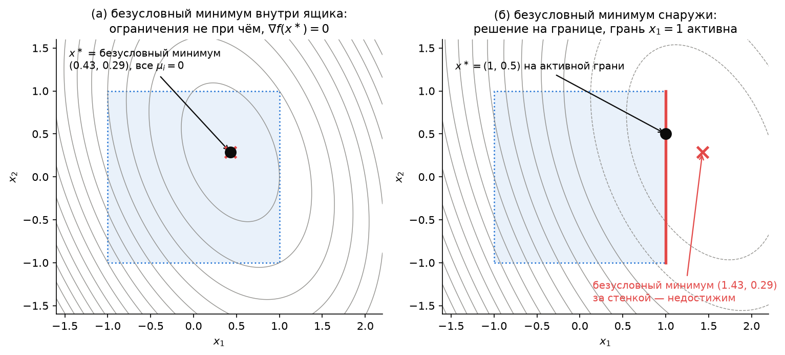
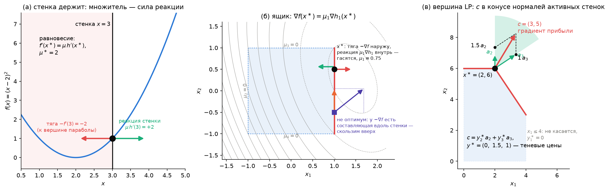
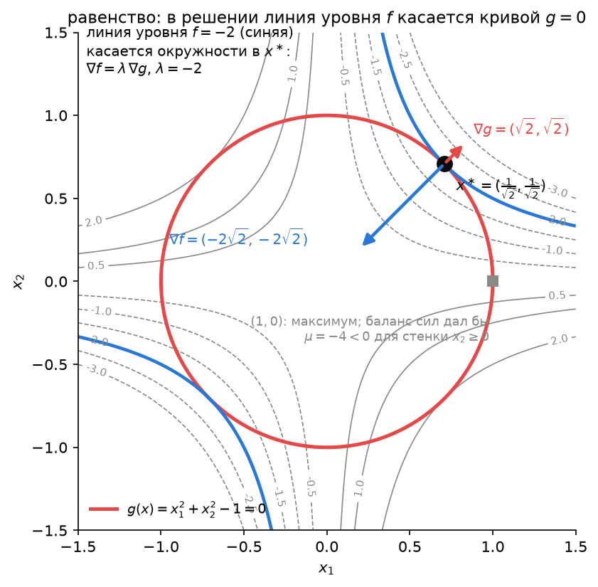

# Лекция 3. Как учитывать ограничения: геометрия оптимума и множители Лагранжа

*Вычислительная оптимизация, магистратура, 1 курс. 23 сентября 2026.*

**План лекции**

1. Повторение: самое важное из лекций 1–2 и три задачки
2. Где живёт минимум
3. Одна стенка: антиградиент смотрит наружу
4. Несколько стенок: конус нормалей
5. Равенства: касание
6. Функция Лагранжа — бухгалтерия сил
7. Множитель — цена ограничения
8. Что это даёт численно
9. Итоги лекции
10. Что дальше
11. Практика на занятии
12. Упражнения

Конспект опирается на главы 2–3 лекционных заметок М. Диля (*Lecture Notes on Numerical Optimization*, 2017), §4.2 и §5.5.3 книги Boyd & Vandenberghe и §12.1 Nocedal & Wright. Код демонстраций — ноутбук [`demo03.ipynb`](demo03.ipynb). Картинки конспекта строятся скриптом [`make_figures.py`](make_figures.py).

---

## 1. Повторение: самое важное из лекций 1–2 и три задачки

Сегодня закрывается **часть I** курса — то, что нужно знать о задаче *до* того, как её решать. Начнём с пяти вопросов, на которые вы уже умеете отвечать, а потом проверим это на трёх задачах, которых в курсе ещё не было.

### 1.1. Пять вопросов, без которых сегодня не обойтись

| Вопрос | Ответ | Где |
|---|---|---|
| Как записана любая задача? | $\min f(x)$ при $g(x)=0$, $h(x)\ge0$. В решении часть неравенств **активна** ($h_i(x^\ast)=0$), остальные — нет | Л1, §3–4 |
| Есть ли решение вообще? | Да, если $\Omega$ компактно (Вейерштрасс) или $f$ коэрцитивна. Выпуклость этого **не** даёт: $\min e^x$ | Л1, §5; Л2, §6 |
| Что такое класс задачи и почему это важно? | LP $\subset$ QP $\subset$ QCQP $\subset$ NLP; главный водораздел — выпуклость. Негладкие $\lvert\cdot\rvert$ и $\max$ превращаются в линейные неравенства вспомогательными переменными | Л1, §6, §8 |
| Когда задача выпукла и что это даёт? | $f$ выпукла, равенства аффинны, $h_i$ вогнуты $\Rightarrow$ любой локальный минимум глобален; при строгой выпуклости решение единственно, множество решений всегда выпукло | Л2, §6 |
| Как проверить, что точка — решение? | $\nabla f(x^\ast)^\top(y-x^\ast)\ge0$ для всех $y\in\Omega$; без ограничений — $\nabla f(x^\ast)=0$ | Л2, §7 |

Если какая-то строка вызывает сомнение — перечитайте указанный раздел до домашнего задания 2: там всё это понадобится.

### 1.2. Три задачки

Каждая задача коротка, решается тем, что в таблице, и оставляет крючок к сегодняшней теме. Численная проверка всех трёх — в [`demo03.ipynb`](demo03.ipynb), часть (0).

**Задача А. Три «середины».** Есть пять чисел $a = (1, 2, 3, 4, 20)$. Какая точка $x$ минимизирует

$$
\text{(i)}\ \sum_i (x - a_i)^2, \qquad \text{(ii)}\ \sum_i \lvert x - a_i\rvert, \qquad \text{(iii)}\ \max_i \lvert x - a_i\rvert\ ?
$$

Три ответа — три разные «середины» одних и тех же данных: **среднее** $6$, **медиана** $3$ и **середина размаха** $10.5$. Выброс $20$ утаскивает среднее и особенно минимакс, а медиане он безразличен — поэтому в задачах с выбросами подгоняют в норме $\ell_1$ (лекция 1, §8, и бонус ДЗ 1).

Как это получено. Задача (i) — выпуклая квадратичная без ограничений: $f'(x) = 2\sum_i(x - a_i) = 0$ даёт среднее (строка 5 таблицы). Задачи (ii) и (iii) негладкие, критерий $\nabla f = 0$ неприменим, но вспомогательные переменные $s_i \ge \pm(x - a_i)$ превращают обе в **LP** (строка 3): $\min \sum_i s_i$ и $\min s$ соответственно, при $-s_i \le x - a_i \le s_i$. `linprog` выдаёт ровно $3$ и $10.5$. Все три задачи выпуклы, поэтому найденное — глобальный минимум (строка 4). Замечание про единственность: при *чётном* числе точек у задачи (ii) решений целый отрезок между двумя средними точками — множество решений выпуклой задачи выпукло, но не обязано быть точкой.

**Задача Б. Спасатель на пляже.** Спасатель стоит в $30$ м от кромки воды; тонущий — в $40$ м вдоль берега и $20$ м от кромки в воде. Бежит спасатель со скоростью $5$ м/с, плывёт — $1.5$ м/с. В какой точке берега входить в воду?

Пусть $x$ — координата точки входа вдоль берега. Время

$$
T(x) = \frac{\sqrt{30^2 + x^2}}{5} + \frac{\sqrt{20^2 + (40 - x)^2}}{1.5} .
$$

Оба слагаемых — норма от аффинной функции, делённая на положительное число, значит $T$ выпукла (лекция 2, §5), и даже строго; $T(x)\to\infty$ при $\lvert x\rvert\to\infty$ — коэрцитивна. Итого решение **существует и единственно** (строки 2 и 4), и находится из $T'(x^\ast) = 0$ (строка 5):

$$
\frac{x^\ast}{5\sqrt{30^2 + x^{\ast2}}} = \frac{40 - x^\ast}{1.5\sqrt{20^2 + (40 - x^\ast)^2}}
\quad\Longleftrightarrow\quad
\frac{\sin\theta_1}{v_1} = \frac{\sin\theta_2}{v_2},
$$

где $\theta_{1,2}$ — углы траектории к нормали берега. Это **закон Снеллиуса**: свет преломляется ровно так, как бежал бы спасатель, потому что он тоже минимизирует время (принцип Ферма). Уравнение четвёртой степени по $x$ — формулы для корня нет, `minimize_scalar` даёт $x^\ast \approx 35.3$ м и $T^\ast \approx 22.96$ с. Для сравнения: по прямой — $24.76$ с, «добежать до траверза и плыть перпендикулярно» — $23.33$ с. Обратите внимание на разделение труда, которое сохранится на весь курс: *ответ* — число от солвера, *формула* — условие оптимальности.

**Задача В. Самый большой круг в многоугольнике.** Многоугольник задан пятью неравенствами $a_i^\top x \le b_i$:

$$
x_1 \ge 0,\quad x_2 \ge 0,\quad x_1 + 2x_2 \le 8,\quad 3x_1 + x_2 \le 12,\quad x_1 - x_2 \le 3 .
$$

Найти центр $c$ и радиус $r$ наибольшего круга, целиком лежащего внутри (это **центр Чебышёва** многоугольника — самая «глубокая» его точка).

Выглядит как нелинейная задача — круг всё-таки. Но круг радиуса $r$ с центром $c$ лежит в полуплоскости $a_i^\top x \le b_i$ тогда и только тогда, когда его самая далёкая в направлении $a_i$ точка $c + r\,a_i/\lVert a_i\rVert$ лежит в ней: $a_i^\top c + r\lVert a_i\rVert \le b_i$. Числа $\lVert a_i\rVert$ известны заранее, поэтому по переменным $(c, r)$ это **линейное** неравенство, и вся задача — **LP**:

$$
\max_{c,\,r}\ r \quad\text{при}\quad a_i^\top c + r\lVert a_i\rVert \le b_i,\ i = 1,\dots,5,\quad r \ge 0 .
$$

Это тот самый приём «моделирование ради выпуклости» из лекции 2, §8: та же задача, но записанная так, что солвер решает её надёжно. Ответ: $c = (r, r)$, $r = 6 - 2\sqrt5 \approx 1.528$. Круг касается **трёх** сторон — $x_1 \ge 0$, $x_2 \ge 0$ и $x_1 + 2x_2 \le 8$; эти ограничения активны, два других — нет (строка 1).

А теперь крючок. `linprog` вместе с решением возвращает поле `res.ineqlin.marginals` — пять чисел, по одному на ограничение: $(0.191,\ 0.382,\ 0.191,\ 0,\ 0)$ с точностью до знака. У двух сторон, которых круг не касается, стоят **нули**; у трёх активных — положительные числа $\mu_i$, причём $\sum_i \mu_i a_i = 0$ и $\sum_i \mu_i \lVert a_i\rVert = 1$: круг «держат» ровно те стороны, которых он касается, и их нормали уравновешивают друг друга. Что это за числа, откуда они берутся и почему у неактивных ограничений обязаны стоять нули — это и есть сегодняшняя лекция (разделы 3–4 и 7).

На подумать до следующей пары: склад для трёх городов

Три города в точках $a_1, a_2, a_3 \in \mathbb{R}^2$; где поставить склад $x$, чтобы сумма расстояний $\sum_i \lVert x - a_i\rVert_2$ была минимальна? (Это точка Ферма–Торричелли.) Задача выпукла (сумма норм от аффинных), но негладка в самих городах. Если все углы треугольника меньше $120^\circ$, решение лежит внутри, и условие $\nabla f(x^\ast) = 0$ означает, что три единичных вектора $(x^\ast - a_i)/\lVert x^\ast - a_i\rVert$ дают в сумме ноль — а три единичных вектора с нулевой суммой образуют углы ровно по $120^\circ$. Если один из углов $\ge 120^\circ$, решение — в его вершине (там $f$ негладка, и $\nabla f = 0$ уже не обязательно). Сравните с суммой *квадратов* расстояний: там ответ — центроид $(a_1 + a_2 + a_3)/3$, и выброс-город утаскивает его точно так же, как в задаче А. Проверьте численно (`minimize` с `Nelder-Mead`, чтобы не спотыкаться о негладкость).

### 1.3. Что сегодня

Лекция 2 закончилась условием оптимальности $\nabla f(x^\ast)^\top(y-x^\ast)\ge0$ — оно работает, когда допустимое множество простое и «допустимые направления» видны глазами (шар, параллелепипед). Сегодня разберёмся, **как выглядит решение, когда ограничения жмут**, в общем случае: где живёт минимум, что происходит у стенки и в вершине, почему у каждого ограничения появляется своё число — множитель Лагранжа — и что это число означает (сила, с которой стенка держит точку; цена, которую стоит ослабление ограничения). Всё — на картинках и на трёх старых знакомых: ящике из демо к лекции 2, планировании производства из лекции 1 и круге из задачи В. В лекции 2 обещалась ещё двойственность — второй, независимый способ находить те же множители и оценивать $f^\ast$ снизу; её мы отложили до части IV, когда у вас будет опыт с множителями как с силами.

## 2. Где живёт минимум

Возьмём задачу с ограничениями-неравенствами $\min f(x)$ при $h(x)\ge0$ и нарисуем две вещи: **линии уровня** $f$ и **допустимое множество** $\Omega=\{h\ge0\}$. Сравним с безусловным минимумом $\hat x$ — точкой, куда мы пришли бы, если бы ограничений не было ($\nabla f(\hat x)=0$). Два случая.

**(а) $\hat x$ внутри $\Omega$.** Ограничения не при чём: решение — сам $\hat x$, $\nabla f(x^\ast)=0$, как в лекции 2. Ни одно ограничение не активно. Ящик $[-1,1]^2$ с $f=\tfrac12x^\top Qx+c^\top x$, $Q=\begin{pmatrix}2&0.5\\0.5&1\end{pmatrix}$, $c=(-1,-0.5)$: $\hat x=-Q^{-1}c\approx(0.43,\,0.29)$ — внутри, и это ответ.

**(б) $\hat x$ снаружи $\Omega$.** Тот же ящик с $c=(-3,-1)$: $\hat x\approx(1.43,\,0.29)$ — за стенкой $x_1=1$. Внутрь ящика линии уровня входят с «уклоном» к $\hat x$, но дойти до него нельзя; решение $x^\ast=(1,\,0.5)$ лежит **на границе**, на грани $x_1=1$. Это ограничение **активно** ($h_1(x^\ast)=1-x_1^\ast=0$), три остальных — нет.

Отсюда вся программа лекции: если решение на границе, нужно понять, **какие стенки держат точку и с какой силой**. Ответ на первый вопрос — «активные ограничения», на второй — множители Лагранжа.

## 3. Одна стенка: антиградиент смотрит наружу

Вспомним условие оптимальности лекции 2 (раздел 7): для выпуклой задачи $\min_{x\in\Omega} f(x)$ точка $x^\ast$ — решение тогда и только тогда, когда

$$
\nabla f(x^\ast)^\top (y - x^\ast) \ge 0 \quad\text{для всех допустимых } y,
$$

то есть **ни одно допустимое направление не ведёт вниз**: антиградиент $-\nabla f(x^\ast)$ «смотрит наружу» из $\Omega$. Внутри $\Omega$ направления есть во все стороны, и условие превращается в $\nabla f(x^\ast)=0$ — случай (а) раздела 2.

Теперь случай (б): $\Omega = \{x : h(x)\ge0\}$ и решение стоит **у стенки** — в $x^\ast$ активно одно ограничение, $h_1(x^\ast)=0$. Градиент $\nabla h_1(x^\ast)$ смотрит **внутрь** области (туда, где $h_1$ растёт). Допустимые направления — те, что не выходят за стенку: $\nabla h_1(x^\ast)^\top d \ge 0$. Спросим: какие векторы $\nabla f(x^\ast)$ удовлетворяют условию «$\nabla f^\top d \ge 0$ для всех таких $d$»?

- Если у $\nabla f$ есть составляющая **вдоль** стенки — пойдём вдоль стенки против неё: это допустимо, и $f$ убывает. Не оптимум.
- Если антиградиент $-\nabla f$ смотрит **внутрь** области — шаг внутрь уменьшает $f$. Не оптимум.
- Остаётся одно: антиградиент направлен точно **наружу**, в стенку, а сам $\nabla f(x^\ast)$ — по нормали внутрь, вдоль $\nabla h_1$, — то есть

$$
\nabla f(x^\ast) = \mu\,\nabla h_1(x^\ast), \qquad \mu \ge 0 .
$$

Число $\mu$ — **множитель** этого ограничения (общее имя появится в разделе 6). Прочитаем уравнение как физику: $-\nabla f$ — сила, тянущая точку вниз по $f$ (к вершине параболы, к центру эллипсов); $\mu\nabla h_1$ — **реакция стенки**, направленная внутрь; в равновесии они гасят друг друга:

$$
\nabla f(x^\ast) - \mu\,\nabla h_1(x^\ast) = 0 .
$$

Это главное уравнение лекции: **оптимум у стенки — это баланс сил** «тяга минус реакция стенки». Знак $\mu\ge0$ — не формальность: стенка умеет только *отталкивать* (давить внутрь области), но не притягивать.

**Одномерный пример — завод с контрактом (панель (а)).** Себестоимость выпуска $x$ единиц — $f(x)=(x-2)^2$: дешевле всего делать две. Контракт: не меньше трёх, $h(x)=x-3\ge0$. Безусловный минимум $x=2$ за стенкой, решение у стенки $x^\ast=3$. Баланс сил: $f'(3)=2=\mu^\ast\cdot h'(3)=\mu^\ast\cdot1$, значит $\mu^\ast=2$ — сила, с которой контракт держит завод. Запомните это число: в разделе 7 оно получит второе прочтение.

**Ящик (панель (б)).** Случай (б) раздела 2: решение $x^\ast=(1,\,0.5)$, активна одна грань $x_1\le1$, то есть $h_1 = 1-x_1$, $\nabla h_1 = (-1,0)$. Градиент цели $\nabla f(x^\ast) = Qx^\ast + c = (-0.75,\ 0) = 0.75\cdot\nabla h_1$ — антиградиент $(0.75,\,0)$ смотрит точно наружу через грань, $\mu_1^\ast = 0.75$, у трёх других граней $\mu=0$. Для сравнения — точка $(1,-0.5)$ на той же грани: $\nabla f = (-1.25,-1)$, антиградиент $(1.25,\ 1)$ имеет составляющую вдоль стенки *вверх* — по ней и надо скользить, пока не окажемся в $x^\ast$. Так, кстати, и работают методы для задач с простыми ограничениями: скользи вдоль активных стенок, пока антиградиент не станет перпендикулярен им (часть IV).

## 4. Несколько стенок: конус нормалей

Если в $x^\ast$ активны две стенки, $h_1$ и $h_2$ (вершина), допустимые направления — те, что не выходят ни за одну: $\nabla h_1^\top d\ge0$ и $\nabla h_2^\top d\ge0$. Условие «ни одно не ведёт вниз» означает, что $\nabla f(x^\ast)$ лежит в **конусе**, натянутом на нормали активных стенок:

$$
\nabla f(x^\ast) = \mu_1 \nabla h_1(x^\ast) + \mu_2 \nabla h_2(x^\ast), \qquad \mu_1,\mu_2 \ge 0
$$

(это лемма Фаркаша; доказывать не будем, картинка (в) убедительнее). Физика та же: тяга $-\nabla f$ уравновешена *двумя* реакциями, каждая по своей нормали и каждая только внутрь. Стенки, которых точка не касается, не давят: их $\mu_i = 0$. Это **комплементарная нежёсткость** — чисто геометрический факт: для каждого ограничения либо оно активно (может давить), либо его множитель ноль. Круг из задачи В раздела 1 — ровно это: $\sum_i \mu_i a_i = 0$, $\sum_i\mu_i\lVert a_i\rVert = 1$ — баланс сил по переменным $(c, r)$, нули у сторон, которых круг не касается (упражнение 12.4).

**Числа: вершина LP (панель (в)).** Планирование производства (лекция 1, §7.2): $\max\ 3x_1+5x_2$ при $x_1\le4$, $2x_2\le12$, $3x_1+2x_2\le18$, $x\ge0$; решение — вершина $x^\ast=(2,6)$, прибыль $36$. Активны ограничения 2 и 3 с внешними нормалями $a_2=(0,2)$, $a_3=(3,2)$ (для задачи на максимум «тянет» градиент прибыли $c$, и он должен лежать в конусе *внешних* нормалей активных стенок — то же самое с точностью до знака). Разложим $c$ по ним:

$$
c = (3,5) = 1.5\cdot(0,2) + 1\cdot(3,2) .
$$

Ограничения 1 точка не касается — коэффициент $0$. Итого $y^\ast = (0,\ 1.5,\ 1)$: **множители — это коэффициенты разложения градиента цели по нормалям активных стенок**, и найти их можно, решив линейную систему $2\times2$ по активным строкам.

Те же три числа `linprog` возвращает вместе с решением в `res.ineqlin.marginals` (раздел 7). В общем случае их называют **множителями Лагранжа**; почему «Лагранжа» — в разделе 6.

## 5. Равенства: касание

Ограничение-равенство $g(x)=0$ — не стенка, а **кривая** (в $\mathbb{R}^n$ — поверхность): сходить с неё нельзя ни в какую сторону, двигаться можно только вдоль. Значит, допустимые направления — касательные к кривой, и условие «ни одно допустимое направление не ведёт вниз» превращается в «$\nabla f$ не имеет составляющей вдоль касательной», то есть $\nabla f$ перпендикулярен кривой. Перпендикуляр к кривой $g=0$ — это $\nabla g$. Итого

$$
\nabla f(x^\ast) = \lambda\,\nabla g(x^\ast),
$$

и **знак $\lambda$ любой**: стенка, с которой нельзя сойти ни в одну сторону, может держать и «изнутри», и «снаружи». Геометрически: в решении **линия уровня $f$ касается кривой $g=0$** — иначе, сдвинувшись вдоль кривой, можно было бы перейти на линию уровня пониже.

**Пример: прямоугольник в круге** (ДЗ 2, задача 1г): $\min -4x_1x_2$ при $g(x)=x_1^2+x_2^2-1=0$, $x\ge0$. Линии уровня цели — гиперболы $x_1x_2=\text{const}$; окружность. Ответ виден на картинке: гипербола уровня $-2$ касается окружности в $x^\ast=(1/\sqrt2,\,1/\sqrt2)$ — квадрат. Проверим касание градиентами: $\nabla f=(-4x_2,\,-4x_1)=(-2\sqrt2,\,-2\sqrt2)$, $\nabla g=(2x_1,\,2x_2)=(\sqrt2,\,\sqrt2)$, и действительно $\nabla f=\lambda\nabla g$ с $\lambda=-2$ (отрицательный — потому и нужен свободный знак).

Касание — условие **необходимое**, но не достаточное, и нужно аккуратно учитывать все ограничения. Посмотрите на точку $(1,0)$: там $f=0$ — это *максимум* на четверти окружности, а не минимум. Почему система её отвергает? Там активны два ограничения: равенство $g=0$ и неравенство $x_2\ge0$ с нормалью $(0,1)$. Баланс сил $\nabla f=\lambda\nabla g+\mu\,(0,1)$ даёт $(0,-4)=\lambda(2,0)+\mu(0,1)$, то есть $\lambda=0$ и $\mu=-4<0$: стенка $x_2\ge0$ должна была бы *притягивать* точку, а стенки умеют только отталкивать. Знак множителя отсеял максимум. А вот отличать минимум от седла при выполненной системе научимся в части III (условия второго порядка, лекция 8).

## 6. Функция Лагранжа — бухгалтерия сил

Собрали три картинки: у стенки $\nabla f=\mu\nabla h$ с $\mu\ge0$; в вершине $\nabla f=\sum\mu_i\nabla h_i$, у неактивных $\mu_i=0$; на кривой $\nabla f=\lambda\nabla g$ с любым $\lambda$. Все три — одно уравнение: **тяга $\nabla f$ уравновешена реакциями ограничений**. Удобно завести функцию, производная которой и есть это уравнение:

$$
L(x,\lambda,\mu)\;=\;f(x)-\lambda^\top g(x)-\mu^\top h(x),
$$

где $\lambda\in\mathbb{R}^p$ — множители равенств (знак любой), $\mu\in\mathbb{R}^m_{\ge0}$ — множители неравенств. Это **функция Лагранжа**, а $\lambda,\mu$ — **множители Лагранжа**. Её градиент по $x$ — ровно баланс сил:

$$
\nabla_x L(x^\ast,\lambda^\ast,\mu^\ast)=\nabla f(x^\ast)-\sum_j\lambda_j^\ast\nabla g_j(x^\ast)-\sum_i\mu_i^\ast\nabla h_i(x^\ast)=0 .
$$

Само по себе это уравнение ещё не всё: нужно, чтобы точка была допустимой, чтобы стенки давили внутрь, и чтобы давили только те стенки, которых точка касается. Вместе:

$$
\boxed{\;\nabla_x L=0,\qquad g(x^\ast)=0,\quad h(x^\ast)\ge0,\qquad \mu^\ast\ge0,\qquad \mu_i^\ast\,h_i(x^\ast)=0\ \ \forall i\;}
$$

Последняя строчка — **комплементарная нежёсткость**: для каждого неравенства хотя бы одно из двух — множитель или запас — равно нулю (стенка, которой не касаются, не давит; стенка, которая давит, — та, которой касаются). Эта система называется **условиями Каруша–Куна–Таккера (ККТ)**; лекция 10 добавит к ней условия регулярности и разберёт невыпуклый случай, а части III–IV будут учить методы, которые её решают. Знак $\mu\ge0$ вы уже вывели из картинки раздела 3, свободный знак $\lambda$ — из раздела 5.

**Связь с условием оптимальности лекции 2.** Для выпуклой задачи два утверждения эквивалентны:

- геометрическое (лекция 2, раздел 7): $\nabla f(x^\ast)^\top(y-x^\ast)\ge0$ для всех допустимых $y$ — ни одно допустимое направление не ведёт вниз;
- в терминах множителей: система в рамке выше.

Первое удобно проверять, когда $\Omega$ простое и допустимые направления видны глазами (проекции на шар и параллелепипед в лекции 2). Второе работает для любых $g$, $h$ — нужно лишь решить систему на $\lambda,\mu$ — и именно оно даёт **числа**: силы реакции, цены ресурсов (раздел 7). Для выпуклых задач оба условия необходимы и достаточны; для невыпуклых система ККТ — лишь необходимое условие (как $\nabla f=0$ без ограничений).

Как это соотносится с записью Бойда ($f_i(x)\le0$)?

Boyd & Vandenberghe пишут неравенства как $f_i(x)\le0$ с множителями $\lambda_i\ge0$ и $L=f_0+\sum_i\lambda_if_i+\nu^\top h$. Поскольку наше $h(x)=-f_i(x)$ (лекция 2, замечание о соглашениях), $L_{\text{Boyd}}=f-\lambda^\top(-h)+\nu^\top g=f-\lambda^\top h+\nu^\top g$ — то же самое с точностью до переименования $\lambda\leftrightarrow\mu$, $\nu\leftrightarrow-\lambda$. При чтении Boyd или документации солверов держите это в голове.

## 7. Множитель — цена ограничения

У множителя есть второе прочтение, не менее важное, чем сила. Вернёмся к заводу с контрактом: $\min(x-2)^2$ при $x\ge b$, $b=3$. Решение $x^\ast=b$, множитель $\mu^\ast=f'(b)=2(b-2)=2$. А теперь спросим: насколько подорожает контракт, если требовать не $3$, а $3.01$? Оптимальная себестоимость $f^\ast(b)=(b-2)^2$, её производная $df^\ast/db=2(b-2)=2$ — **ровно $\mu^\ast$**. Множитель — это **цена ограничения**: на сколько изменится оптимум при ослаблении или ужесточении ограничения на единицу. Общий факт $\partial f^\ast/\partial b_i=\mu_i^\ast$ докажем в лекции 14; сегодня — увидим на LP.

**LP планирования производства.** Ограничение 2 — мощность второго цеха $2x_2\le b_2$, в исходной задаче $b_2=12$. Решим задачу для разных $b_2$ и нарисуем максимальную прибыль $f^\ast(b_2)$:

Кусочно-линейная функция, и на участке около $b_2=12$ её наклон равен $1.5$ — это $y_2^\ast$ из раздела 4, коэффициент при $a_2$ в разложении градиента прибыли. Час второго цеха стоит $1.5$ единицы прибыли: столько принесёт дополнительный час, столько потеряется от его нехватки. Час первого цеха стоит $0$ — цех простаивает, $x_1^\ast=2<4$. За пределами участка (при $b_2<6$ или $b_2>18$) набор активных ограничений меняется, и цена меняется вместе с ним: множители верны **локально**, пока держат те же стенки. В экономике эти числа называют **теневыми ценами**; для диеты из ДЗ 1 они означают, сколько стоит единица каждого вещества в терминах расходов на продукты.

**Солвер отдаёт множители бесплатно.** `scipy.optimize.linprog` вместе с решением возвращает `res.ineqlin.marginals` — по числу на каждое ограничение (для задачи на максимум — со знаком минус, см. демо). Это и есть $y^\ast=(0,\,1.5,\,1)$; те же числа вы видели в задаче В раздела 1 — теперь понятно, что это силы, с которыми стороны держат круг, и одновременно цены: на сколько вырос бы радиус, если сдвинуть сторону на единицу.

## 8. Что это даёт численно

**Сертификат решения.** Если солвер вернул $x^\ast$ и множители, подставьте их в систему раздела 6: невязка $\nabla_xL$, допустимость, знаки $\mu$, произведения $\mu_ih_i$. Для выпуклой задачи все нули — значит решение доказано, не зная правильного ответа заранее (демо, часть d). Это второй сертификат после условия лекции 2, и он работает для любых $h$.

**Кто активен, знает `marginals`.** Ненулевой множитель — ограничение держит; нулевой — можно выбросить, решение не изменится (пока не изменятся данные). Это первое, на что стоит смотреть, разбираясь с результатом солвера: какие ограничения реально ограничивают.

**Методы частей III–IV решают именно эту систему.** Ньютон–Лагранж (лекция 9), SQP (лекция 13) и методы внутренней точки (лекция 12) — разные способы решать систему ККТ численно; множители в них — такие же неизвестные, как и $x$. Поэтому картинка «тяга против реакции стенок» будет с вами до конца курса.

## 9. Итоги лекции

1. Если безусловный минимум допустим — ограничения не при чём, $\nabla f(x^\ast)=0$. Если нет — решение на границе, и часть ограничений **активна**.
2. У стенки антиградиент смотрит наружу: $\nabla f(x^\ast)=\mu\nabla h(x^\ast)$, $\mu\ge0$ — тяга уравновешена реакцией стенки. Множитель — это **сила**.
3. В вершине $\nabla f$ лежит в конусе нормалей активных стенок: $\nabla f=\sum_i\mu_i\nabla h_i$, $\mu\ge0$; стенки, которых точка не касается, не давят: $\mu_i=0$ — **комплементарная нежёсткость**.
4. На кривой $g=0$ решение — точка касания линии уровня и кривой: $\nabla f=\lambda\nabla g$, знак $\lambda$ любой.
5. Функция Лагранжа $L=f-\lambda^\top g-\mu^\top h$ — бухгалтерия сил: $\nabla_xL=0$ плюс допустимость, $\mu\ge0$ и $\mu_ih_i=0$ — система условий оптимальности (ККТ). Для выпуклых задач она эквивалентна условию лекции 2.
6. Множитель — **цена** ограничения: $\partial f^\ast/\partial b_i=\mu_i^\ast$ локально, пока не сменился набор активных ограничений; `linprog` отдаёт эти числа в `marginals`.

## 10. Что дальше

Этой лекцией заканчивается **часть I** курса (лекции 1–3): постановка задачи, выпуклость, геометрия ограничений — три способа смотреть на задачу ещё до того, как мы начали её *решать*. **Часть II** (лекции 4–7) — как решать без ограничений: условия оптимальности, градиентный спуск, Ньютон, BFGS, вычисление производных. Множители вернутся всерьёз в **части III** (лекции 8–9: равенства, Ньютон–Лагранж) и **IV** (лекция 10: полные условия ККТ с регулярностью; лекции 11–13: LP, QP, внутренняя точка, SQP). Там же появится **двойственность Лагранжа** — второй, независимый способ находить множители и одновременно получать гарантированные оценки $f^\ast$ снизу; черновик этого материала уже лежит в [`lectures/extra/duality.md`](../extra/duality.md) для любопытных.

**Домашнее задание 3** выдаётся 7 октября (после лекции 5) — тема градиентный спуск, Ньютон, BFGS: реализация и сравнение (см. [программу курса](../../syllabus.md#4-домашние-задания)).

**Литература к лекции.** Diehl, разделы 2.4 и 3.1–3.3 (условия оптимальности с ограничениями, геометрия); Boyd & Vandenberghe, §4.2.3 и §5.5.3 (геометрическая интерпретация условий ККТ); Nocedal & Wright, §12.1 (картинки касания и активных ограничений); Поляк, гл. 1.

## 11. Практика на занятии

Вторая половина пары, 35–40 минут. Всё, что нужно, — ноутбук [`demo03.ipynb`](demo03.ipynb).

| Время | Что делаем |
|-------|-----------|
| 5 мин | Часть (0): три задачки раздела 1 в коде — пробежать, задержаться на `marginals` круга. |
| 8 мин | Часть (a): где живёт минимум — ящик с двумя разными $c$, безусловный минимум против решения с `bounds`, какие грани активны. |
| 10 мин | Часть (b): баланс сил — $\mu=0.75$ для ящика из $\nabla f(x^\ast)$; для LP разложение $c$ по нормалям активных ограничений против `res.ineqlin.marginals`. |
| 7 мин | Часть (c): равенство — прямоугольник в круге, `minimize` с `constraints=eq`, $\lambda=-2$ из $\nabla f=\lambda\nabla g$, картинка касания. |
| 8 мин | Часть (d): сертификат — невязка системы ККТ для ящика и LP; чувствительность $f^\ast(b_2)$ по сетке, наклон $=y_2^\ast$. Упражнение 12.2 у доски. |

## 12. Упражнения

Для разбора на занятии и самостоятельно. Подробный разбор с проверкой кодом — ноутбук [`exercises03.ipynb`](exercises03.ipynb), краткие ответы — [`exercises03.md`](exercises03.md).

**12.1.** Завод с контрактом: $\min_x (x-2)^2$ при $x\ge b$. Для $b=2.5$, $3$, $4$ найдите $x^\ast$ и множитель $\mu^\ast$ из баланса сил $f'(x^\ast)=\mu^\ast h'(x^\ast)$. Убедитесь, что $\mu^\ast=df^\ast/db$. Что происходит при $b<2$ и почему там $\mu^\ast=0$?

**12.2.** В LP планирования производства увеличьте мощность третьего цеха с $18$ до $b_3$. Найдите (аналитически или перебором по `linprog`) значение $b_3$, при котором набор активных ограничений меняется, и новые множители сразу после этой точки. Почему множитель ограничения 3 обязан обратиться в ноль ровно там, где оно перестаёт быть активным?

**12.3.** QP $\min_x \tfrac12x^\top Qx+c^\top x$ при $-1\le x\le1$, $Q=\begin{pmatrix}1&0.8\\0.8&2\end{pmatrix}$, $c=(1,-2)$. Решите численно (`minimize` с `bounds`), определите активные грани и найдите множители из линейной системы $\nabla f(x^\ast)=\sum_i\mu_i\nabla h_i(x^\ast)$ по активным $i$. Проверьте $\mu\ge0$ и комплементарную нежёсткость.

**12.4.** Центр Чебышёва (задача В раздела 1): переменные $(c,r)$, цель $-r$, ограничения $h_i=b_i-a_i^\top c-r\lVert a_i\rVert\ge0$. Выпишите баланс сил по $c$ и по $r$ и получите $\sum_i\mu_ia_i=0$, $\sum_i\mu_i\lVert a_i\rVert=1$. Сверьте с `marginals` из демо, часть (0). Почему у двух сторон множители нулевые?

**12.5.** Прямоугольник в круге: $\min -4x_1x_2$ при $x_1^2+x_2^2=1$, $x_1,x_2\ge0$. Проверьте систему раздела 6 в трёх точках дуги: $(1/\sqrt2,1/\sqrt2)$, $(1,0)$, $(0,1)$ (на осях активны ограничения $x_i\ge0$). Найдите $\lambda$ и $\mu$ в каждой; где система выполнена, а где нарушен знак $\mu$? Что это говорит о характере точки? Сравните с ДЗ 2.

**Домашнее задание 3** — по градиентным методам, выдаётся 7 октября.

## Вопросы для самопроверки

1. Как по картинке линий уровня и допустимого множества понять, лежит ли решение внутри или на границе? Что можно сказать о $\nabla f(x^\ast)$ в каждом случае?
2. Почему у стенки $\nabla f(x^\ast)$ обязан быть параллелен $\nabla h(x^\ast)$, и почему коэффициент $\mu$ неотрицателен? Что было бы не так при $\mu<0$? При составляющей $\nabla f$ вдоль стенки?
3. Что такое комплементарная нежёсткость на языке сил и на языке цен? Как проверить её на числах для решения, которое вернул солвер?
4. Почему у множителя равенства знак любой, а у множителя неравенства — нет?
5. Что означает $y_2^\ast=1.5$ в LP планирования производства — как сила и как цена? Почему это число верно только локально?
