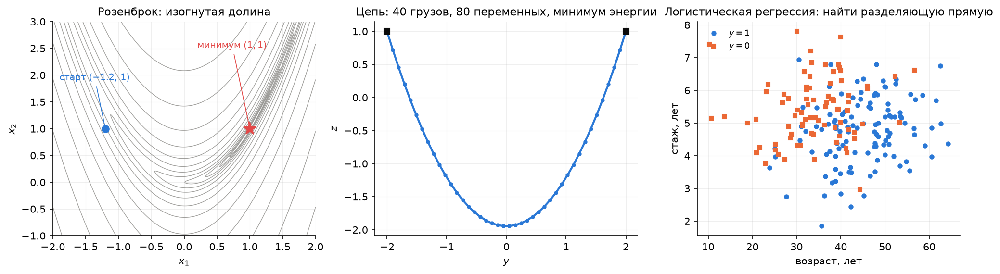
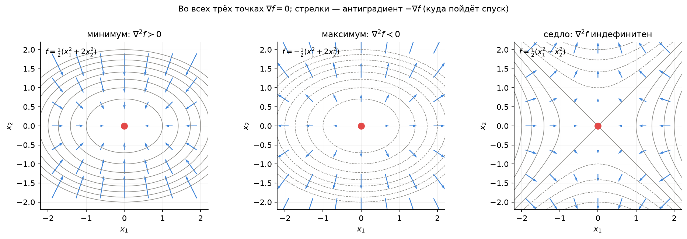
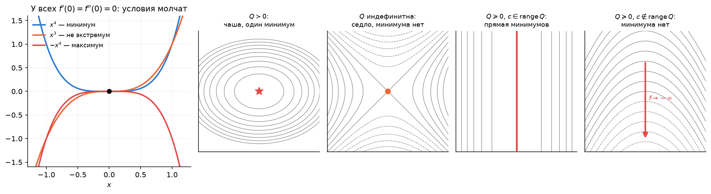
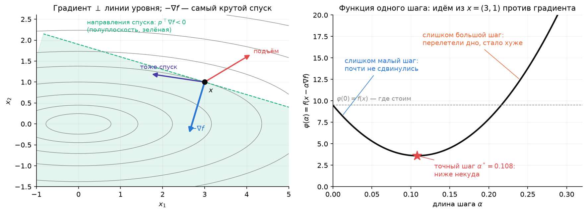
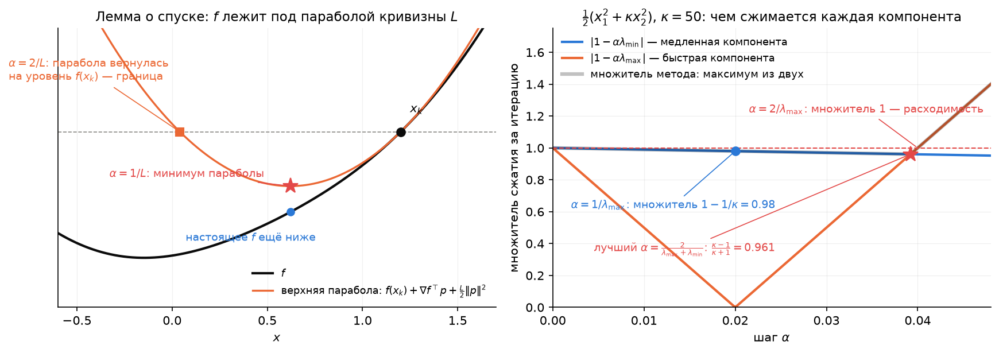
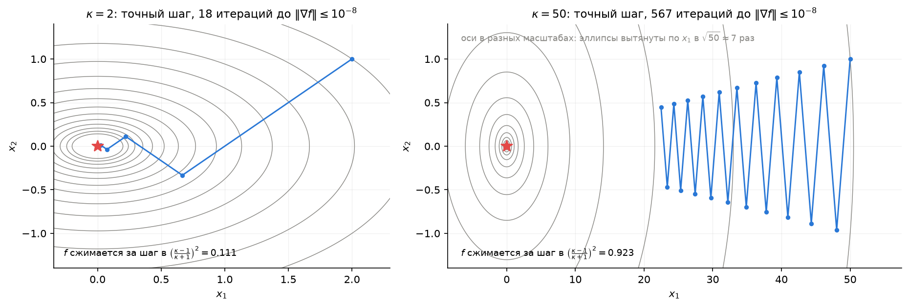
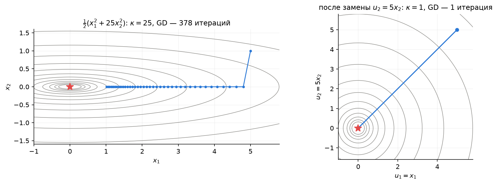
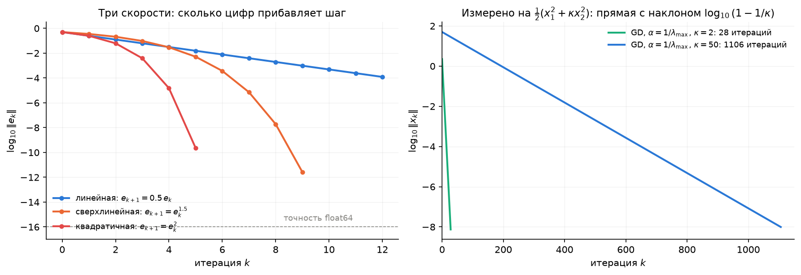
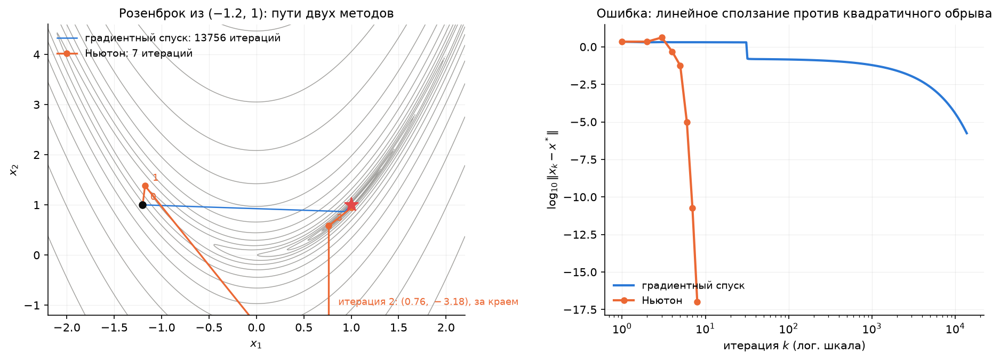

# Лекция 4. Безусловная оптимизация: условия оптимальности, градиентный спуск и скорость сходимости

**Курс:** Вычислительная оптимизация · **Часть II. Безусловная оптимизация и ньютоновские методы** · Лекция 4 из 16 · 30 сентября 2026

**Материалы:** [конспект-ноутбук](lecture04.ipynb) · [демо-ноутбук](demo04.ipynb) · [разбор упражнений](exercises04.ipynb) · [сценарий доски](board04.md)

---

Часть I закончилась на том, как *выглядит* решение: $\nabla f=0$ для выпуклых задач без ограничений, баланс сил $\nabla f=\sum\mu_i\nabla h_i$ у стенок. Часть II — о том, как решение *находить*. Сегодня ограничений нет вовсе, $\Omega=\mathbb{R}^n$, и три вопроса:

1. Как узнать точку минимума, если функция не выпукла — что даёт $\nabla f=0$ и что добавляет гессиан?
2. Как к минимуму *идти* — куда шагать и на сколько?
3. Почему одна и та же идея — идти против градиента — на одной задаче укладывается в 18 шагов, а на другой требует 13 тысяч, и что с этим делать?

Ответ на третий вопрос — одно число, **число обусловленности** $\kappa$. Оно будет главным героем лекции.

## 1. Повторение и мост: от «как выглядит решение» к «как его найти»

### 1.1. Что уже умеем

| Вопрос | Ответ | Где |
|---|---|---|
| Есть ли минимум? | Да, если $f$ непрерывна и растёт на бесконечности ($f\to\infty$ при $\lVert x\rVert\to\infty$): множество $\{f\le f(x_0)\}$ ограничено, минимум ищется на компакте | Л1, §5 |
| Как проверить точку в выпуклой задаче? | $\nabla f(x^\ast)=0$ — необходимо и достаточно, и минимум глобальный. Для невыпуклых — «лишь необходимое условие, об этом лекция 4» | Л2, §7 |
| Что такое «решить численно»? | Итерации $x_{k+1}=x_k+p_k$, остановка при $\lVert\nabla f(x_k)\rVert\le\varepsilon$; важны число итераций и цена одной | Л1, §8 |

### 1.2. Три задачи на сегодня



**Розенброк.** $f(x)=(1-x_1)^2+100\,(x_2-x_1^2)^2$ — «банановая долина». Стационарная точка находится в две строки: из $\partial f/\partial x_2=200(x_2-x_1^2)=0$ следует $x_2=x_1^2$, тогда $\partial f/\partial x_1=-2(1-x_1)=0$ даёт $x_1=1$. Точка одна — $(1,1)$, $f(1,1)=0\le f$, так что это глобальный минимум невыпуклой функции (в ДЗ 2, задача 2а, вы разберёте её гессиан подробно). Осталось до неё дойти. Это стандартный полигон для методов части II: изогнутая узкая долина, на дне которой методы ползут.

**Цепь без пола** (лекция 1, §7.3). $40$ грузов на пружинах, $80$ переменных, минимум энергии — выпуклая квадратичная задача. Без ограничений её решает `np.linalg.solve`, но сегодня мы запустим на ней градиентный спуск и увидим, что даже выпуклая квадратичная задача может быть *трудной*.

**Логистическая регрессия** (лекция 1, §7.5). По возрасту и стажу предсказать класс: найти $w$, минимизирующий $\frac1n\sum_i\log(1+e^{-y_i x_i^\top w})$. Выпуклая, гладкая, без ограничений — и на ней градиентный спуск без одной простой подготовки не сходится вовсе.

Во всех трёх задачах нет ни одной стенки. Вспомним систему условий оптимальности лекции 3: $\nabla_xL=0$, допустимость, $\mu\ge0$, $\mu_ih_i=0$. Нет ограничений — нет множителей, и вся система сводится к одному уравнению $\nabla f(x^\ast)=0$. **Нет стенок — нет сил.**

**Что мы знаем о множителях и чего пока нет.** После лекции 3 у множителя два прочтения — сила реакции стенки и цена ограничения, — а система ККТ — сертификат: подставили решение и множители, все нули — решение доказано. Чего мы *не* умеем: находить множители, не угадывая заранее, какие стенки активны, и получать гарантированные оценки $f^\ast$ снизу. Это даёт **двойственность Лагранжа** — лекция 10; кому не терпится, черновик лежит в [`lectures/extra/duality.md`](../extra/duality.md). Задача 4 в ДЗ 2 продолжает тему множителей уже сейчас.

### 1.3. Что сегодня

Условия оптимальности первого и второго порядка (разделы 2–3) → градиентный спуск: направление, шаг, лемма о спуске (4) → число обусловленности и скорость (5–6) → один шаг Ньютона как тизер лекции 5 (7). Семинар — задачи у доски (11–12).

## 2. Стационарные точки: условие первого порядка

**Теорема (необходимое условие первого порядка).** Если $x^\ast$ — локальный минимум $f\in C^1$ на $\mathbb{R}^n$, то $\nabla f(x^\ast)=0$.

*Доказательство.* Пусть $g=\nabla f(x^\ast)\ne0$. Пойдём против градиента: по Тейлору $f(x^\ast-tg)=f(x^\ast)-t\lVert g\rVert^2+o(t)$, и при малом $t>0$ значение меньше $f(x^\ast)$ — сколь угодно близко к $x^\ast$ есть точки лучше. Противоречие с локальностью минимума. $\square$

Точки с $\nabla f=0$ называются **стационарными**. Теорема говорит только «минимум — стационарная точка», но не наоборот: стационарной может быть и точка максимума, и **седло** — точка, из которой в одни стороны функция растёт, а в другие убывает.



Стрелки — антиградиент $-\nabla f$, то есть направление, куда пойдёт спуск. В минимуме стрелки сходятся, в максимуме расходятся, в седле — сходятся вдоль одной оси и расходятся вдоль другой. Для методов часть II это важнее, чем кажется: градиентный спуск ищет точку, где стрелки исчезают, и седло для него — такая же стационарная точка, как минимум (упражнение 12.1). Спасает только то, что седло **неустойчиво**: любое отклонение с «хребта» уводит вниз.

**Обозначения на всю часть II.** $x^\ast$ — минимум, $e_k=x_k-x^\ast$ — ошибка $k$-й итерации, $g_k=\nabla f(x_k)$, $H(x)=\nabla^2f(x)$ — гессиан, симметричная матрица $n\times n$.

## 3. Второй порядок: необходимое, достаточное и зазор между ними

Раз первого порядка мало, привлекаем гессиан. По Тейлору второго порядка вдоль направления $p$:

$$
f(x^\ast+tp)=f(x^\ast)+t\,\nabla f(x^\ast)^\top p+\tfrac12t^2\,p^\top\nabla^2f(x^\ast)\,p+o(t^2).
$$

В стационарной точке средний член нуль, и всё решает знак квадратичной формы.

**Теорема (второй порядок).** Пусть $f\in C^2$.

- *Необходимое условие:* если $x^\ast$ — локальный минимум, то $\nabla f(x^\ast)=0$ и $\nabla^2f(x^\ast)\succeq0$.
- *Достаточное условие:* если $\nabla f(x^\ast)=0$ и $\nabla^2f(x^\ast)\succ0$, то $x^\ast$ — **строгий** локальный минимум.

*Доказательство.* Необходимость: будь $p^\top Hp<0$ для какого-то $p$, вдоль $p$ функция убывала бы при малых $t$ — снова точки лучше рядом. Достаточность: $p^\top Hp\ge\lambda_{\min}\lVert p\rVert^2>0$, а остаток $o(t^2)$ мал равномерно по единичным $p$ (гессиан непрерывен), поэтому при малых $t$ квадратичный член перевешивает и $f(x^\ast+tp)>f(x^\ast)$ для всех $p\ne0$. $\square$

**Зазор.** Между $\succeq0$ и $\succ0$ есть щель, и в ней условия молчат. Три функции одной переменной — $x^4$, $x^3$, $-x^4$ — имеют в нуле одинаковые $f'(0)=f''(0)=0$, а судьбы разные: минимум, не экстремум, максимум. Различить их могут только старшие производные, и общего рецепта нет; в двух переменных то же: $x_1^2+x_2^4$ и $x_1^2-x_2^4$ имеют один гессиан $\operatorname{diag}(2,0)$ (упражнение 12.2).



**Квадратичный случай — без зазора.** Для $f(x)=\tfrac12x^\top Qx+c^\top x$ гессиан постоянен и равен $Q$, остатка Тейлора нет, и ответ полный:

| $Q$ | Ландшафт | Стационарные точки |
|---|---|---|
| $Q\succ0$ | чаша | одна, $x^\ast=-Q^{-1}c$ — глобальный минимум (лекция 2, §7) |
| $Q$ индефинитна, невырождена | седло | одна, $-Q^{-1}c$, но это не минимум: вдоль собственного вектора с $\lambda<0$ функция уходит в $-\infty$ (если $Q$ ещё и вырождена, стационарных точек либо целая прямая, либо нет вовсе — $f\to-\infty$ в любом случае) |
| $Q\succeq0$ вырождена, $c\in\operatorname{range}Q$ | жёлоб | целая прямая (плоскость) минимумов — как в МНК с линейно зависимыми столбцами |
| $Q\succeq0$ вырождена, $c\notin\operatorname{range}Q$ | наклонный жёлоб | стационарных точек нет, $f\to-\infty$ вдоль жёлоба |

Эта таблица понадобится в лекции 5: метод Ньютона на каждом шаге минимизирует именно такую модель, и «седло» в таблице означает, что шаг Ньютона может пойти *вверх*.

**Выпуклость закрывает зазор.** Если $f$ выпукла, $\nabla f(x^\ast)=0$ — необходимо и достаточно, и минимум глобальный (лекция 2, §7): гессиан здесь не нужен вообще. Гессиан нужен ровно тогда, когда выпуклости нет.

**Розенброк.** Из ДЗ 2: единственная стационарная точка $(1,1)$, в ней

$$
\nabla^2f(1,1)=\begin{pmatrix}802&-400\\-400&200\end{pmatrix},\qquad \lambda_{\min}\approx0.40,\quad\lambda_{\max}\approx1001.6 .
$$

Оба собственных числа положительны — по достаточному условию это строгий локальный минимум, а так как $f\ge0=f(1,1)$, ещё и глобальный. Запомните эти два числа: их отношение $\kappa\approx2508$ объяснит всё, что случится с градиентным спуском в разделе 5.

## 4. Градиентный спуск: направление, шаг, лемма о спуске

Условия найдены; теперь — как к ним прийти. Итерационный метод из лекции 1 (§8): $x_{k+1}=x_k+p_k$. Нужно выбрать направление $p_k$ и длину шага.

**Направление.** Производная $f$ в точке $x$ по единичному направлению $p$ равна $\nabla f(x)^\top p$. По неравенству Коши–Буняковского $\nabla f^\top p\ge-\lVert\nabla f\rVert$, и равенство достигается при $p=-\nabla f/\lVert\nabla f\rVert$: **антиградиент — направление самого крутого спуска** (упражнение 12.8). Все направления с $p^\top\nabla f<0$ — **направления спуска**: они образуют полуплоскость (полупространство), а её граница — касательная к линии уровня, ведь $\nabla f$ ортогонален линии уровня.



**Метод.** Градиентный спуск — это

$$
\boxed{\;x_{k+1}=x_k-\alpha_k\nabla f(x_k)\;}
$$

и вся содержательная часть — в выборе $\alpha_k$. Вдоль луча $x_k-\alpha\nabla f(x_k)$ функция становится функцией одной переменной $\varphi(\alpha)=f(x_k-\alpha\nabla f(x_k))$, и $\varphi'(0)=-\lVert\nabla f(x_k)\rVert^2<0$: при малых $\alpha$ спуск гарантирован. Вопрос — насколько малых.

**Постоянный шаг и лемма о спуске.** Пусть градиент липшицев: $\lVert\nabla f(x)-\nabla f(y)\rVert\le L\lVert x-y\rVert$. Для $C^2$-функции это значит $\lVert\nabla^2f\rVert\le L$, то есть $-LI\preceq\nabla^2f\preceq LI$ — кривизна ограничена в обе стороны; для леммы ниже нужна только верхняя половина. Для квадратичной $L=\lVert Q\rVert$, при $Q\succeq0$ это $\lambda_{\max}(Q)$. Тогда квадратичная модель с кривизной $L$ — **верхняя оценка** функции (упражнение 12.6):

$$
f(y)\le f(x)+\nabla f(x)^\top(y-x)+\tfrac L2\lVert y-x\rVert^2,
\qquad\text{откуда}\qquad
f(x-\alpha\nabla f)\le f(x)-\alpha\Big(1-\frac{\alpha L}2\Big)\lVert\nabla f\rVert^2 .
$$

При $0<\alpha<2/L$ скобка положительна, и функция гарантированно убывает; при $\alpha=1/L$ убывание наибольшее, $f$ уменьшается хотя бы на $\lVert\nabla f\rVert^2/(2L)$. На картинке ниже (слева) это видно без формул: $f$ лежит под параболой кривизны $L$, касающейся её в $x_k$; шаг $1/L$ приводит в минимум параболы, а при шаге $2/L$ парабола возвращается на уровень $f(x_k)$ — гарантии спуска больше нет. Суммируя по итерациям: $\sum_k\lVert\nabla f(x_k)\rVert^2\le2L\,(f(x_0)-f^\ast)<\infty$, значит $\nabla f(x_k)\to0$. Если множество уровня $\{f\le f(x_0)\}$ ограничено (лекция 1, §5), предельные точки итераций стационарны, а для выпуклой $f$ — это глобальный минимум; без ограниченности итерации могут уйти на бесконечность, как у $f(x)=\log(1+e^{-x})$: градиент стремится к нулю, а минимума нет. Граница $2/L$ настоящая: за ней шаг перепрыгивает дно и метод не сходится (раздел 5, Розенброк).



**Точный шаг.** Минимизировать $\varphi(\alpha)$ по $\alpha$. Для квадратичной $f=\tfrac12x^\top Qx+c^\top x$ это делается явно: с $g=\nabla f(x_k)$

$$
\alpha_k^\ast=\frac{g^\top g}{g^\top Qg}.
$$

Для общей $f$ точный поиск — сама по себе задача оптимизации, и на практике его заменяют приближённым.

**Backtracking — рецепт на сегодня.** Начать с $\alpha=1$ и делить пополам, пока не выполнено **условие Армихо** — «убыло хотя бы малую долю того, что обещала линейная модель»:

```python
alpha = 1.0
while f(x - alpha * g) > f(x) - 1e-4 * alpha * (g @ g):
    alpha /= 2
x = x - alpha * g
```

Три строки, работают без знания $L$ и на невыпуклых функциях. Почему это сходится, чем плоха константа $10^{-4}$ и что такое условие Вольфе — лекция 6; на картинке выше видно главное: backtracking останавливается недалеко от точного шага.

**Остановка.** Как в лекции 1: $\lVert\nabla f(x_k)\rVert\le\varepsilon$. Для выпуклой $f$ малый градиент означает близость к глобальному минимуму, для невыпуклой — к стационарной точке; какой именно, метод не знает. Насколько близко — обещание лекции 2 (§8) выполняем сейчас: если $\nabla^2f\succeq mI$, то $\lVert x_k-x^\ast\rVert\le\lVert\nabla f(x_k)\rVert/m$. При маленьком $m$ (плохо обусловленная задача) малый градиент гарантирует немногое — ещё одна причина, по которой в разделе 5 регрессия без масштабирования не доходит до $\varepsilon=10^{-6}$.

## 5. Скорость: число обусловленности

Метод сходится. Но *как быстро*? Ответ виден на квадратичной функции, а к общей переносится почти дословно.

**Квадратичная задача в собственных осях.** Пусть $f=\tfrac12x^\top Qx$, $Q\succ0$ с собственными числами $0<\lambda_1\le\dots\le\lambda_n$; минимум в нуле, ошибка $e_k=x_k$. Шаг $x_{k+1}=x_k-\alpha Qx_k=(I-\alpha Q)x_k$: в базисе собственных векторов каждая компонента ошибки умножается на свой множитель $1-\alpha\lambda_i$. Чтобы сходились все, нужно $|1-\alpha\lambda_i|<1$ для всех $i$, то есть $0<\alpha<2/\lambda_{\max}$ — снова граница $2/L$. Возьмём $\alpha=1/\lambda_{\max}$: компонента вдоль $\lambda_{\max}$ обнуляется за один шаг, а самая медленная, вдоль $\lambda_{\min}$, сжимается всего в

$$
1-\frac{\lambda_{\min}}{\lambda_{\max}}=1-\frac1\kappa,\qquad
\boxed{\;\kappa=\frac{\lambda_{\max}(Q)}{\lambda_{\min}(Q)}\;}
$$

— **число обусловленности**. За $k$ шагов ошибка умножается на $(1-1/\kappa)^k\approx e^{-k/\kappa}$, и чтобы уменьшить её в $1/\varepsilon$ раз, нужно

$$
k\approx\kappa\ln\frac1\varepsilon\quad\text{итераций.}
$$

Число итераций **пропорционально $\kappa$**. При $\kappa=2$ одна верная цифра стоит $3$ итерации, при $\kappa=50$ — $114$. Правая панель картинки 08 показывает, чем сжимается каждая компонента при разных $\alpha$: лучший постоянный шаг $2/(\lambda_{\max}+\lambda_{\min})$ уравнивает быструю и медленную компоненты и даёт множитель $(\kappa-1)/(\kappa+1)$ — число итераций уменьшается вдвое, не больше (упражнение 12.3). Оба множителя относятся к ошибке $\lVert e_k\rVert$; для $f-f^\ast$, квадратичной по ошибке, множители — их квадраты. Точный шаг не спасает: для него $f$ сжимается в $\big(\frac{\kappa-1}{\kappa+1}\big)^2$ за итерацию — та же скорость, что у лучшего постоянного шага, и итераций по-прежнему порядка $\kappa$.



**Зигзаг.** При точном шаге соседние градиенты ортогональны (упражнение 12.8в), и на вытянутом эллипсе метод мечется поперёк долины, продвигаясь вдоль неё чуть-чуть за шаг: $18$ итераций при $\kappa=2$ против $567$ при $\kappa=50$. Геометрия та же, что у Розенброка, только у него долина ещё и изогнута.

**Общий случай.** Если $mI\preceq\nabla^2f(x)\preceq LI$ всюду (сильно выпуклая функция с липшицевым градиентом), то градиентный спуск с шагом $1/L$ даёт $f(x_k)-f^\ast\le(1-m/L)^k\,(f(x_0)-f^\ast)$ — то же самое с $\kappa=L/m$ (здесь множитель для $f$, поэтому итераций в оценке вдвое больше, чем для ошибки). Для невыпуклой функции оценка локальная: у Розенброка градиент глобально не липшицев, и $L$ имеет смысл только вблизи минимума, где $L\approx\lambda_{\max}(\nabla^2f(1,1))$.

**Числа.** Все допуски — $\lVert\nabla f\rVert\le10^{-6}$ для градиентного спуска (демо, части c–e).

| Задача | $\kappa$ | Шаг | Итераций |
|---|---|---|---|
| Розенброк из $(-1.2,1)$ | $2508$ в $(1,1)$ | постоянный $0.001\approx1/\lambda_{\max}$ | $32\,076$ |
| | | постоянный $0.0019$ | $16\,851$ |
| | | постоянный $0.002>2/\lambda_{\max}$ | не сходится: подходит к минимуму, но он для такого шага неустойчив; итерации оседают в колебании поперёк долины, $f$ прыгает между $1.25\cdot10^{-3}$ и $1.26\cdot10^{-3}$ |
| | | backtracking | $13\,756$ |
| Цепь, $N=10/40/80$ | $49/681/2659\approx\big(\frac{2(N+1)}\pi\big)^2$ | $1/L$ | $10\,575$ при $N=40$, вчетверо больше при удвоении $N$ |
| Регрессия, признаки как есть | $7.5\cdot10^4$ | backtracking | не достигает $10^{-6}$ за $20\,000$ |
| Регрессия, стандартизованная | $2.75$ | backtracking | $195$ |

Оценка $\kappa\ln10^6\approx3.5\cdot10^4$ для Розенброка и факт $32\,076$ — величины одного порядка, и это всё, чего стоит ожидать: оценка говорит о сжатии ошибки вблизи минимума, а факт — о пути из далёкой точки. Backtracking вдвое быстрее шага $0.001$ не потому, что «долина вдали шире», а потому, что у дна он принимает шаг $2^{-9}\approx0.00195$, а иногда и $2^{-8}$, — ближе к границе $2/\lambda_{\max}\approx0.002$; шаг $0.0019$ по той же причине даёт $16\,851$. Цепь: гессиан энергии — блочная матрица жёсткости $\operatorname{diag}(DK,DK)$ с трёхдиагональной $K$ (упражнение 12.9); чем длиннее цепь, тем «мягче» её самая медленная мода и тем хуже обусловленность — выпуклая квадратичная задача, а спуск ползёт. Регрессия: признаки «возраст $\approx40\pm10$ лет» и «стаж $\approx5\pm1$ лет» плюс столбец единиц; гессиан $\frac1nX^\top SX$ — взвешенная матрица вторых моментов признаков.

**Масштабирование переменных — первое лекарство.** Число обусловленности — свойство не задачи, а *координат*. Заменим $u_2=5x_2$ в $f=\tfrac12(x_1^2+25x_2^2)$: эллипсы становятся кругами, $\kappa=1$, и градиентный спуск попадает в минимум за один шаг вместо $378$.



То же для логистической регрессии — но с поправкой, которая важна. Причина её $\kappa\approx7.5\cdot10^4$ — не «годы против рублей»: оба признака в годах. Причина в **сдвиге**: столбец «возраст $40\pm10$» почти коллинеарен столбцу единиц (среднее в четыре раза больше разброса), и гессиан почти вырожден. Одно масштабирование признаков (деление на разброс) снижает $\kappa$ лишь до $\sim10^3$; **стандартизация** — вычесть среднее *и* поделить на разброс — до $2.75$, и метод сходится за $195$ итераций (демо, часть d). Общее правило: шаг $x_{k+1}=x_k-\alpha D^{-1}\nabla f(x_k)$ с диагональной $D$ — это градиентный спуск в масштабированных переменных $u=D^{1/2}x$; выбор $D$ называют **предобуславливанием**. Стандартизация — уже аффинная замена (сдвиг плюс масштаб), но идея та же: сделать долину круглой. Простейший вариант — привести все переменные к величинам порядка единицы: расстояние в метрах и в километрах — это одна задача, но $\kappa$ у них отличается в $10^6$ раз (упражнение 12.3д).

**Почему градиентный спуск всё же живёт.** Одна итерация стоит один градиент — $O(n)$ операций и памяти; для логистической регрессии с миллионом признаков ничего дороже мы себе позволить не можем, и $\kappa$ приходится чинить масштабированием, а не сменой метода. Там, где $n$ невелико, есть методы, которым $\kappa$ безразлично, — раздел 7.

## 6. Линейная, сверхлинейная, квадратичная

Мы сказали «ошибка сжимается в $q$ раз за шаг». Это — **линейная** сходимость, и не единственно возможная. Пусть $x_k\to x^\ast$.

| Тип | Определение | Что видно на графике $\log\lVert e_k\rVert$ | Верные цифры |
|---|---|---|---|
| линейная | $\lVert e_{k+1}\rVert\le q\lVert e_k\rVert$, $q<1$ | прямая с наклоном $\log q$ | по одной каждые $\ln10/\ln(1/q)$ итераций |
| сверхлинейная | $\lVert e_{k+1}\rVert/\lVert e_k\rVert\to0$ | всё круче и круче | всё больше за шаг |
| квадратичная | $\lVert e_{k+1}\rVert\le C\lVert e_k\rVert^2$ | «обрыв» | число цифр удваивается: $10^{-2},10^{-4},10^{-8},10^{-16}$ |



Градиентный спуск — линейный с $q=1-1/\kappa$ (с одним и тем же $q$ для всех $k$ начиная с некоторого — иначе линейной сходимостью пришлось бы назвать и $1/k$): на правой картинке ошибка на квадратичной задаче ложится на прямую, и наклон точно $\log_{10}(1-1/\kappa)$. Число обусловленности задаёт наклон, и пока мы шагаем строго против градиента, улучшить его можно только масштабированием. Память о предыдущих шагах — сопряжённые градиенты (лекция 6), момент — снижает цену до $\sim\sqrt\kappa$ итераций, но не меняет типа: это всё ещё прямая. Квадратичная сходимость — это когда из $10^{-2}$ в $10^{-16}$ попадают за три шага; такую даёт метод Ньютона.

## 7. Тизер: один шаг Ньютона

Градиентный спуск использует линейную модель функции. Возьмём квадратичную — Тейлора второго порядка в текущей точке:

$$
m_k(p)=f(x_k)+\nabla f(x_k)^\top p+\tfrac12\,p^\top\nabla^2f(x_k)\,p,
\qquad
\nabla m_k=0\ \Longrightarrow\ \boxed{\;p_k=-\nabla^2f(x_k)^{-1}\nabla f(x_k)\;}
$$

— **шаг Ньютона**. Если $f$ квадратична, модель точна, и шаг попадает в минимум *за одну итерацию* — это ровно $x^\ast=-Q^{-1}c$ из таблицы раздела 3; для цепи это `np.linalg.solve(H, -g)`, одна линейная система вместо $10\,575$ итераций. Если $f$ не квадратична, модель точна лишь вблизи, но там — квадратичная сходимость.



На Розенброке из $(-1.2,1)$: Ньютон — $7$ итераций до $\lVert\nabla f\rVert\le10^{-10}$ (до $10^{-6}$, как у спуска, — $6$), градиентный спуск — $13\,756$. Ошибка Ньютона: $2.2,\ 2.2,\ 4.2,\ 0.48,\ 0.056,\ 10^{-5},\ 10^{-11}$ — сначала два шага почти впустую, на втором даже *хуже* (модель вдали от минимума врёт, и шаг улетает в $(0.77,-3.2)$), зато последние три — удвоение цифр. Числу обусловленности Ньютон безразличен: он делает ту же самую линейную замену координат, что мы делали руками в разделе 5, только автоматически и на каждом шаге — для логистической регрессии он сходится за $6$ итераций что с масштабированием признаков, что без.

Цена: гессиан ($n^2$ чисел) и линейная система ($n^3$ операций), а главное — вдали от минимума шаг может пойти не туда: без линейного поиска Ньютон вообще не метод спуска, $f$ на его шаге может и вырасти (как на второй итерации выше), а если $\nabla^2f$ индефинитен, модель — седло из раздела 3, и её «минимума» не существует. Как это чинится (квази-Ньютон, линейный поиск, доверительная область) — лекции 5 и 6.

## 8. Что это даёт численно

**Диагноз по графику.** Постройте $\log\lVert\nabla f(x_k)\rVert$ или $\log(f(x_k)-f^\ast)$ по итерациям. Прямая с пологим наклоном — линейная сходимость с большим $\kappa$: проверьте масштабы переменных, прежде чем менять метод. Обрыв — ньютоновская сходимость: вы в области, где квадратичная модель точна.

**Стационарная точка — ещё не минимум.** Для невыпуклой $f$ малый градиент не различает минимум и седло. Если есть сомнения — собственные числа гессиана в найденной точке (демо, часть a); отрицательное собственное число указывает направление, вдоль которого можно спуститься ещё.

**Что делает `minimize` по умолчанию.** Без ограничений SciPy запускает BFGS — квази-ньютоновский метод: он не считает гессиан, а восстанавливает его по градиентам, и сходится сверхлинейно. Это тема лекции 5; после неё вы напишете градиентный спуск, Ньютон и BFGS сами и сравните их на Розенброке, цепи и регрессии (ДЗ 3).

**Откуда брать градиент.** В демо все градиенты выписаны руками. Что делать, когда $f$ — тысяча строк кода, — лекция 7: конечные разности и их погрешность, алгоритмическое дифференцирование.

## 9. Итоги лекции

1. Минимум — стационарная точка: $\nabla f(x^\ast)=0$. Обратное неверно: стационарной бывает и седло, и максимум.
2. Второй порядок: $\nabla^2f\succeq0$ необходимо, $\nabla^2f\succ0$ достаточно; между ними — зазор ($x^4$, $x^3$, $-x^4$), который закрывает только выпуклость. Для квадратичных функций ответ полный: чаша, седло, жёлоб.
3. Градиентный спуск $x_{k+1}=x_k-\alpha\nabla f(x_k)$: антиградиент — самый крутой спуск. Постоянный шаг $\alpha<2/L$ гарантирует убывание (лемма о спуске); точный шаг на квадратичной — $g^\top g/g^\top Qg$; backtracking по Армихо — рабочий рецепт без знания $L$.
4. Скорость линейная с множителем $1-1/\kappa$ для ошибки: итераций $\approx\kappa\ln(1/\varepsilon)$. **Число обусловленности** $\kappa=\lambda_{\max}/\lambda_{\min}$ — то, что вблизи минимума определяет, ползёт метод или летит.
5. $\kappa$ — свойство координат, а не задачи: масштабирование переменных (предобуславливание) — первое лекарство. Розенброк $\kappa\approx2500$, цепь $\kappa\sim N^2$, регрессия без стандартизации $\kappa\sim10^5$.
6. Линейная, сверхлинейная, квадратичная сходимость — «сколько цифр прибавляет шаг». Ньютон: квадратичная модель, один шаг на квадратичной задаче, $7$ итераций против $13\,756$ на Розенброке — но только вблизи минимума и за цену гессиана.

## 10. Что дальше

**Лекция 5** — метод Ньютона всерьёз: локальная сходимость и теорема о сжатии, квази-ньютоновские обновления (BFGS, L-BFGS), метод Гаусса–Ньютона для задач МНК, и почему для всех них важно то, что мы сегодня увидели на Розенброке. **Лекция 6** — что делать вдали от минимума: линейный поиск (Армихо, Вольфе), доверительная область, сопряжённые градиенты. **Лекция 7** — как считать производные.

**Домашнее задание 3** выдаётся 7 октября, после лекции 5: градиентный спуск, Ньютон и BFGS — реализация и сравнение на сегодняшних задачах (см. [программу курса](../../syllabus.md#4-домашние-задания)). **Домашнее задание 2** — срок 7 октября.

**Литература к лекции.** Diehl, гл. 4 (условия оптимальности без ограничений) и §5.1 (скорости сходимости); Nocedal & Wright, §2.1 (условия оптимальности), §2.2 и §3.3 (направления спуска, скорость градиентного метода); Boyd & Vandenberghe, §9.1–9.3 (сильная выпуклость, число обусловленности, градиентный метод); Поляк, гл. 1 (градиентный метод).

## 11. Семинар: задачи у доски

Вторая половина пары, ~33 минуты, — задачи, которые решаются руками. Ноутбук [`demo04.ipynb`](demo04.ipynb) на занятии не открываем (кроме части (c) с Розенброком, если останется время): он для самостоятельной проверки тех же задач в коде после пары. Условия — в разделе 12, разбор с ответами — в [`exercises04.ipynb`](exercises04.ipynb).

| Мин | Задача | Что тренирует |
|-----|--------|---------------|
| 5 | **12.1** Стационарные точки $(x_1^2-1)^2+x_2^2$: седло и два минимума по гессиану; куда придёт спуск из $(0,0.5)$ | классификация по гессиану; седло — ловушка для спуска |
| 12 | **12.3** Спуск на $\tfrac12(x_1^2+\kappa x_2^2)$ с постоянным шагом: диапазон $\alpha$, лучший $\alpha$ по картинке двух множителей, итераций на одну цифру; (д) километры против метров — $\kappa=10^6$ из ничего | откуда берётся $\kappa$ — руками, покоординатно; масштабирование = замена переменных |
| 6 | **12.4** Розенброк: гессиан в $(1,1)$, $\kappa$ через след и определитель, оценка числа итераций против демо | оценка $\kappa\ln(1/\varepsilon)$ на живых числах |
| 4 | **12.7** Четыре последовательности ошибок — назвать тип сходимости хором | линейная / сверхлинейная / квадратичная на слух |
| 6 | **12.5** Прочитать график сходимости: по наклону восстановить $\kappa$, число итераций, решить, масштабировать ли | диагноз по графику — то, что придётся делать в ДЗ 3 |

Дома: 12.2 (зазор второго порядка, пример Пеано), 12.6 (лемма о спуске — доказать), 12.8 (самый крутой спуск и ортогональность), 12.9 (цепь: $\kappa\sim N^2$), 12.10 (логистическая регрессия: гессиан и почему помогает стандартизация); затем прогнать `demo04.ipynb`, части (a)–(e).

## 12. Упражнения

Для разбора на занятии и самостоятельно. Подробный разбор с проверкой кодом — ноутбук [`exercises04.ipynb`](exercises04.ipynb), краткие ответы — [`exercises04.md`](exercises04.md).

**12.1.** Стационарные точки $f(x)=(x_1^2-1)^2+x_2^2$ (пример лекции 2, §4). Найдите все точки с $\nabla f=0$, выпишите гессиан в каждой и классифицируйте: минимум, максимум, седло. Сверьте с картой $\lambda_{\min}\nabla^2f$ из лекции 2. Куда придёт градиентный спуск из $(0,\,0.5)$? Из $(0.01,\,0.5)$?

**12.2.** Зазор между необходимым и достаточным условием. (а) Для $x^4$, $x^3$, $-x^4$ в нуле: что говорят условия первого и второго порядка и что на самом деле? (б) То же для $f(x)=x_1^2+x_2^4$ и $g(x)=x_1^2-x_2^4$ в нуле: гессианы одинаковы, а судьбы разные. (в) Пример Пеано: $f(x)=(x_2-x_1^2)(x_2-2x_1^2)$. Покажите, что $\nabla f(0)=0$ и $\nabla^2f(0)=\operatorname{diag}(0,2)\succeq0$; что вдоль любой прямой через нуль функция имеет в нуле строгий локальный минимум; и что нуль всё же не локальный минимум — найдите точки сколь угодно близко к нулю с $f<0$. Что это говорит о проверке «по направлениям»?

**12.3.** Градиентный спуск на $f(x)=\tfrac12(x_1^2+\kappa x_2^2)$, $\kappa\ge1$, с постоянным шагом $\alpha$. (а) Выпишите итерацию покоординатно. (б) При каких $\alpha$ метод сходится из любой точки? (в) Какой $\alpha$ даёт наименьший множитель сжатия $\max(|1-\alpha|,\,|1-\alpha\kappa|)$ и чему он равен? Нарисуйте оба множителя как функции $\alpha$. (г) Сколько итераций нужно на одну верную десятичную цифру при $\kappa=50$ для $\alpha=1/\kappa$ и для лучшего $\alpha$? Почему при обоих шагах $f$ сжимается за итерацию в квадрат множителя для ошибки? (д) Единицы измерения: пусть $f=\tfrac12(x_1^2+x_2^2)$, обе координаты — метры, $\kappa=1$. Перепишите $f$ через $u_1=x_1/1000$ (километры), $u_2=x_2$: чему равно $\kappa$ и сколько итераций на одну цифру? Покажите, что шаг $u\leftarrow u-\alpha D^{-1}\nabla_uf(u)$ с $D=\operatorname{diag}(10^6,1)$ — это спуск в исходных переменных, а при $D=\nabla^2f$ и $\alpha=1$ — шаг Ньютона (раздел 7).

**12.4.** Розенброк $f(x)=(1-x_1)^2+100(x_2-x_1^2)^2$. Выпишите гессиан в $(1,1)$, найдите его собственные числа и $\kappa$. Оцените, сколько итераций градиентного спуска с шагом $1/\lambda_{\max}$ нужно, чтобы вблизи минимума уменьшить ошибку в $10^6$ раз. Сравните с числом итераций из демо (часть c) и с методом Ньютона.

**12.5.** Прочитайте график. Градиентный спуск с постоянным шагом $1/L$ на сильно выпуклой функции стартовал с $\|\nabla f(x_0)\|=1$ и остановился по $\|\nabla f\|\le10^{-8}$; $\log_{10}\|\nabla f(x_k)\|$ лёг на прямую с наклоном $-0.0004$ на итерацию. (а) Каков множитель сжатия $q$ за итерацию и какому $\kappa$ он соответствует? (б) Сколько итераций понадобилось? (в) Стоит ли масштабировать переменные перед повторным запуском и как изменится график? (г) Как выглядел бы график, если бы метод сменили на ньютоновский?

**12.6.** Лемма о спуске. Пусть $\|\nabla f(x)-\nabla f(y)\|\le L\|x-y\|$ для всех $x,y$. Докажите, что $f(y)\le f(x)+\nabla f(x)^\top(y-x)+\tfrac L2\|y-x\|^2$ (подсказка: $f(y)-f(x)=\int_0^1\nabla f(x+t(y-x))^\top(y-x)\,dt$), и выведите $f(x-\alpha\nabla f(x))\le f(x)-\alpha\big(1-\tfrac{\alpha L}2\big)\|\nabla f(x)\|^2$. При каких $\alpha$ функция гарантированно убывает? Какой $\alpha$ даёт наибольшее гарантированное убывание? Чему равно $L$ для квадратичной $\tfrac12x^\top Qx$, $Q\succeq0$?

**12.7.** Скорость по последовательности. Даны ошибки $\|e_k\|$ четырёх методов: (а) $10^{-1},10^{-2},10^{-3},10^{-4},\dots$; (б) $10^{-1},10^{-2},10^{-4},10^{-8},\dots$; (в) $1/k$; (г) $1/k!$. Определите тип сходимости каждой (линейная — с каким множителем, сверхлинейная, квадратичная, ни одна из них). Сколько итераций нужно каждой, чтобы от ошибки $\le10^{-1}$ дойти до $\le10^{-12}$?

**12.8.** Направление наискорейшего спуска. (а) Докажите, что среди единичных векторов $p$ производная по направлению $\nabla f(x)^\top p$ минимальна при $p=-\nabla f(x)/\|\nabla f(x)\|$. (б) Докажите, что $\nabla f(x)$ ортогонален линии уровня $\{y: f(y)=f(x)\}$ (подсказка: продифференцируйте $f(\gamma(t))=\mathrm{const}$ вдоль кривой $\gamma$ на линии уровня). (в) Покажите, что при точном линейном поиске $\nabla f(x_{k+1})\perp\nabla f(x_k)$ — отсюда зигзаг на картинке 04.

**12.9.** Цепь без пола (лекция 1, §7.3). Покажите, что гессиан энергии — блочно-диагональная матрица $\operatorname{diag}(DK,\,DK)$ с трёхдиагональной $K$ ($2$ на диагонали, $-1$ рядом), не зависящая от $x$. Собственные числа $K$ равны $2-2\cos\frac{j\pi}{N+1}$, $j=1,\dots,N$ (примите без доказательства). Найдите $\kappa$ как функцию $N$ и покажите, что $\kappa\approx\big(\tfrac{2(N+1)}{\pi}\big)^2$ при больших $N$. Оцените, сколько итераций градиентного спуска нужно при $N=40$, чтобы уменьшить ошибку в $10^6$ раз, и сколько шагов Ньютона. Почему здесь Ньютон — это просто `np.linalg.solve`?

**12.10.** Логистическая регрессия (лекция 1, §7.5; данные — демо лекции 2, часть d). Для $f(w)=\frac1n\sum_{i=1}^n\log\big(1+e^{-y_i\,x_i^\top w}\big)$, $y_i\in\{-1,1\}$, найдите $\nabla f$ и $\nabla^2f$ и покажите, что $\nabla^2f=\frac1nX^\top SX$ с диагональной $S\succeq0$. Гессиан — взвешенная матрица вторых моментов признаков: объясните, почему признак «возраст $40\pm10$» вместе со столбцом единиц даёт большое $\kappa$ (подсказка: столбцы почти коллинеарны), почему одно масштабирование признаков этого не лечит, а стандартизация — сдвиг плюс масштаб — лечит.

**Домашнее задание 3** — по градиентным методам, выдаётся 7 октября.

## Вопросы для самопроверки

1. Почему в локальном минимуме $\nabla f=0$, и почему из $\nabla f=0$ минимум не следует? Приведите по примеру седла и максимума.
2. В чём зазор между $\nabla^2f\succeq0$ и $\nabla^2f\succ0$? Какие три функции одной переменной его демонстрируют, и что происходит с зазором для выпуклых функций?
3. Почему антиградиент — самый крутой спуск? Что такое направление спуска вообще, и как выглядит их множество на картинке линий уровня?
4. Что гарантирует лемма о спуске и при каких шагах? Что произойдёт при $\alpha>2/L$ — на квадратичной функции и на Розенброке?
5. Что такое число обусловленности, как оно входит в число итераций градиентного спуска и почему масштабирование переменных его меняет, хотя задача та же?
6. Как по графику $\log\lVert e_k\rVert$ отличить линейную, сверхлинейную и квадратичную сходимость? Какая у градиентного спуска и какая у Ньютона?
