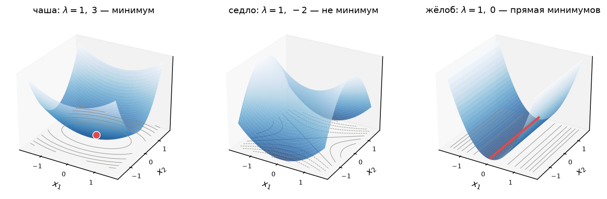
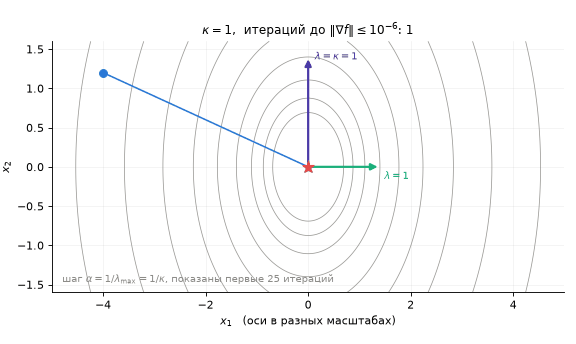
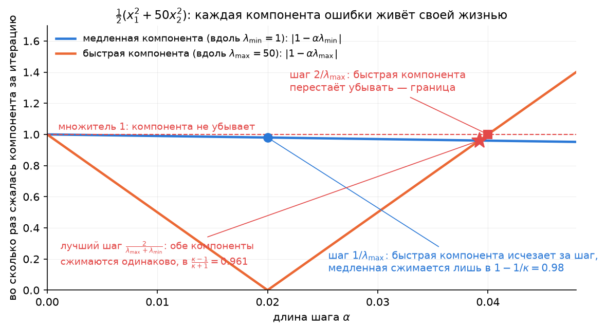
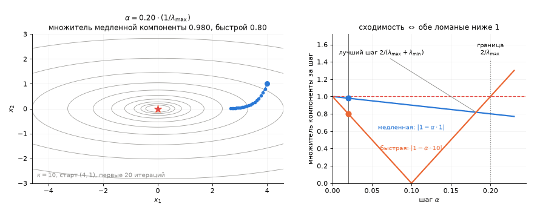

# Лекция 4. Безусловная оптимизация: условия оптимальности, градиентный спуск и скорость сходимости

**Курс:** Вычислительная оптимизация · **Часть II. Безусловная оптимизация и ньютоновские методы** · Лекция 4 из 16 · 30 сентября 2026

**Материалы:** [конспект-ноутбук с кодом демонстраций](lecture04.ipynb) · [демо-ноутбук](demo04.ipynb) · [разбор упражнений](exercises04.ipynb) · [сценарий доски](board04.md)

В конспекте-ноутбуке ячейки демонстраций стоят прямо в тех разделах, к которым относятся (заголовки «Демо (0)»–«Демо (d)»): две задачи — после 1.2, стационарные точки — после раздела 3, спуск на квадратичной — после раздела 5, Розенброк и цепь — после раздела 7. Тот же код отдельно и целиком — `demo04.ipynb`.

---

Часть I закончилась на том, как *выглядит* решение: $\nabla f=0$ для выпуклых задач без ограничений, баланс сил $\nabla f=\sum\mu_i\nabla h_i$ у стенок. Часть II — о том, как решение *находить*. Сегодня ограничений нет вовсе, $\Omega=\mathbb{R}^n$, и три вопроса:

1. Как узнать точку минимума, если функция не выпукла — что даёт $\nabla f=0$ и что добавляет гессиан?
2. Как к минимуму *идти* — куда шагать и на сколько?
3. Почему одна и та же идея — идти против градиента — на одной задаче укладывается в 18 шагов, а на другой требует 13 тысяч, и что с этим делать?

Ответ на третий вопрос — одно число, **число обусловленности** $\kappa$. Оно будет главным героем лекции.

## 1. Повторение и мост: от «как выглядит решение» к «как его найти»

### 1.1. Что уже умеем

| Вопрос | Ответ | Где |
|---|---|---|
| Есть ли минимум? | Да, если $f$ непрерывна и растёт на бесконечности ($f\to\infty$ при $\lVert x\rVert\to\infty$): множество $\{f\le f(x_0)\}$ ограничено, минимум ищется на компакте | Л1, §5 |
| Как проверить точку в выпуклой задаче? | $\nabla f(x^\ast)=0$ — необходимо и достаточно, и минимум глобальный. Для невыпуклых — «лишь необходимое условие, об этом лекция 4» | Л2, §7 |
| Что такое «решить численно»? | Итерации $x_{k+1}=x_k+p_k$, остановка при $\lVert\nabla f(x_k)\rVert\le\varepsilon$; важны число итераций и цена одной | Л1, §8 |

### 1.2. Две задачи на сегодня


**Розенброк.** $f(x)=(1-x_1)^2+100\,(x_2-x_1^2)^2$ — «банановая долина». Стационарная точка находится в две строки: из $\partial f/\partial x_2=200(x_2-x_1^2)=0$ следует $x_2=x_1^2$, тогда $\partial f/\partial x_1=-2(1-x_1)=0$ даёт $x_1=1$. Точка одна — $(1,1)$, $f(1,1)=0\le f$, так что это глобальный минимум невыпуклой функции (в ДЗ 2, задача 2а, вы разберёте её гессиан подробно). Осталось до неё дойти. Это стандартный полигон для методов части II: изогнутая узкая долина, на дне которой методы ползут.

**Цепь без пола** (лекция 1, §7.3). $40$ грузов на пружинах, $80$ переменных, минимум энергии — выпуклая квадратичная задача. Без ограничений её решает `np.linalg.solve`, но сегодня мы запустим на ней градиентный спуск и увидим, что даже выпуклая квадратичная задача может быть *трудной*.

В обеих задачах нет ни одной стенки. Вспомним систему условий оптимальности лекции 3: $\nabla_xL=0$, допустимость, $\mu\ge0$, $\mu_ih_i=0$. Нет ограничений — нет множителей, и вся система сводится к одному уравнению $\nabla f(x^\ast)=0$. **Нет стенок — нет сил.**

**Что мы знаем о множителях и чего пока нет.** После лекции 3 у множителя два прочтения — сила реакции стенки и цена ограничения, — а система ККТ — сертификат: подставили решение и множители, все нули — решение доказано. Чего мы *не* умеем: находить множители, не угадывая заранее, какие стенки активны, и получать гарантированные оценки $f^\ast$ снизу. Это даёт **двойственность Лагранжа** — лекция 10; кому не терпится, черновик лежит в [`lectures/extra/duality.md`](../extra/duality.md). Задача 4 в ДЗ 2 продолжает тему множителей уже сейчас.

### 1.3. Что сегодня

Условия оптимальности первого и второго порядка (разделы 2–3) → градиентный спуск: направление, шаг, лемма о спуске (4) → число обусловленности и скорость (5–6) → один шаг Ньютона как тизер лекции 5 (7). Семинар — задачи у доски (11–12).

## 2. Стационарные точки: условие первого порядка

**Теорема (необходимое условие первого порядка).** Если $x^\ast$ — локальный минимум $f\in C^1$ на $\mathbb{R}^n$, то $\nabla f(x^\ast)=0$.

*Доказательство.* Пусть $g=\nabla f(x^\ast)\ne0$. Пойдём против градиента: по Тейлору $f(x^\ast-tg)=f(x^\ast)-t\lVert g\rVert^2+o(t)$, и при малом $t>0$ значение меньше $f(x^\ast)$ — сколь угодно близко к $x^\ast$ есть точки лучше. Противоречие с локальностью минимума. $\square$

Точки с $\nabla f=0$ называются **стационарными**. Теорема говорит только «минимум — стационарная точка», но не наоборот: стационарной может быть и точка максимума, и **седло** — точка, из которой в одни стороны функция растёт, а в другие убывает.


Стрелки — антиградиент $-\nabla f$, то есть направление, куда пойдёт спуск. В минимуме стрелки сходятся, в максимуме расходятся, в седле — сходятся вдоль одной оси и расходятся вдоль другой. Для методов часть II это важнее, чем кажется: градиентный спуск ищет точку, где стрелки исчезают, и седло для него — такая же стационарная точка, как минимум (упражнение 12.1). Спасает только то, что седло **неустойчиво**: любое отклонение с «хребта» уводит вниз.

**Обозначения на всю часть II.** $x^\ast$ — минимум, $e_k=x_k-x^\ast$ — ошибка $k$-й итерации, $g_k=\nabla f(x_k)$, $H(x)=\nabla^2f(x)$ — гессиан, симметричная матрица $n\times n$.

## 3. Второй порядок: необходимое, достаточное и зазор между ними

Раз первого порядка мало, привлекаем гессиан. По Тейлору второго порядка вдоль направления $p$:

$$
f(x^\ast+tp)=f(x^\ast)+t\,\nabla f(x^\ast)^\top p+\tfrac12t^2\,p^\top\nabla^2f(x^\ast)\,p+o(t^2).
$$

В стационарной точке средний член нуль, и всё решает знак квадратичной формы.

**Теорема (второй порядок).** Пусть $f\in C^2$.

- *Необходимое условие:* если $x^\ast$ — локальный минимум, то $\nabla f(x^\ast)=0$ и $\nabla^2f(x^\ast)\succeq0$.
- *Достаточное условие:* если $\nabla f(x^\ast)=0$ и $\nabla^2f(x^\ast)\succ0$, то $x^\ast$ — **строгий** локальный минимум.

*Доказательство.* Необходимость: будь $p^\top Hp<0$ для какого-то $p$, вдоль $p$ функция убывала бы при малых $t$ — снова точки лучше рядом. Достаточность: $p^\top Hp\ge\lambda_{\min}\lVert p\rVert^2>0$, а остаток $o(t^2)$ мал равномерно по единичным $p$ (гессиан непрерывен), поэтому при малых $t$ квадратичный член перевешивает и $f(x^\ast+tp)>f(x^\ast)$ для всех $p\ne0$. $\square$

**Зазор.** Между $\succeq0$ и $\succ0$ есть щель, и в ней условия молчат. Три функции одной переменной — $x^4$, $x^3$, $-x^4$ — имеют в нуле одинаковые $f'(0)=f''(0)=0$, а ведут себя по-разному: минимум, не экстремум, максимум. Различить их могут только старшие производные, и общего рецепта нет; в двух переменных то же: $x_1^2+x_2^4$ и $x_1^2-x_2^4$ имеют один гессиан $\operatorname{diag}(2,0)$ (упражнение 12.2).


**Квадратичный случай — без зазора.** Для $f(x)=\tfrac12x^\top Qx+c^\top x$ гессиан постоянен и равен $Q$, остатка Тейлора нет, и ответ полный:

| $Q$ | Ландшафт | Стационарные точки |
|---|---|---|
| $Q\succ0$ | чаша | одна, $x^\ast=-Q^{-1}c$ — глобальный минимум (лекция 2, §7) |
| $Q$ индефинитна, невырождена | седло | одна, $-Q^{-1}c$, но это не минимум: вдоль собственного вектора с $\lambda<0$ функция уходит в $-\infty$ (если $Q$ ещё и вырождена, стационарных точек либо целая прямая, либо нет вовсе — $f\to-\infty$ в любом случае) |
| $Q\succeq0$ вырождена, $c\in\operatorname{range}Q$ | жёлоб | целая прямая (плоскость) минимумов — как в МНК с линейно зависимыми столбцами |
| $Q\succeq0$ вырождена, $c\notin\operatorname{range}Q$ | наклонный жёлоб | стационарных точек нет, $f\to-\infty$ вдоль жёлоба |



Те же три ландшафта объёмно: у чаши минимум — точка, у седла перевал (вдоль одной оси вверх, вдоль другой вниз), у жёлоба — целая прямая минимумов на дне.

Эта таблица понадобится в лекции 5: метод Ньютона на каждом шаге минимизирует именно такую модель, и «седло» в таблице означает, что шаг Ньютона может пойти *вверх*.

**Выпуклость закрывает зазор.** Если $f$ выпукла, $\nabla f(x^\ast)=0$ — необходимо и достаточно, и минимум глобальный (лекция 2, §7): гессиан здесь не нужен вообще. Гессиан нужен ровно тогда, когда выпуклости нет.

**Розенброк.** Из ДЗ 2: единственная стационарная точка $(1,1)$, в ней

$$
\nabla^2f(1,1)=\begin{pmatrix}802&-400\\-400&200\end{pmatrix},\qquad \lambda_{\min}\approx0.40,\quad\lambda_{\max}\approx1001.6 .
$$

Оба собственных числа положительны (что это за числа и почему они здесь главные — §5.1) — по достаточному условию это строгий локальный минимум, а так как $f\ge0=f(1,1)$, ещё и глобальный. Запомните эти два числа: их отношение $\kappa\approx2508$ объяснит всё, что случится с градиентным спуском в разделе 5.

## 4. Градиентный спуск: направление, шаг, лемма о спуске

Условия найдены; теперь — как к ним прийти. Итерационный метод из лекции 1 (§8): $x_{k+1}=x_k+p_k$. Два вопроса: куда шагать и на сколько. Обозначим градиент в текущей точке $g=\nabla f(x)$.

### 4.1. Куда идти

Пусть $p$ — единичный вектор. Скорость изменения $f$ при движении из $x$ в направлении $p$ — производная по направлению — равна скалярному произведению $g^\top p$. Запишем его через угол $\theta$ между $g$ и $p$:

$$
g^\top p=\lVert g\rVert\cdot\lVert p\rVert\cdot\cos\theta=\lVert g\rVert\cos\theta .
$$

Косинус меняется от $-1$ до $1$, и эта формула отвечает на три вопроса сразу:

- $\theta=180^\circ$, то есть $p=-g/\lVert g\rVert$: скорость $-\lVert g\rVert$ — самое быстрое убывание. **Антиградиент — направление самого крутого спуска.**
- $\theta>90^\circ$: скорость отрицательна. Все такие $p$ — **направления спуска**; они заполняют полуплоскость (в $\mathbb{R}^n$ — полупространство) по ту сторону от градиента.
- $\theta=90^\circ$: скорость нуль — в первом порядке функция не меняется. Такие $p$ касаются линии уровня; значит, **градиент перпендикулярен линии уровня**.


### 4.2. Метод и функция одного шага

Градиентный спуск — это

$$
\boxed{\;x_{k+1}=x_k-\alpha_k\,g_k\;}\qquad g_k=\nabla f(x_k),
$$

и вся содержательная часть — в выборе длины шага $\alpha_k$.

Чтобы думать о шаге, сведём задачу к одной переменной. Зафиксируем точку $x_k$ и направление $-g_k$; тогда значение функции зависит только от длины шага:

$$
\varphi(\alpha)=f(x_k-\alpha g_k).
$$

Это «функция одного шага» — сечение $f$ вдоль луча (правая панель картинки выше). Её производная в нуле — по цепному правилу, производная $f$ по направлению $-g_k$:

$$
\varphi'(0)=\nabla f(x_k)^\top(-g_k)=-\lVert g_k\rVert^2<0 .
$$

Значит, при достаточно малых $\alpha$ функция убывает. Слишком малый шаг — почти не сдвинулись; слишком большой — перелетели дно и стало хуже. Нужно понять, какой шаг «достаточно малый».

### 4.3. Какой шаг безопасен: лемма о спуске

**Шаг 1. Что мы знаем о функции впереди.** В точке $x_k$ известны высота и наклон. Про то, что дальше, договоримся знать одно число — $L$, границу кривизны: вторая производная по любому направлению не превосходит $L$. Одномерно: $f''(t)\le L$ всюду. Для квадратичной $\tfrac12x^\top Qx$ это наибольшее собственное число $Q$ — кривизна вдоль самого крутого направления (что такое собственные числа — §5.1). У Розенброка возле минимума $L\approx1000$.

**Шаг 2. Парабола сверху.** Если кривизна не больше $L$, функция не может загибаться вверх круче параболы кривизны $L$. Одномерно это формула Тейлора с оценкой остатка: сдвинувшись из $x$ на $p$,

$$
f(x+p)\le f(x)+f'(x)\,p+\frac L2\,p^2 .
$$

В $n$ измерениях то же самое: $f(x+p)\le f(x)+g^\top p+\frac L2\lVert p\rVert^2$. Справа — парабола, касающаяся $f$ в точке $x$; функция лежит под ней (картинка ниже; доказательство — упражнение 12.6).


**Шаг 3. Подставляем наш шаг.** Градиентный спуск сдвигается на $p=-\alpha g$. Считаем два слагаемых параболы:

$$
g^\top p=g^\top(-\alpha g)=-\alpha\lVert g\rVert^2,\qquad
\frac L2\lVert p\rVert^2=\frac L2\,\alpha^2\lVert g\rVert^2 .
$$

Складываем и выносим общий множитель $\alpha\lVert g\rVert^2$:

$$
f(x-\alpha g)\;\le\;f(x)-\alpha\lVert g\rVert^2+\frac L2\alpha^2\lVert g\rVert^2
\;=\;f(x)-\alpha\Big(1-\frac{\alpha L}{2}\Big)\lVert g\rVert^2 .
$$

**Шаг 4. Читаем формулу.** Из $f(x)$ вычитается произведение трёх множителей — гарантированное убывание за шаг:

- $\lVert g\rVert^2$ — насколько круто. В минимуме $g=0$: убывать больше нечему.
- $\alpha$ — насколько далеко шагнули.
- $1-\alpha L/2$ — **штраф за загиб**: склон не прямой, он загибается вверх, и чем дальше шаг, тем больше загиб съедает. Единственный множитель, который может обратиться в нуль или стать отрицательным.

| шаг $\alpha$ | штраф $1-\alpha L/2$ | что это значит |
|---|---|---|
| $1/(2L)$ | $3/4$ | загиб съел четверть |
| $1/L$ | $1/2$ | загиб съел половину, но убывание $\alpha(1-\alpha L/2)\lVert g\rVert^2=\lVert g\rVert^2/(2L)$ — наибольшее из гарантированных |
| $2/L$ | $0$ | загиб съел всё: гарантии нет |
| $3/L$ | $-1/2$ | парабола выше исходной точки: функция может вырасти |

Почему наибольшее убывание при $1/L$: $\alpha(1-\alpha L/2)=\alpha-\alpha^2L/2$ — парабола по $\alpha$ ветвями вниз, её вершина в $\alpha=1/L$. Это та же точка, что минимум параболы на картинке.

Числа для ощущения: $L=10$, $\lVert g\rVert=3$. Шаг $0.05$ гарантирует убывание $0.05\cdot0.75\cdot9=0.34$; шаг $0.1=1/L$ — $0.45$; шаг $0.15$ — снова $0.34$; шаг $0.2=2/L$ — ничего.

**Вывод: шаг $\alpha<2/L$ безопасен, $\alpha=1/L$ — лучший из гарантированных.** Граница настоящая: на квадратичной функции с кривизной ровно $L$ шаг больше $2/L$ перепрыгивает дно и уходит выше, а у Розенброка шаг $0.0019$ сходится, шаг $0.002$ — уже нет (раздел 5).

**Шаг 5. Почему метод сходится.** Каждая итерация с $\alpha=1/L$ снимает с $f$ не меньше $\lVert g_k\rVert^2/(2L)$. Сложим по всем итерациям: суммарное убывание не может превысить $f(x_0)-f^\ast$ — ниже минимума не упасть. Значит,

$$
\sum_k\frac{\lVert g_k\rVert^2}{2L}\le f(x_0)-f^\ast<\infty,
$$

и слагаемые стремятся к нулю: $\lVert g_k\rVert\to0$. Метод не расходится и не застревает — он спускается, пока градиент не обнулится. Если множество уровня $\{f\le f(x_0)\}$ ограничено (лекция 1, §5), итерации не убегают на бесконечность и их предельные точки стационарны; для выпуклой $f$ это глобальный минимум.

### 4.4. Точный шаг на квадратичной функции

Раз $\varphi(\alpha)$ — функция одной переменной, можно взять $\alpha$ в её минимуме. В общем случае это отдельная задача, а для квадратичной $f=\tfrac12x^\top Qx+c^\top x$ ответ выписывается. Градиент $g=Qx+c$. Подставим $x-\alpha g$ и раскроем скобки по частям:

$$
\tfrac12(x-\alpha g)^\top Q(x-\alpha g)=\tfrac12x^\top Qx-\alpha\,g^\top Qx+\tfrac12\alpha^2\,g^\top Qg,
\qquad
c^\top(x-\alpha g)=c^\top x-\alpha\,c^\top g .
$$

Складываем. Первые слагаемые дают $f(x)$; средние — $-\alpha\,(g^\top Qx+c^\top g)=-\alpha\,g^\top(Qx+c)=-\alpha\lVert g\rVert^2$. Итого

$$
\varphi(\alpha)=f(x)-\alpha\lVert g\rVert^2+\tfrac12\alpha^2\,g^\top Qg
$$

— парабола по $\alpha$ ветвями вверх. Её минимум там, где производная нуль:

$$
\varphi'(\alpha)=-\lVert g\rVert^2+\alpha\,g^\top Qg=0
\quad\Longrightarrow\quad
\boxed{\;\alpha^\ast=\frac{\lVert g\rVert^2}{g^\top Qg}\;}
$$

Что это за число: $g^\top Qg/\lVert g\rVert^2$ — кривизна функции вдоль направления $g$; она лежит между $\lambda_{\min}$ и $\lambda_{\max}$ (§5.1), поэтому $1/\lambda_{\max}\le\alpha^\ast\le1/\lambda_{\min}$. Точный шаг никогда не короче безопасного $1/L$ — и ровно равен ему, когда градиент смотрит вдоль самого крутого направления. Для неквадратичной $f$ явной формулы нет, и точный поиск заменяют приближённым.

### 4.5. Backtracking: шаг без знания $L$

На практике $L$ неизвестна. Обойдёмся без неё: пробуем большой шаг, и если функция не уменьшилась — делим шаг пополам, пока не уменьшится.

```python
alpha = 1.0
while f(x - alpha * g) >= f(x):
    alpha /= 2
x = x - alpha * g
```

Почему цикл конечен: как только $\alpha$ станет меньше $2/L$, лемма о спуске гарантирует убывание. Почему это хорошо: шаг подстраивается под кривизну там, где мы находимся — вдали от минимума, где долина шире, шаги крупнее, чем позволил бы глобальный $1/L$. В демо проверка чуть строже — требуется убывание хотя бы на $10^{-4}\,\alpha\lVert g\rVert^2$, а не просто «стало меньше»; зачем нужна эта добавка и как выбирать шаг ещё лучше — лекция 6.

### 4.6. Когда остановиться

Как в лекции 1: $\lVert g_k\rVert\le\varepsilon$. Для выпуклой $f$ малый градиент означает близость к глобальному минимуму, для невыпуклой — к стационарной точке; какой именно, метод не знает.

Насколько близко — обещание лекции 2 (§8), выполняем сейчас. Пусть кривизна всюду не меньше $m>0$ (функция сильно выпукла). В минимуме $g(x^\ast)=0$; по пути от $x^\ast$ до $x$ градиент накапливался со скоростью не меньше $m$ на единицу длины, поэтому

$$
\lVert g(x)\rVert\ge m\,\lVert x-x^\ast\rVert
\quad\Longrightarrow\quad
\lVert x-x^\ast\rVert\le\frac{\lVert g(x)\rVert}{m}.
$$

При маленьком $m$ — пологая долина — малый градиент гарантирует немногое: можно быть далеко от минимума и почти не чувствовать наклона.

## 5. Скорость: число обусловленности

Метод сходится. Но *как быстро*? Ответ виден на квадратичной функции $f=\tfrac12x^\top Qx$, а к общей переносится почти дословно. Чтобы его прочитать, нужно одно понятие — собственные числа матрицы $Q$.

### 5.1. Собственные числа на пальцах

**Матрица растягивает и поворачивает стрелки.** Возьмём вектор $v$ и умножим: $Qv$. Обычно результат смотрит в другую сторону и имеет другую длину. Но у симметричной $Q$ есть особые направления, вдоль которых стрелка после умножения только растягивается, не поворачиваясь: $Qv=\lambda v$. Это **собственные векторы**, а множитель растяжения $\lambda$ — **собственное число**. У симметричной матрицы $2\times2$ таких направлений ровно два, и они перпендикулярны.

**Собственные направления — оси эллипсов.** Идём из центра вдоль собственного вектора $v$ на расстояние $t$: $f(tv)=\tfrac12t^2\,v^\top Qv=\tfrac12\lambda t^2$ — обычная парабола с кривизной $\lambda$. Значит, **собственное число — это кривизна чаши вдоль её главной оси.** Где $\lambda$ большое, функция растёт круто и эллипс линии уровня узкий; где маленькое — полого, эллипс длинный. Полуоси эллипса относятся как $1/\sqrt\lambda$.

**Между осями кривизна плавно меняется.** Если крутить единичную стрелку $v$ по кругу и смотреть на $v^\top Qv$ — кривизну в этом направлении, — получится волна: максимум $\lambda_{\max}$ на одной оси, минимум $\lambda_{\min}$ на перпендикулярной, между ними плавный переход. Кривизны больше $\lambda_{\max}$ и меньше $\lambda_{\min}$ не бывает. Это единственный факт о собственных числах, который лекции нужен.

**Отсюда зигзаг.** Градиент нашей функции $\nabla f=Qx$. Если $x$ лежит на собственной оси, $Qx=\lambda x$ — градиент смотрит точно в центр, и один шаг верной длины попадает в минимум. Если $x$ не на оси, матрица поворачивает стрелку в сторону крутой оси: градиент тянет поперёк долины, а не вдоль. Шаг — промах на другую сторону — снова тянет поперёк. Чем сильнее различаются $\lambda$, тем сильнее поворот.

**Число обусловленности** $\kappa=\lambda_{\max}/\lambda_{\min}$ — квадрат отношения полуосей эллипса: эллипс $7:1$ — это $\kappa\approx50$. По картинке линий уровня $\kappa$ оценивается на глаз. Для $2\times2$ собственные числа считаются без корней: $\lambda_1+\lambda_2$ — след (сумма диагонали), $\lambda_1\lambda_2$ — определитель; если след много больше определителя, одно число большое, другое маленькое, чаша вытянута.



Покрутить руками — κ, поворот осей и шаг — можно на [интерактивной странице](https://claude.ai/artifact/CyjE8F1hMmk6b9giQD7DEs): стрелка бегает по кругу и показывает, где $Qv$ параллелен $v$, а спуск запускается из любой точки.

### 5.2. Квадратичная задача в собственных осях

Пусть $Q\succ0$ с собственными числами $0<\lambda_{\min}=\lambda_1\le\dots\le\lambda_n=\lambda_{\max}$. Минимум в нуле, ошибка $e_k=x_k$.

**Шаг метода.** $x_{k+1}=x_k-\alpha Qx_k=(I-\alpha Q)\,x_k$.

**Разложим ошибку по собственным осям.** Компонента ошибки вдоль оси $i$ — это её проекция на $i$-й собственный вектор. Матрица $Q$ вдоль этой оси действует как умножение на $\lambda_i$, поэтому $I-\alpha Q$ действует как умножение на $1-\alpha\lambda_i$: **каждая компонента ошибки за итерацию умножается на свой множитель $1-\alpha\lambda_i$**, независимо от остальных. Задача распалась на $n$ одномерных.

**Когда всё сходится.** Компонента убывает, если $|1-\alpha\lambda_i|<1$, то есть $0<\alpha<2/\lambda_i$. Самое жёсткое условие — от самой крутой оси: $0<\alpha<2/\lambda_{\max}$. Это та же граница $2/L$ из леммы о спуске, теперь видно, откуда она берётся.



**Берём безопасный шаг $\alpha=1/\lambda_{\max}$.** Компонента вдоль крутой оси умножается на $1-1=0$ — исчезает за один шаг. Компонента вдоль самой пологой оси умножается на

$$
1-\frac{\lambda_{\min}}{\lambda_{\max}}=1-\frac1\kappa,\qquad
\boxed{\;\kappa=\frac{\lambda_{\max}(Q)}{\lambda_{\min}(Q)}\;}
$$

— и это самое медленное, что есть в методе. Всё остальное сходится быстрее, поэтому после первых шагов ошибка почти целиком лежит вдоль пологой оси и сжимается ровно в $1-1/\kappa$ за итерацию.

**Сколько итераций.** За $k$ шагов медленная компонента умножается на $(1-1/\kappa)^k\approx e^{-k/\kappa}$. Чтобы уменьшить ошибку в $1/\varepsilon$ раз, нужно

$$
k\approx\kappa\ln\frac1\varepsilon\quad\text{итераций.}
$$

Число итераций **пропорционально $\kappa$**: при $\kappa=2$ одна верная цифра стоит $3$ итерации, при $\kappa=50$ — $114$.

**Можно ли выбрать шаг лучше.** Можно, но ненамного. На картинке 09 лучший постоянный шаг — там, где две ломаные пересекаются: $\alpha=2/(\lambda_{\max}+\lambda_{\min})$, обе компоненты сжимаются в $(\kappa-1)/(\kappa+1)$ раз. Это вдвое быстрее шага $1/\lambda_{\max}$ — и это потолок: и точный линейный поиск даёт ту же скорость (упражнение 12.3).



На анимации шаг растёт от осторожного до запретного: пока обе ломаные ниже единицы, путь сходится, а за границей $2/\lambda_{\max}$ быстрая компонента растёт и метод раскачивается поперёк долины.


**Зигзаг.** При точном шаге соседние градиенты ортогональны (упражнение 12.8), и на вытянутом эллипсе метод мечется поперёк долины: $18$ итераций при $\kappa=2$ против $567$ при $\kappa=50$. У Розенброка та же геометрия, только долина ещё и изогнута.

### 5.3. Сколько это стоит на наших задачах

Всё выше — про квадратичную функцию, но переносится дословно: если $mI\preceq\nabla^2f(x)\preceq LI$ всюду, работает та же картина с $\kappa=L/m$; у невыпуклой функции — локально, вблизи минимума с $\kappa$ его гессиана.

Числа лекции в одном месте (старт Розенброка $(-1.2,1)$, стоп $\lVert\nabla f\rVert\le10^{-6}$):

| Задача | $\kappa$ | Шаг | Итераций |
|---|---|---|---|
| Розенброк | $2508$ | $0.001\approx1/\lambda_{\max}$ | $32\,076$ |
| | | backtracking | $13\,756$ |
| | | $0.002>2/\lambda_{\max}$ | не сходится: колебание поперёк долины |
| Цепь, $N=40$ | $681$ | $1/L$ | $10\,575$ |

Оценка $\kappa\ln10^6\approx3.5\cdot10^4$ для Розенброка и факт $32\,076$ — величины одного порядка; большего от оценки и не требуется.

### 5.4. Масштабирование и другие модификации спуска

**Масштабирование переменных — первое лекарство.** $\kappa$ — свойство координат, а не задачи: замена $u_2=5x_2$ в $f=\tfrac12(x_1^2+25x_2^2)$ превращает эллипсы в круги, и спуск попадает в минимум за один шаг вместо $378$. В общем виде это шаг $x\leftarrow x-\alpha D^{-1}\nabla f(x)$ — **предобуславливание** (упражнение 12.3(е)).


Помимо выбора координат, у градиентного спуска есть целое семейство модификаций — все они борются с тем же зигзагом:

| Модификация | Идея | Что даёт |
|---|---|---|
| предобуславливание | спуск в перемасштабированных переменных | $\kappa$ задачи после замены координат |
| инерция: «тяжёлый шарик», Нестеров | к шагу добавляется часть предыдущего — разгон вдоль долины, гашение поперёк | $\sim\sqrt\kappa$ итераций вместо $\sim\kappa$ |
| сопряжённые градиенты | та же память о прошлых шагах, подобранная точно под квадратичную задачу | $\sim\sqrt\kappa$; лекция 6 |
| стохастический градиент (SGD) | градиент по случайной части суммы $\frac1n\sum_i f_i$ | итерация в разы дешевле; стандарт обучения моделей, в этом курсе не понадобится |

Все они остаются методами **первого порядка**: сходимость линейная, модификации лишь улучшают множитель. Скачок качества — квадратичная сходимость — требует второго порядка, то есть гессиана (раздел 7). Почему спуском всё же пользуются: его итерация стоит один градиент, $O(n)$ операций и памяти, а второй порядок дороже.

## 6. Линейная, сверхлинейная, квадратичная

Мы сказали «ошибка сжимается в $q$ раз за шаг». Это — **линейная** сходимость, и не единственно возможная.

| Тип | Определение | Что видно на графике $\log\lVert e_k\rVert$ | Верные цифры |
|---|---|---|---|
| линейная | $\lVert e_{k+1}\rVert\le q\lVert e_k\rVert$, $q<1$ | прямая с наклоном $\log q$ | по одной каждые $\ln10/\ln(1/q)$ итераций |
| сверхлинейная | $\lVert e_{k+1}\rVert/\lVert e_k\rVert\to0$ | всё круче и круче | всё больше за шаг |
| квадратичная | $\lVert e_{k+1}\rVert\le C\lVert e_k\rVert^2$ | «обрыв» | число цифр удваивается: $10^{-2},10^{-4},10^{-8},10^{-16}$ |


Градиентный спуск — линейный с $q=1-1/\kappa$: на правой картинке ошибка ложится на прямую ровно с этим наклоном. Сопряжённые градиенты (лекция 6) снижают цену до $\sim\sqrt\kappa$ итераций, но график остаётся прямой. Квадратичная сходимость — из $10^{-2}$ в $10^{-16}$ за три шага — это метод Ньютона.

## 7. Тизер: один шаг Ньютона

Градиентный спуск живёт в линейной модели функции. Возьмём модель честнее — квадратичную, Тейлора второго порядка в текущей точке:

$$
m_k(p)=f(x_k)+\nabla f(x_k)^\top p+\tfrac12\,p^\top\nabla^2f(x_k)\,p,
\qquad
\nabla m_k=0\ \Longrightarrow\ \boxed{\;p_k=-\nabla^2f(x_k)^{-1}\nabla f(x_k)\;}
$$

— **шаг Ньютона**.

Если $f$ квадратична, модель — это сама $f$, и шаг попадает в минимум за одну итерацию: это $x^\ast=-Q^{-1}c$ из раздела 3, а для цепи — `np.linalg.solve` вместо $10\,575$ итераций (семинар, 12.9). Если $f$ не квадратична, модель точна вблизи минимума — и там сходимость квадратичная.


Розенброк из $(-1.2,1)$:

| | итераций |
|---|---|
| градиентный спуск, backtracking | $13\,756$ |
| Ньютон | $7$ |

Первые два шага Ньютона почти впустую: вдали от минимума модель врёт, второй шаг даже вылетает в $(0.77,-3.2)$. Зато с четвёртого шага число верных цифр удваивается. Числу обусловленности Ньютон безразличен: гессиан сам выпрямляет долину на каждом шаге.

Цена:

- гессиан — $n^2$ чисел, линейная система — $n^3$ операций;
- вдали от минимума шаг может вести *вверх*: без линейного поиска Ньютон — не метод спуска;
- если $\nabla^2f$ индефинитен, модель — седло из раздела 3, и минимума у неё нет.

Как это чинится — квази-Ньютон, линейный поиск, доверительная область — лекции 5 и 6.

## 8. Что это даёт численно

- **Диагноз по графику** $\log\lVert\nabla f(x_k)\rVert$: пологая прямая — большое $\kappa$, проверьте масштабы переменных; обрыв — вы в ньютоновской области.
- **Стационарная точка — ещё не минимум**: при сомнениях смотрите собственные числа гессиана в найденной точке (демо, часть a).
- **`scipy.optimize.minimize` по умолчанию** запускает BFGS — квази-ньютоновский метод (лекция 5); в ДЗ 3 вы напишете спуск, Ньютона и BFGS сами и сравните на Розенброке и цепи.
- **Откуда брать градиенты**, когда $f$ — тысяча строк кода: конечные разности и алгоритмическое дифференцирование — лекция 7; первое знакомство — CasADi на семинаре (12.10).

## 9. Итоги лекции

1. Минимум — стационарная точка, но стационарной бывает и седло (разделы 2–3).
2. Гессиан: $\succeq0$ необходимо, $\succ0$ достаточно; в зазоре между ними условия молчат (раздел 3).
3. Спуск: антиградиент — самое крутое направление, шаг $\alpha<2/L$ гарантирует убывание, backtracking обходится без $L$ (раздел 4).
4. Скорость — линейная с множителем $1-1/\kappa$: итераций $\approx\kappa\ln(1/\varepsilon)$ (раздел 5).
5. $\kappa$ — свойство координат: первое лекарство — масштабирование, дальше — инерция и сопряжённые градиенты (раздел 5.4).
6. Ньютон: квадратичная модель, $7$ итераций против $13\,756$, — но только вблизи минимума и за цену гессиана (раздел 7).

## 10. Что дальше

**Лекция 5** — Ньютон всерьёз: локальная сходимость, квази-ньютоновские методы (BFGS), Гаусс–Ньютон. **Лекция 6** — глобализация: линейный поиск, доверительная область, сопряжённые градиенты. **Лекция 7** — как считать производные.

**ДЗ 3** выдаётся 7 октября, после лекции 5: спуск, Ньютон и BFGS — реализация и сравнение (см. [программу](../../syllabus.md#4-домашние-задания)). **ДЗ 2** — срок 7 октября.

**Литература к лекции.** Diehl, гл. 4 и §5.1; Nocedal & Wright, §2.1–2.2, §3.3; Boyd & Vandenberghe, §9.1–9.3; Поляк, гл. 1.

## 11. Семинар: цепь руками и CasADi

Два блока, ~27 минут: задача 12.9 решается у доски, задача 12.10 — за ноутбуком, начиная с основ CasADi из раздела 11.1. Разбор с ответами — [`exercises04.ipynb`](exercises04.ipynb); для второго блока нужен пакет: `uv sync --group casadi`.

| Мин | Блок |
|-----|------|
| 10 | **12.9** — цепь аналитически: один груз → общий $N$ → дискретная парабола |
| 5 | **11.1** — основы CasADi, по ячейке на шаг |
| 10 | **12.10** — Розенброк и цепь через CasADi и IPOPT |

Дома: 12.0–12.8 и 12.11; затем демонстрации (a)–(d) в конспекте-ноутбуке или `demo04.ipynb`.

### 11.1. CasADi с нуля: символьные вычисления

**Зачем.** Весь сегодняшний день мы выписывали производные руками. Инструмент может строить их сам — если видит не готовые числа, а саму формулу. Для этого формулу записывают *символьно*.

**Шаг 1. Символьная переменная — имя, а не число.**

```python
import casadi as ca

x = ca.SX.sym("x")   # переменная без значения
f = (1 - x)**2       # ничего не вычислилось
print(f)             # sq((1-x))
```

Обычный Python сразу посчитал бы число — но у `x` нет значения, считать нечего. CasADi вместо этого **запоминает дерево операций**: «вычесть из единицы, возвести в квадрат». Печать показывает это дерево.

**Шаг 2. Из дерева — функция.**

```python
F = ca.Function("F", [x], [f])   # вход x, выход f
print(F(3))                      # 4, то есть (1-3)^2
```

`Function` прогоняет по дереву конкретное число: дерево — рецепт, `Function` — повар.

**Шаг 3. Производная — операция над деревом.**

```python
df = ca.jacobian(f, x)                    # НОВОЕ дерево — производная
print(ca.Function("dF", [x], [df])(3))    # 4, точно: -2*(1-3)
```

`jacobian` проходит по дереву и по табличным правилам (производная квадрата, цепное правило) строит новое дерево. Ни малых шагов $h$, ни погрешностей — производная **точная**. Это называется алгоритмическим дифференцированием; как оно устроено и почему почти бесплатно — лекция 7.

**Шаг 4. Векторы: Розенброк в три строки.**

```python
x = ca.SX.sym("x", 2)
f = (1 - x[0])**2 + 100 * (x[1] - x[0]**2)**2
print(ca.Function("H", [x], [ca.hessian(f, x)[0]])([1, 1]))
# [[802, -400], [-400, 200]] — гессиан из 12.4, без единой производной руками
```

**Шаг 5. Солвер.**

```python
S = ca.nlpsol("S", "ipopt", {"x": x, "f": f})
sol = S(x0=[-1.2, 1.0])
print(sol["x"])      # [1, 1] — примерно за 20 итераций
```

`nlpsol` получает переменные и цель, все производные строит сам и отдаёт задачу IPOPT — промышленному солверу ньютоновского типа.

**Чего CasADi не делает.** Не упрощает формулы по-человечески, не выбирает метод и не заметит плохое $\kappa$: читать график сходимости и чинить координаты — по-прежнему вам. Внутри нет никакой магии — только дерево операций и цепное правило.

## 12. Упражнения

Для разбора на занятии и самостоятельно. У каждой задачи курсивом — её суть одной фразой. Подробный разбор по пунктам с проверкой кодом — ноутбук [`exercises04.ipynb`](exercises04.ipynb), краткие ответы — [`exercises04.md`](exercises04.md).

**12.0. Разминка — счёт руками.** Шесть коротких пунктов на повторение; каждый решается на бумаге за минуту. *Суть: держать руки тёплыми — градиенты, гессианы и шаги без компьютера.*

- (а) Для $f(x)=3x_1^2-2x_1x_2+x_2^2+5x_1$ выпишите $\nabla f$ и $\nabla^2f$.
- (б) Сделайте руками два шага спуска на $f(x)=\tfrac12(x_1^2+9x_2^2)$ из $(2,\,1)$ с шагом $\alpha=0.1$. Во сколько раз сжалась каждая координата за шаг?
- (в) Найдите собственные числа матрицы $\begin{pmatrix}6&-2\\-2&2\end{pmatrix}$ через след и определитель. Чему равно $\kappa$?
- (г) Для той же матрицы как гессиана: какие шаги $\alpha$ безопасны и чему равен шаг $1/L$?
- (д) Повторение лекции 2: выпуклы ли $e^{x_1}+x_2^2$ и $x_1x_2$? Проверьте по гессиану.
- (е) Найдите и классифицируйте стационарные точки $g(x)=x^3-3x$ на прямой.

**12.1. Стационарные точки и седло.** $f(x)=(x_1^2-1)^2+x_2^2$ — пример лекции 2, §4. *Суть: спуск гарантирует только $\nabla f=0$, и седло его ловит.*

- (а) Найдите все точки с $\nabla f=0$.
- (б) Выпишите гессиан в каждой и классифицируйте: минимум, максимум или седло.
- (в) Куда придёт градиентный спуск из $(0,\,0.5)$? А из $(0.01,\,0.5)$?

**12.2. Зазор между необходимым и достаточным.** *Суть: при нулевом собственном числе гессиана условия второго порядка молчат — решают старшие члены.*

- (а) Для $x^4$, $x^3$, $-x^4$ в нуле: что говорят условия первого и второго порядка и что на самом деле?
- (б) $f(x)=x_1^2+x_2^4$ и $g(x)=x_1^2-x_2^4$ в нуле: гессианы одинаковы, а поведение в нуле разное. Какое и почему?
- (в) Пример Пеано, $f(x)=(x_2-x_1^2)(x_2-2x_1^2)$: проверьте, что $\nabla f(0)=0$ и $\nabla^2f(0)=\operatorname{diag}(0,2)\succeq0$.
- (г) Покажите, что вдоль каждой прямой через нуль $f$ имеет в нуле строгий локальный минимум.
- (д) Найдите точки сколь угодно близко к нулю, где $f<0$. Почему проверка «по направлениям» не заменяет $\nabla^2f\succ0$?

**12.3. Спуск на вытянутой квадратичной.** $f(x)=\tfrac12(x_1^2+\kappa x_2^2)$, $\kappa\ge1$, постоянный шаг $\alpha$. *Суть: вся скорость спуска видна в двух числах $|1-\alpha|$ и $|1-\alpha\kappa|$.*

- (а) Выпишите итерацию покоординатно.
- (б) При каких $\alpha$ метод сходится из любой точки?
- (в) Нарисуйте $|1-\alpha|$ и $|1-\alpha\kappa|$ как функции $\alpha$. Какой шаг даёт наименьший множитель и чему тот равен?
- (г) При $\kappa=50$: сколько итераций на одну верную цифру у шага $1/\kappa$ и у лучшего шага? Во сколько раз за итерацию при этом сжимается $f$?
- (д) Единицы измерения: в $f=\tfrac12(x_1^2+x_2^2)$ (обе координаты в метрах, $\kappa=1$) перейдите к $u_1=x_1/1000$ (километры), $u_2=x_2$. Чему теперь равны гессиан, $\kappa$ и цена одной верной цифры?
- (е) Покажите, что шаг $u\leftarrow u-\alpha D^{-1}\nabla f(u)$ с $D=\operatorname{diag}(10^6,1)$ — это обычный спуск в метрах, а при $D=\nabla^2f$ и $\alpha=1$ — шаг Ньютона из раздела 7.

**12.4. Розенброк: цена одной верной цифры.** $f(x)=(1-x_1)^2+100(x_2-x_1^2)^2$. *Суть: одно число $\kappa$ предсказывает тридцать тысяч итераций.*

- (а) Выпишите гессиан в точке $(1,1)$.
- (б) Найдите его собственные числа и $\kappa$. Подсказка: след и определитель — корень извлекать не придётся.
- (в) Оцените, сколько итераций спуска с шагом $1/\lambda_{\max}$ нужно вблизи минимума, чтобы уменьшить ошибку в $10^6$ раз.
- (г) Сравните с фактами из демо (c): шаги $0.001$ и $0.0019$, backtracking, Ньютон.

**12.5. Прочитайте график.** Спуск с шагом $1/L$ на сильно выпуклой функции стартовал с $\|\nabla f(x_0)\|=1$ и остановился по $\|\nabla f\|\le10^{-8}$; график $\log_{10}\|\nabla f(x_k)\|$ лёг на прямую с наклоном $-0.0004$ на итерацию. *Суть: по одному наклону читаются множитель, $\kappa$ и цена цифры — главный диагностический график курса.*

- (а) Каков множитель сжатия $q$ за итерацию и какому $\kappa$ он соответствует?
- (б) Сколько итераций понадобилось?
- (в) Стоит ли масштабировать переменные перед повторным запуском? Как изменится график?
- (г) Как выглядел бы график у метода Ньютона?

**12.6. Лемма о спуске.** Дано: $\|\nabla f(x)-\nabla f(y)\|\le L\|x-y\|$ для всех $x,y$. *Суть: главная формула раздела 4 выводится в три строки из одного интеграла.*

- (а) Докажите $f(y)\le f(x)+\nabla f(x)^\top(y-x)+\tfrac L2\|y-x\|^2$. Подсказка: $f(y)-f(x)=\int_0^1\nabla f(x+t(y-x))^\top(y-x)\,dt$.
- (б) Подставьте $y=x-\alpha\nabla f(x)$ и получите $f(x-\alpha\nabla f)\le f(x)-\alpha\big(1-\tfrac{\alpha L}2\big)\|\nabla f(x)\|^2$.
- (в) При каких $\alpha$ убывание гарантировано? Какой $\alpha$ даёт наибольшее гарантированное убывание?
- (г) Чему равно $L$ для квадратичной $\tfrac12x^\top Qx$, $Q\succeq0$?

**12.7. Тип сходимости на слух.** Даны ошибки $\|e_k\|$ четырёх методов: (а) $10^{-1},10^{-2},10^{-3},10^{-4},\dots$; (б) $10^{-1},10^{-2},10^{-4},10^{-8},\dots$; (в) $1/k$; (г) $1/k!$. *Суть: тип сходимости читается по отношению соседних ошибок.*

- Определите тип каждой: линейная (с каким множителем), сверхлинейная, квадратичная или ни одна из них.
- Сколько итераций нужно каждой, чтобы от ошибки $\le10^{-1}$ дойти до $\le10^{-12}$?

**12.8. Наискорейший спуск и ортогональность.** *Суть: три коротких доказательства о том, куда смотрит градиент.*

- (а) Докажите, что среди единичных $p$ производная по направлению $\nabla f(x)^\top p$ минимальна при $p=-\nabla f(x)/\|\nabla f(x)\|$.
- (б) Докажите, что $\nabla f(x)$ ортогонален линии уровня. Подсказка: продифференцируйте $f(\gamma(t))=\mathrm{const}$ вдоль кривой на линии уровня.
- (в) Покажите, что при точном линейном поиске $\nabla f(x_{k+1})\perp\nabla f(x_k)$ — отсюда зигзаг на картинке 04.

**12.9. Цепь: решаем аналитически.** Цепь без пола из лекции 1, §7.3: $N$ грузов массой $m=4/N$ на пружинах жёсткости $D$ между точками $(-2,1)$ и $(2,1)$; энергия $E=\tfrac D2\sum_{i=0}^N\big[(y_{i+1}-y_i)^2+(z_{i+1}-z_i)^2\big]+mg\sum_{i=1}^N z_i$. *Суть: минимум энергии находится руками — условие $\nabla E=0$ линейно, и у решения есть явная формула.*

- (а) $N=1$: выпишите $E(y_1,z_1)$, решите $\nabla E=0$ и найдите точку равновесия.
- (б) Общий $N$: покажите, что $\nabla E=0$ — это $D(2y_i-y_{i-1}-y_{i+1})=0$ и $D(2z_i-z_{i-1}-z_{i+1})=-mg$. Почему система линейна?
- (в) Выведите, что по $y$ грузы расставлены равномерно, а по $z$ подстановкой проверьте $z_i=1-\frac{mg}{2D}\,i\,(N+1-i)$ — дискретную параболу. Какова глубина провиса в середине?
- (г) Почему это ровно `np.linalg.solve(H, -b)` из демо и один шаг Ньютона?

**12.10. CasADi: та же задача в несколько строк.** Нужен пакет CasADi: `uv sync --group casadi`. *Суть: градиенты и гессианы, которые мы писали руками, инструмент строит сам — и решает задачу готовым солвером; как это устроено внутри — лекция 7.*

- (а) Опишите Розенброка символьно (`casadi.SX.sym`) и получите градиент и гессиан автоматически. Сверьте гессиан в $(1,1)$ с 12.4.
- (б) Решите задачу солвером: `nlpsol('S', 'ipopt', ...)` из старта $(-1.2,\,1)$. Сверьте ответ и число итераций с демо (c).
- (в) Соберите энергию цепи символьно циклом по пружинам, решите тем же солвером и сверьте с параболой из 12.9.

**12.11. Цепь: $\kappa$ растёт с числом грузов.** Продолжение 12.9: гессиан $\nabla^2E=\operatorname{diag}(DK,\,DK)$ с трёхдиагональной $K$ там уже выписан. *Суть: чем мельче дробим задачу, тем хуже она обусловлена — $\kappa\sim N^2$.*

- (а) Собственные числа $K$ равны $2-2\cos\frac{j\pi}{N+1}$, $j=1,\dots,N$ (примите без доказательства). Найдите $\kappa(N)$.
- (б) Покажите, что $\kappa\approx\big(\tfrac{2(N+1)}\pi\big)^2$ при больших $N$.
- (в) При $N=40$ оцените, сколько итераций спуска с шагом $1/L$ нужно, чтобы уменьшить ошибку в $10^6$ раз, и сравните с одним шагом Ньютона из 12.9(е).

## Вопросы для самопроверки

1. Почему в локальном минимуме $\nabla f=0$, и почему из $\nabla f=0$ минимум не следует? Приведите по примеру седла и максимума.
2. В чём зазор между $\nabla^2f\succeq0$ и $\nabla^2f\succ0$? Какие три функции одной переменной его демонстрируют, и что происходит с зазором для выпуклых функций?
3. Почему антиградиент — самый крутой спуск? Что такое направление спуска вообще, и как выглядит их множество на картинке линий уровня?
4. Что гарантирует лемма о спуске и при каких шагах? Что произойдёт при $\alpha>2/L$ — на квадратичной функции и на Розенброке?
5. Что такое число обусловленности, как оно входит в число итераций градиентного спуска и почему масштабирование переменных его меняет, хотя задача та же?
6. Как по графику $\log\lVert e_k\rVert$ отличить линейную, сверхлинейную и квадратичную сходимость? Какая у градиентного спуска и какая у Ньютона?
