# Лекция 5. Метод Ньютона, квази-ньютоновские методы и Гаусс–Ньютон: локальная сходимость

**Курс:** Вычислительная оптимизация · **Часть II. Безусловная оптимизация и ньютоновские методы** · Лекция 5 из 16 · 7 октября 2026

**Материалы:** [конспект-ноутбук с кодом демонстраций](lecture05.ipynb) · [демо-ноутбук](demo05.ipynb) · [семинар: свой Ньютон и BFGS против SciPy](seminar05.ipynb) · [разбор упражнений](exercises05.ipynb) · [сценарий доски](board05.md)

В конспекте-ноутбуке две демонстрации стоят прямо в тексте: «Демо (a)» — Ньютон и демпфирование на Розенброке — после раздела 3, «Демо (b)» — BFGS — после раздела 4. Задачи-крючки, Гаусс–Ньютон на синусе и биография цепи — только в `demo05.ipynb` (части (0), (c), (d)).

---

Лекция 4 закончилась обещанием: градиентный спуск сходится линейно и платит за каждую верную цифру $\sim\kappa$ итераций, а один тизер — метод Ньютона — прошёл Розенброка за $7$ итераций вместо $13\,756$. Сегодня разбираемся, за счёт чего и какой ценой. Три вопроса:

1. Почему Ньютон делает за $7$ шагов то, на что спуску нужно $13\,756$, — и почему при этом его второй шаг улетает в $(0.76,\,-3.18)$?
2. Гессиан — это $n^2$ производных и решение системы $n\times n$ на каждом шаге. Можно ли обойтись без него — *измерить* кривизну по градиентам, которые мы и так считаем?
3. У задач подгонки — сумм квадратов невязок — есть структура. Даёт ли она «почти Ньютона» за цену одного градиента?

Все методы сегодня — **одна формула**:

$$
\boxed{\;x_{k+1}=x_k-\alpha_k\,B_k^{-1}\,\nabla f(x_k)\;}
$$

Матрица $B_k$ — это то, что метод *знает о кривизне* функции в точке $x_k$; $\alpha_k$ — длина шага. Градиентный спуск ничего о кривизне не знает: $B_k=I$. Лекция заполняет три строки таблицы ниже, по одной на раздел, и каждый ответ — выбор $B_k$. Все они — один и тот же рецепт Ньютона «линеаризуй и реши» в разной обстановке: для уравнения $F(x)=0$ — с якобианом, для минимума — с гессианом (потому что минимум — это уравнение $\nabla f=0$), для суммы квадратов — с $J^\top J$ вместо гессиана, а Левенберг–Марквардт и BFGS — тот же шаг с «починенной» или «выученной» матрицей. Второй сюжет лекции — что происходит, когда кривизна, которую метод *думает*, что знает, врёт.

| Метод | $B_k$ | Что нужно от $f$ | Цена шага | Сходимость | Розенброк из $(-1.2,1)$ |
|---|---|---|---|---|---|
| градиентный спуск (Л4) | $I$ | $\nabla f$ | $O(n)$ | линейная, $\propto\kappa$ | $13\,756$ |
| Ньютон (раздел 2–3) | ? | ? | ? | ? | $7$ |
| BFGS (раздел 4) | ? | ? | ? | ? | ? |
| Гаусс–Ньютон (раздел 5) | ? | ? | ? | ? | синус: ? |

## 1. Повторение и мост: от линейной модели к квадратичной

### 1.1. Что уже умеем

| Вопрос | Ответ | Где |
|---|---|---|
| Как узнать минимум? | $\nabla f(x^\ast)=0$ необходимо; $\nabla^2f(x^\ast)\succ0$ — достаточно для строгого локального минимума; седло тоже стационарно | Л4, §2–3 |
| Куда шагать и на сколько? | против градиента; шаг $\alpha<2/L$ безопасен; backtracking — пробуем $\alpha=1$ и делим пополам, пока $f$ не уменьшится | Л4, §4 |
| Сколько итераций? | $\approx\kappa\ln(1/\varepsilon)$ — линейная сходимость с множителем $1-1/\kappa$; Розенброк $\kappa=2508$, цепь $N=40$ — $\kappa=681$ | Л4, §5 |
| Какие бывают скорости? | линейная — прямая на графике $\log\lVert e_k\rVert$; сверхлинейная — всё круче; квадратичная — цифры удваиваются | Л4, §6 |

**Обозначения на всю лекцию.** $g_k=\nabla f(x_k)$ — градиент в текущей точке, $\nabla^2f(x_k)$ — гессиан (симметричная матрица $n\times n$; в коде ДЗ 3 он обозначен `H`), $e_k=x_k-x^\ast$ — ошибка, $p$ — **смещение** из текущей точки: следующая точка — $x_k+p$. $B_k$ — матрица кривизны в формуле лекции.

### 1.2. Две задачи на сегодня

**Розенброк** (Л4, §1.2), старт $(-1.2,\,1)$. Спуск с backtracking — $13\,756$ итераций, Ньютон — $7$. Но посмотрите на путь Ньютона: вторая итерация уводит в $(0.76,\,-3.18)$, ошибка *растёт* вдвое, и лишь с четвёртого шага начинается обрыв. К концу раздела 3 мы будем знать, почему оба факта — и $7$, и выброс — следствия одной формулы.

**Подгонка синуса** (ДЗ 2, задача 2(б)). Те же $60$ измерений $y_i=2\sin(3t_i+0.7)+\varepsilon_i$ и та же модель $\varphi(t;x)=x_1\sin(x_2t+x_3)$. Это **нелинейный МНК**: $f(x)=\tfrac12\sum_i r_i(x)^2$, $r_i=\varphi(t_i;x)-y_i$. Из старта $(1,\,3,\,0)$ градиентный спуск доползает до $f^\ast=1.1393$ за $731$ итерацию, а чистый метод Ньютона сходится за $9$ итераций — в точку с $x_1=0$, к модели «ноль», которая не описывает данные вовсе. Ньютон не ошибся: он честно нашёл стационарную точку. Не ту. Метод раздела 5, который пользуется структурой суммы квадратов, доходит до правильного ответа за $7$ итераций.

Третья задача — **цепь без пола** ($N=40$ грузов, $80$ переменных, выпуклая квадратичная энергия; Л1 §7.3, Л4 §1.2) — будет мерилом в разделе 6: на ней каждый метод лекции получает своё число итераций.

### 1.3. Что сегодня

Ньютон для уравнений и для оптимизации — «линеаризуй и реши», квадратичная модель (раздел 2) → квадратичная сходимость и её граница: куда приходит Ньютон, демпфирование, седловая модель (3) → секущее уравнение, BFGS, L-BFGS (4) → Ньютон для суммы квадратов: Гаусс–Ньютон и Левенберг–Марквардт (5) → заполненная таблица и биография цепи (6). Семинар — за ноутбуком: пишем Ньютона и BFGS сами и сравниваем со SciPy (раздел 10).

## 2. Метод Ньютона: линеаризуй и реши

### 2.1. Ньютон для уравнений

Начнём не с минимума, а с уравнения. Пусть надо решить $F(x)=0$, $F:\mathbb R\to\mathbb R$. В текущей точке $x_k$ заменим $F$ касательной — линейной моделью по Тейлору: $F(x_k+\Delta)\approx F(x_k)+F'(x_k)\,\Delta$. Приравняем модель к нулю и найдём $\Delta$:

$$
F(x_k)+F'(x_k)\,\Delta=0\quad\Longrightarrow\quad \Delta_k=-\frac{F(x_k)}{F'(x_k)},\qquad x_{k+1}=x_k+\Delta_k .
$$

Геометрически — шаг в точку, где касательная пересекает ось $x$. Это **метод Ньютона для уравнений**, и весь его рецепт — *линеаризуй и реши линейную задачу*. Вблизи простого корня ($F'(x^\ast)\ne0$) ошибка возводится в квадрат, $|x_{k+1}-x^\ast|\le C|x_k-x^\ast|^2$: число верных цифр удваивается на каждом шаге (упражнение 11.0(б) — $\sqrt2$ за три шага; доказательство — в §3.1). Проблемы тоже видны из формулы: плохой старт, $F'(x_k)\approx0$ — касательная почти горизонтальна и шаг огромен, слишком большие шаги вообще.

В $n$ измерениях то же самое. Для $F:\mathbb R^n\to\mathbb R^n$ роль производной играет **матрица Якоби** $J_F$, $(J_F)_{ij}=\partial F_i/\partial x_j$:

$$
F(x_k+p)\approx F(x_k)+J_F(x_k)\,p=0\quad\Longrightarrow\quad J_F(x_k)\,p_k=-F(x_k),\qquad x_{k+1}=x_k+p_k .
$$

Здесь $p$ — смещение из текущей точки, вектор той же размерности, что $x$. На каждом шаге нужны якобиан и решение линейной системы $n\times n$; если $J_F(x^\ast)$ невырожден и старт близок, сходимость снова квадратичная.

### 2.2. Ньютон для оптимизации: уравнение $\nabla f=0$ и квадратичная модель

Минимум — стационарная точка: $\nabla f(x)=0$. Это система $n$ уравнений с $n$ неизвестными, $F=\nabla f$, и её якобиан — гессиан: $J_F=\nabla^2f$. Подставляем в формулу §2.1:

$$
\boxed{\;\nabla^2f(x_k)\,p_k=-g_k,\qquad x_{k+1}=x_k+p_k\;}
$$

Это **метод Ньютона для оптимизации**: Ньютон, применённый к уравнению $\nabla f=0$. В формуле лекции $B_k=\nabla^2f(x_k)$ и $\alpha_k=1$.

**Второй вывод — через квадратичную модель.** Тот же шаг получается, если линеаризовать не градиент, а саму функцию — до второго порядка. Заменим $f$ в окрестности $x_k$ разложением Тейлора по смещению $p$ — **квадратичной моделью**:

$$
m_k(p)=f(x_k)+g_k^\top p+\tfrac12\,p^\top\nabla^2f(x_k)\,p .
$$

Три слагаемых — три вещи, которые модель знает о функции в точке $x_k$: её **высоту** $f(x_k)$, её **наклон** $g_k$ и её **кривизну** $\nabla^2f(x_k)$. При $p=0$ модель совпадает с функцией; при малых $p$ ошибка модели есть $o(\lVert p\rVert^2)$. В одной переменной модель — парабола, которая в точке $x_k$ проходит через график, имеет тот же наклон и изгибается так же, как он.

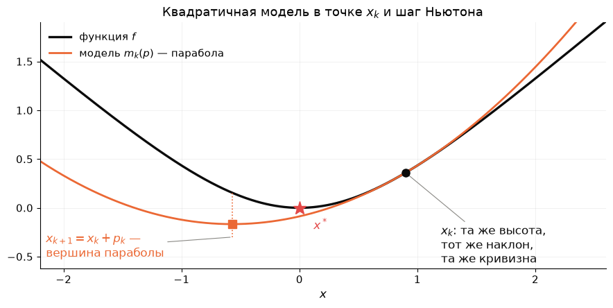

Градиентный спуск пользовался только первыми двумя слагаемыми. Линейная модель минимума не имеет, поэтому длину шага $\alpha$ пришлось назначать снаружи. Квадратичная модель — другое дело: если $\nabla^2f(x_k)\succ0$, это чаша с единственным минимумом, и его можно взять за следующую точку. Градиент модели по $p$ равен нулю, $\nabla m_k(p)=g_k+\nabla^2f(x_k)\,p=0$, — та же система, что выше. Длина шага *не выбирается*: вершина параболы сама говорит, куда и на сколько. На квадратичной функции модель совпадает с функцией, и минимум находится за один шаг — именно так в лекции 4 цепь решалась одним `np.linalg.solve`.

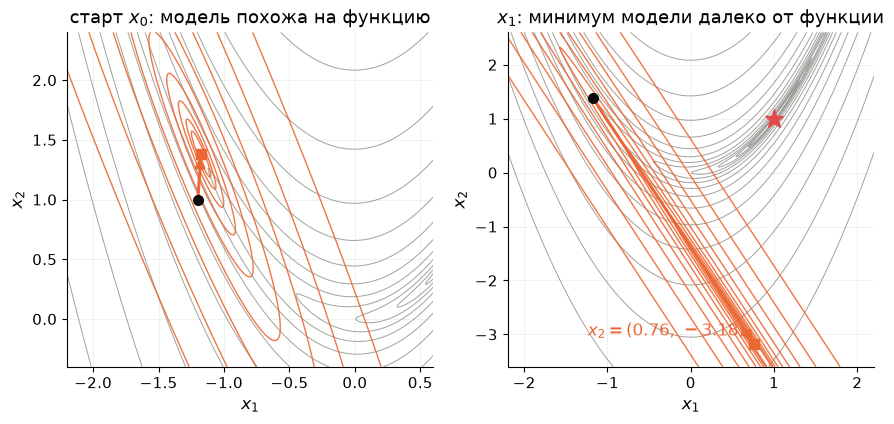

Серые линии — уровни $f$ на Розенброке, оранжевые — уровни модели $m_k$ в двух точках пути Ньютона; квадрат — минимум модели, он же следующая точка. В старте модель похожа на функцию, и шаг разумный. В точке $x_1$ модель — вытянутый эллипс, её минимум $(0.76,-3.18)$ лежит далеко от всего, что похоже на функцию, и $f$ там *больше*, чем в $x_1$. **Ньютон ошибается ровно там, где врёт модель.**

**Два следствия.** Первое: метод решает $\nabla f=0$, а нуль градиента — это и минимум, и максимум, и седло; чашу от перевала он не отличает. Отсюда синус из крючка: точка с $x_1=0$ — стационарная, и Ньютон ею вполне доволен. Второе: координаты методу безразличны. Замена переменных $x=Au$ с невырожденной $A$ переводит $f$ в $\tilde f(u)=f(Au)$; шаг Ньютона в новых координатах — это ровно тот же шаг $p$, пересчитанный в них: $A\tilde p=p$ (вывод — упражнение 11.1(б)). Путь итераций один и тот же, в каких бы единицах ни измерялись переменные. У градиентного спуска всё наоборот: замена $u_2=5x_2$ меняла число итераций с $378$ на $1$ (Л4, §5.4). Число обусловленности — свойство координат, а Ньютон координат не видит; поэтому $\kappa=2508$ Розенброка ему безразлично.

### 2.3. Одна переменная: парабола едет по функции

$f(x)=\ln\cosh x$ — гладкая чаша с минимумом в нуле, но с *убывающей* кривизной: $f''=1/\cosh^2x\to0$ на бесконечности. В точке $x_k$ модель — парабола с той же высотой, наклоном и кривизной; следующая точка — её вершина:

$$
x_{k+1}=x_k-\frac{f'(x_k)}{f''(x_k)}=x_k-\tanh x_k\cosh^2x_k=x_k-\tfrac12\sinh 2x_k .
$$

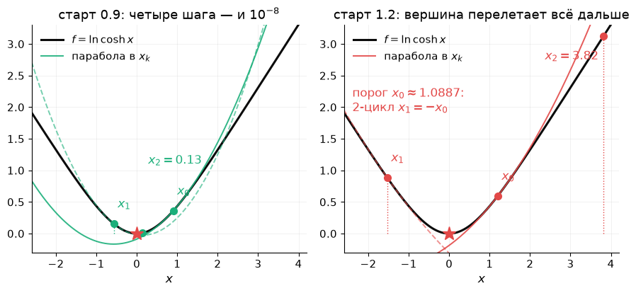

Из $x_0=0.9$ парабола стоит почти там же, где функция: ошибки $0.57,\ 0.13,\ 1.6\cdot10^{-3},\ 2.5\cdot10^{-9}$ — четыре шага, и мы на дне. Из $x_0=1.2$ кривизна в точке мала, парабола широкая, её вершина перелетает через нуль дальше, чем мы были, — и с каждым шагом дальше: $1.2\to-1.53\to3.82\to-516$. Граница между двумя исходами — старт $x_0\approx1.0886$, из которого шаг переносит ровно в $-x_0$, и метод застревает в 2-цикле.

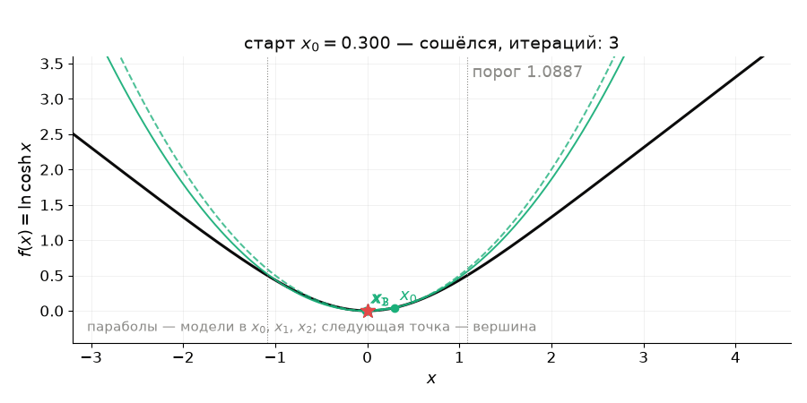

На анимации старт $x_0$ ползёт слева направо: парабола-модель становится всё шире, а её вершина — всё дальше от минимума, пока в $1.0886$ метод не перестаёт сходиться. Это и есть «модель врёт»: вторая производная в точке ничего не знает о функции вдали от неё.

**Одной строкой.** Ньютон — «линеаризуй и реши»: для уравнения $F=0$ — с якобианом, для минимума — с гессианом, потому что $F=\nabla f$; тот же шаг — минимум квадратичной модели; длину шага задаёт модель, координат метод не замечает, но верит модели и там, где она врёт.

## 3. Локальная сходимость: обрыв и его граница

### 3.1. Теорема: ошибка возводится в квадрат

Начнём с одной переменной — здесь всё доказательство укладывается в три строки. Пусть $f'(x^\ast)=0$, $f''>0$ вблизи $x^\ast$, $e_k=x_k-x^\ast$. Разложим *производную* $f'$ по Тейлору в точке $x_k$ и подставим $x^\ast=x_k-e_k$:

$$
0=f'(x^\ast)=f'(x_k)-f''(x_k)\,e_k+\tfrac12f'''(\xi)\,e_k^2
$$

для некоторого $\xi$ между $x_k$ и $x^\ast$. Разделим на $f''(x_k)$ и перенесём: $\dfrac{f'(x_k)}{f''(x_k)}=e_k-\dfrac{f'''(\xi)}{2f''(x_k)}\,e_k^2$. А шаг Ньютона вычитает из $x_k$ ровно $f'(x_k)/f''(x_k)$, поэтому

$$
e_{k+1}=e_k-\frac{f'(x_k)}{f''(x_k)}=\frac{f'''(\xi)}{2f''(x_k)}\;e_k^2 .
$$

Вот и всё: **новая ошибка — квадрат старой**, умноженный на отношение «как быстро меняется кривизна» к «какова кривизна». Если вблизи минимума $|f'''|\le M$ и $f''\ge m>0$, то $|e_{k+1}|\le\frac{M}{2m}\,e_k^2$.

Прочитаем доказательство словами. Шаг Ньютона отвечает на вопрос «где нуль у *касательной* к графику $f'$». Ошибка этого ответа — отброшенный член Тейлора, а он квадратичен по $e_k$. Коэффициент $f'''$ измеряет, насколько касательная врёт; у квадратичной функции $f'''=0$, и метод точен за один шаг.

**Теорема (в $n$ измерениях).** Пусть $\nabla f(x^\ast)=0$, в окрестности $x^\ast$ гессиан липшицев — $\lVert\nabla^2f(x)-\nabla^2f(y)\rVert\le M\lVert x-y\rVert$ — и $\nabla^2f(x)\succeq mI$ с $m>0$. Тогда для итераций Ньютона, начатых достаточно близко к $x^\ast$,

$$
\boxed{\;\lVert e_{k+1}\rVert\le\frac{M}{2m}\,\lVert e_k\rVert^2\;}
$$

Доказательство повторяет одномерное: роль $f'''$ играет липшицева константа $M$ (гессиан меняется не быстрее, чем линейно), роль $f''\ge m$ — нижняя граница собственных чисел гессиана (упражнение 11.2).

### 3.2. Что видно: цифры удваиваются

Если $C\lVert e_0\rVert<1$ при $C=M/2m$, то $C\lVert e_k\rVert\le(C\lVert e_0\rVert)^{2^k}$: число верных цифр удваивается на каждом шаге. Розенброк из $(-1.2,1)$:

| $k$ | 0 | 1 | 2 | 3 | 4 | 5 | 6 |
|---|---|---|---|---|---|---|---|
| $\lVert e_k\rVert$ | $2.2$ | $2.21$ | $4.18$ | $0.48$ | $0.056$ | $9.6\cdot10^{-6}$ | $1.9\cdot10^{-11}$ |

Три фазы. Итерации 0–2: ошибка не убывает — модель врёт, это выброс из крючка. Итерации 3–4: ошибка меньше единицы и начинает падать. С пятой — обрыв: $0.056\to10^{-5}\to10^{-11}$, по цифре, две, четыре, восемь.

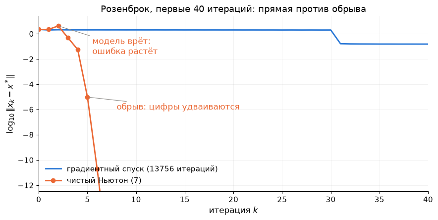

Это главный диагностический рисунок части II: спуск — прямая (линейная сходимость, $13\,756$ итераций), Ньютон — $7$ итераций с горбом в начале и обрывом в конце. Теорема описывает *тип* сходимости, а не область: для Розенброка оценка $M/2m$ гарантирует сходимость лишь из шара радиуса $3\cdot10^{-4}$ вокруг минимума (упражнение 11.2), а метод сошёлся с расстояния $2.2$.

### 3.3. Куда приходит Ньютон

Теорема обещает сходимость только из окрестности. Что снаружи? Ньютон идёт к *ближайшему в смысле модели* нулю градиента — не обязательно к минимуму и не обязательно к ближайшему геометрически.

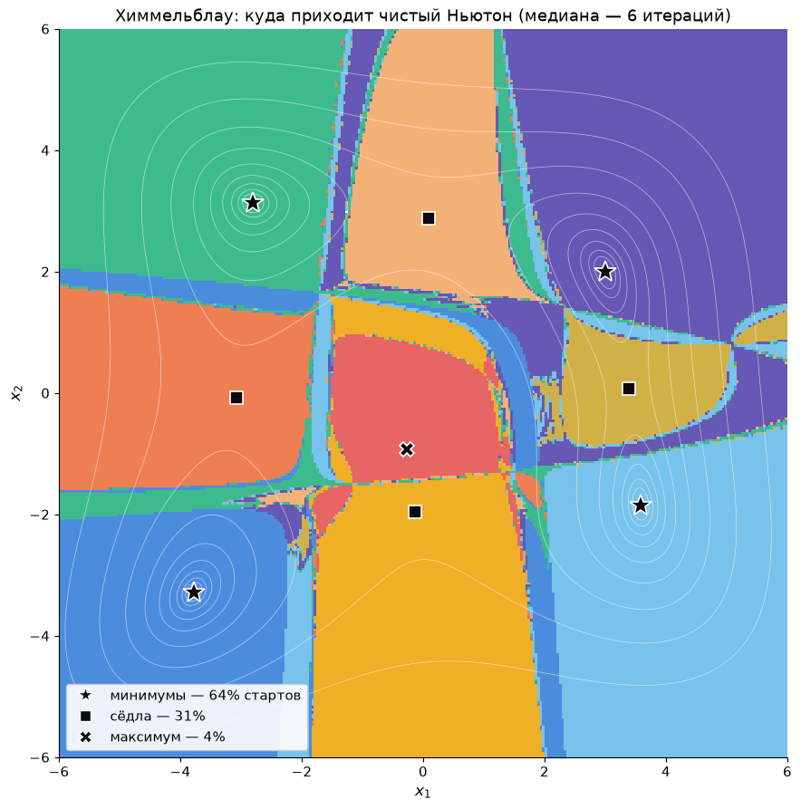

Функция Химмельблау $f=(x_1^2+x_2-11)^2+(x_1+x_2^2-7)^2$ имеет девять стационарных точек: четыре минимума, четыре седла и один локальный максимум. Из каждой точки сетки $300\times300$ запущен чистый Ньютон; цвет — куда он пришёл. Сходится почти отовсюду, в среднем за $6$ итераций, но в минимум — только из $64\,\%$ стартов; $31\,\%$ приходят в сёдла, $4\,\%$ — в максимум, и границы областей изрезаны: соседние старты уходят в разные точки. Это цена первого следствия из §2.2: метод решает $\nabla f=0$ и не отличает чашу от перевала.

Покрутить руками — старт, метод и бассейны — можно на [интерактивной странице](https://claude.ai/artifact/9NaEBdf8cjpnMbYEdW8Zy2) (исходник — [`interactive/05_newton_vs_descent.html`](interactive/05_newton_vs_descent.html)): сцена «Бассейны» на Химмельблау и парабола из §2.3 с ползунком старта; сцена «Ньютон против спуска» на Розенброке пригодится после раздела 4.

### 3.4. Демпфирование: когда модель врёт, шаг укорачиваем

Направление Ньютона хорошее, длина — нет: вдали от минимума вершина параболы может лежать там, где модель уже не имеет отношения к функции. Разделим «куда» и «на сколько»: направление по-прежнему из модели, а длину выберем так же, как в лекции 4 выбирали для спуска:

$$
\nabla^2f(x_k)\,p_k=-g_k,\qquad x_{k+1}=x_k+\alpha_k\,p_k .
$$

**Правило Армихо** (*Armijo rule*) — это backtracking из Л4 §4.5, записанный аккуратно. Начинаем с $\alpha=1$ — с шага, который предлагает сама модель, — и делим $\alpha$ пополам, пока не выполнится

$$
f(x_k+\alpha p_k)\le f(x_k)+c\,\alpha\,g_k^\top p_k,\qquad c=10^{-4}.
$$

Справа — не просто «стало меньше», а «стало меньше хотя бы на долю $c$ от того, что обещает линейная модель»: $g_k^\top p_k<0$ — обещанное убывание на единицу длины, $\alpha\,g_k^\top p_k$ — обещание на весь шаг. Без множителя $c$ метод мог бы принимать шаги с ничтожным убыванием и ползти вечно; с $c=10^{-4}$ требование почти не строже, чем «меньше», но от этого защищает. Цикл конечен: при малых $\alpha$ истинное убывание $f$ приближается к $\alpha\,g_k^\top p_k$ — к полному обещанию, — а требуется лишь его доля $c$. Метод называют **демпфированным Ньютоном** (*damped Newton*), а саму процедуру выбора длины шага вдоль направления — **линейным поиском** (*line search*); в формуле лекции это $B_k=\nabla^2f(x_k)$ и $\alpha_k$ по Армихо.

Почему демпфирование не портит скорость: вблизи минимума модель точна, шаг $\alpha=1$ уменьшает $f$ почти на половину $|g_k^\top p_k|$, и условие с $c=10^{-4}$ выполняется с первой попытки (упражнение 11.4(в)). Укорачивание включается только там, где нужно, — вдали от минимума.

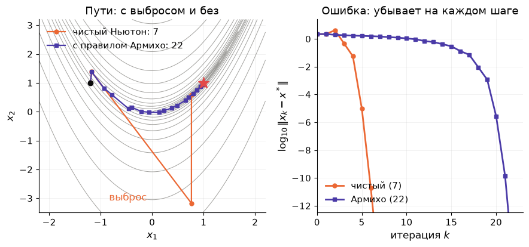

На Розенброке демпфированный Ньютон делает $22$ итерации вместо $7$, зато $f$ убывает на каждом шаге, а наибольшая ошибка по пути — $2.21$ вместо $4.18$: выброса нет. Обрыв начинается позже, потому что первые шаги укорочены; в последних итерациях Армихо принимает $\alpha=1$, и метод снова чистый Ньютон.

**Когда направление — не спуск.** Правило Армихо предполагает $g_k^\top p_k<0$: что $p_k$ вообще ведёт вниз. Для шага Ньютона $g^\top p=-g^\top\big(\nabla^2f\big)^{-1}g$, и знак зависит от гессиана. Если $\nabla^2f\succ0$ — спуск гарантирован. Если же у гессиана есть отрицательное собственное число, его называют **индефинитным** (*indefinite*): квадратичная форма $p^\top\nabla^2f\,p$ принимает и положительные, и отрицательные значения, и модель — не чаша, а седло (Л4, §3). Минимума у седла нет. Уравнение $\nabla^2f\,p=-g$ по-прежнему решается, но его решение — седловая точка модели, и шаг туда может вести *вверх* по $f$.

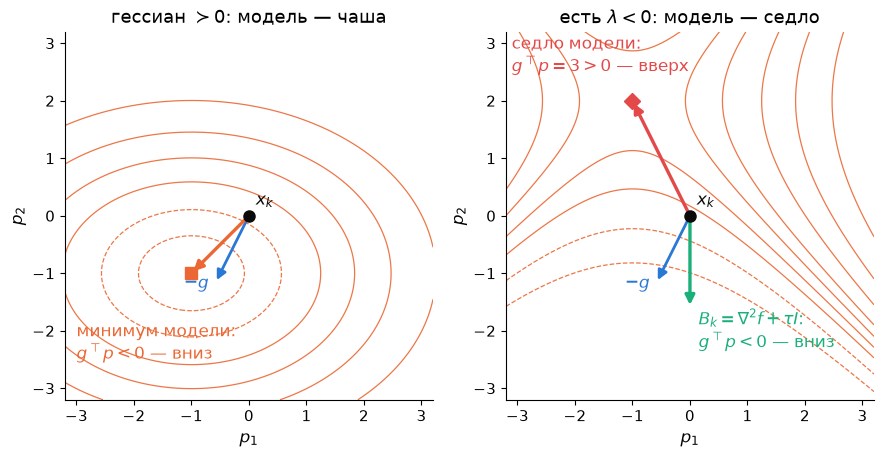

Лечение — то же, что для всякого плохого $B_k$: сделать матрицу положительно определённой, сдвинув все собственные числа на одно и то же $\tau$:

$$
B_k=\nabla^2f(x_k)+\tau I,\qquad \tau>\lvert\lambda_{\min}(\nabla^2f(x_k))\rvert .
$$

Собственные числа $B_k$ равны $\lambda_i+\tau$ — все положительные, и $p_k=-B_k^{-1}g_k$ снова направление спуска. При малом $\tau$ это почти шаг Ньютона, при $\tau\to\infty$ — короткий шаг против градиента: $\tau$ регулирует, насколько мы доверяем кривизне. В коде демо и в ДЗ 3 берётся $\tau=\lvert\lambda_{\min}\rvert+10^{-3}$, и только когда $g^\top p\ge0$. У Розенброка из $(-1.2,1)$ гессиан положительно определён во всех семи точках пути: выброс итерации 2 — не седло, а вытянутая чаша; регуляризация там не нужна, выброс убирает Армихо.

**Одной строкой.** Вблизи минимума Ньютон удваивает число верных цифр за шаг; вдали он решает $\nabla f=0$ и может прийти в седло или шагнуть вверх — длину шага чинит правило Армихо, седловую модель — сдвиг $\tau I$.

## 4. Цена гессиана и квази-ньютоновские методы

### 4.1. Сколько стоит шаг Ньютона

Градиентный спуск: один градиент, $O(n)$ памяти и операций на шаг. Ньютон: гессиан — $n(n+1)/2$ вторых производных, которые нужно *вывести* (Розенброк — три формулы, цепь — матрица $\operatorname{diag}(DK,DK)$, модель с $10^4$ параметров — уже нет), плюс решение системы $n\times n$ — $O(n^3)$. Для цепи $N=400$ это $800\times800$ и доли секунды, для $n=10^5$ — невозможно.

Вопрос: нельзя ли получить кривизну даром — из того, что мы и так считаем?

### 4.2. Секущее уравнение

Одна переменная. Два последних градиента $f'(x_k)$, $f'(x_{k+1})$ и расстояние $s_k=x_{k+1}-x_k$ между точками дают оценку второй производной — наклон секущей:

$$
f''\approx\frac{f'(x_{k+1})-f'(x_k)}{x_{k+1}-x_k}=\frac{y_k}{s_k},\qquad y_k=f'(x_{k+1})-f'(x_k).
$$

Это **метод секущих**: Ньютон, в котором $f''$ заменена разностным отношением. В $n$ измерениях мы хотим матрицу $B_{k+1}\approx\nabla^2f$, которая так же согласуется с последней парой $(s_k,y_k)$:

$$
\boxed{\;B_{k+1}s_k=y_k\;}\qquad s_k=x_{k+1}-x_k,\quad y_k=g_{k+1}-g_k.
$$

Это **секущее уравнение** (*secant equation*): кривизна модели вдоль только что пройденного направления равна измеренной. Для квадратичной функции оно точно: $y_k=Qs_k$. Но при $n>1$ уравнение даёт $n$ условий на $n(n+1)/2$ элементов симметричной матрицы — решений много. Нужно правило выбора.

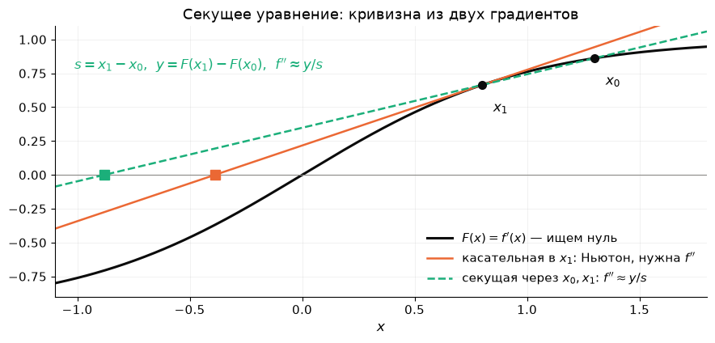

### 4.3. Обновление BFGS

Правило BFGS (Бройден, Флетчер, Гольдфарб, Шанно, 1970): взять $B_{k+1}$, **ближайшую к $B_k$** среди симметричных матриц, удовлетворяющих секущему уравнению (в подходящей взвешенной норме). Ответ выписывается в замкнутом виде — обновление ранга два:

$$
B_{k+1}=B_k-\frac{B_ks_ks_k^\top B_k}{s_k^\top B_ks_k}+\frac{y_ky_k^\top}{y_k^\top s_k}.
$$

На практике удобнее обновлять сразу обратную матрицу $H_k=B_k^{-1}$ — тогда шаг $p_k=-H_kg_k$ не требует решения системы (формула Шермана–Моррисона превращает обновление ранга два для $B$ в такое же для $H$):

$$
\boxed{\;H_{k+1}=\big(I-\rho_ks_ky_k^\top\big)H_k\big(I-\rho_ky_ks_k^\top\big)+\rho_ks_ks_k^\top,\qquad\rho_k=\frac1{y_k^\top s_k}\;}
$$

Два свойства, которые делают формулу рабочей (доказательство — упражнение 11.6):

- $H_{k+1}$ **симметрична** и удовлетворяет секущему уравнению $H_{k+1}y_k=s_k$ — проверяется подстановкой;
- если $H_k\succ0$ и $s_k^\top y_k>0$, то $H_{k+1}\succ0$ — значит, $p_{k+1}=-H_{k+1}g_{k+1}$ снова направление спуска.

Условие $s_k^\top y_k>0$ называют **условием кривизны** (*curvature condition*): вдоль пройденного шага градиент вырос в направлении шага, то есть кривизна положительна. На выпуклой функции оно выполнено при любом шаге; в общем случае его нужно обеспечить выбором длины шага. Для этого к правилу Армихо добавляют вторую проверку — **условие кривизны Вольфе** (*Wolfe curvature condition*): $\nabla f(x_k+\alpha p_k)^\top p_k\ge c_2\,g_k^\top p_k$ при $c_2=0.9$, то есть наклон вдоль направления после шага должен стать заметно менее отрицательным, чем был. Пара «Армихо + Вольфе» гарантирует $s^\top y>0$; так устроен линейный поиск в SciPy. Наш код в демо и ДЗ 3 обходится одним Армихо и просто пропускает обновление, если $s^\top y\le0$.

Метод BFGS: $H_0=I$ (первый шаг — градиентный), далее $p_k=-H_kg_k$, длина шага — по Армихо, обновление $H$ по паре $(s_k,y_k)$. В формуле лекции $B_k=H_k^{-1}$. Цена шага: $O(n^2)$ операций и памяти, **никаких вторых производных**.

### 4.4. BFGS учится эллипсу и сходится сверхлинейно

Квадратичная $f=\tfrac12(x_1^2+50x_2^2)$ из лекции 4, старт $(50,1)$, точный линейный поиск. $H_0=I$ — модель-круг. После первого шага и обновления модель знает кривизну вдоль пройденного направления; после второго — вдоль обоих: $H_2=Q^{-1}=\operatorname{diag}(1,\,0.02)$ **точно**, и метод в минимуме за $2$ итерации против $567$ у спуска с точным шагом. Это общий факт: на квадратичной функции BFGS с точным поиском восстанавливает $Q^{-1}$ и сходится не более чем за $n$ шагов.

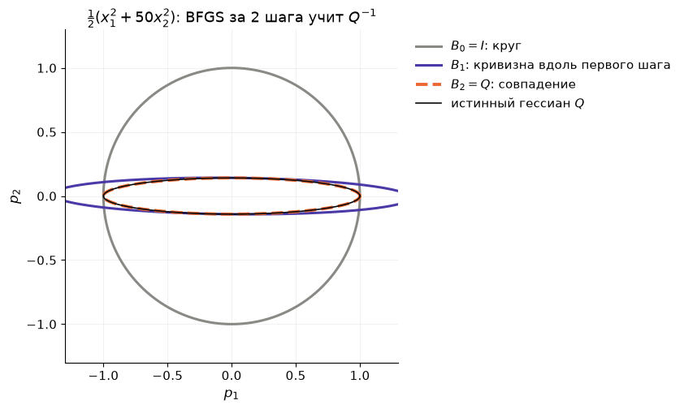

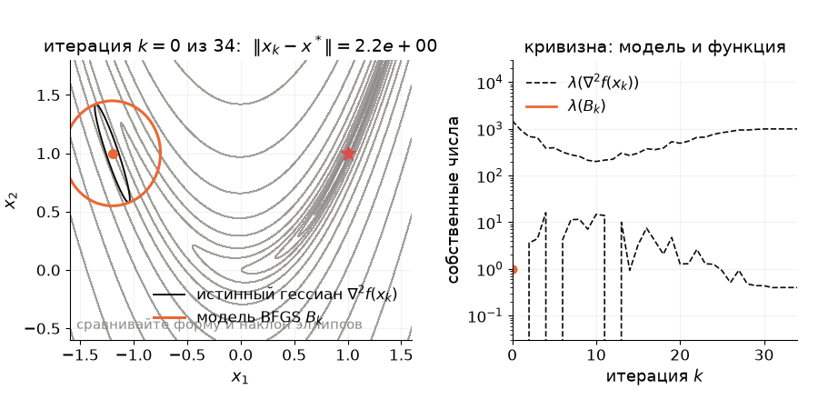

На анимации — BFGS на Розенброке: оранжевый эллипс — модель $B_k$, чёрный — истинный гессиан в той же точке. Первые итерации модель-круг не похожа на функцию; к концу эллипсы совпадают по форме и наклону, и шаги становятся ньютоновскими.

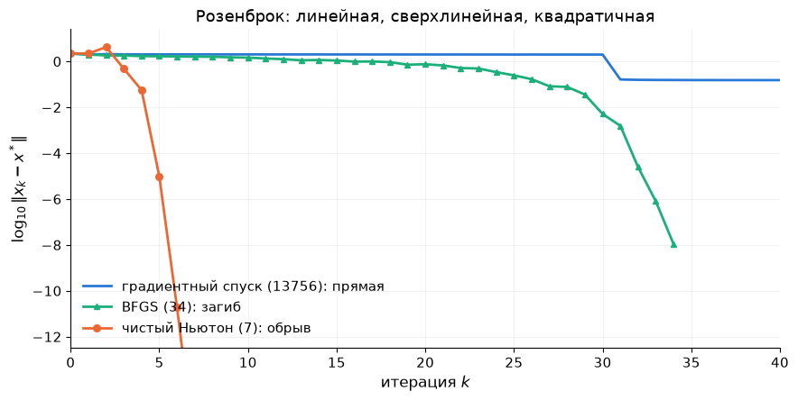

**Сверхлинейная сходимость.** Розенброк из $(-1.2,1)$: наш BFGS — $34$ итерации и $54$ вычисления $f$; `scipy.optimize.minimize(method="BFGS")` — $33$ итерации и $40$ вычислений. Кривая ошибки загибается всё круче, но не так резко, как у Ньютона: хвост отношений $\lVert e_{k+1}\rVert/\lVert e_k\rVert$ — $0.30,\ 0.016,\ 0.032,\ 0.014,\ 0.012$ — стремится к нулю, но не квадратично (там было бы $10^{-5}$). Это **сверхлинейная** сходимость, и она равносильна тому, что $B_k$ приближает гессиан вдоль направлений шагов (теорема Денниса–Морé, Nocedal & Wright, §6.4). Предупреждение: с одним лишь Армихо BFGS хрупок — на цепи $N=40$ он не сходится за $10\,000$ итераций, а SciPy с условием Вольфе сходится за $68$ (упражнение 11.9).

### 4.5. L-BFGS: кривизна с ограниченной памятью

$H_k$ — плотная $n\times n$: при $n=10^6$ не поместится. Но $H_k$ построена из $H_0=I$ и $k$ пар $(s_i,y_i)$ — хранить можно сами пары, а произведение $H_kg$ вычислять рекурсивно без матрицы (*two-loop recursion*). **L-BFGS** (*limited memory*) хранит лишь $m$ последних пар ($m=5$–$20$), остальное забывает; память и шаг — $O(mn)$. Начальную матрицу берут не $I$, а $\gamma_kI$ с $\gamma_k=s_k^\top y_k/y_k^\top y_k$ — грубая оценка масштаба кривизны. Сходимость — линейная, но с множителем много лучше, чем у спуска. В SciPy это `method="L-BFGS-B"` (буква B — ещё и ограничения-ящик); он стоит внутри большинства библиотек, где переменных миллионы.

**Одной строкой.** Квази-Ньютон измеряет кривизну разностью градиентов и накапливает её в $H_k$ по секущему уравнению; BFGS сходится сверхлинейно за цену градиента, L-BFGS помнит только $m$ последних шагов.

## 5. Ньютон для суммы квадратов: Гаусс–Ньютон и Левенберг–Марквардт

### 5.1. Структура нелинейного МНК

Подгонка модели к данным — минимизация суммы квадратов невязок:

$$
f(x)=\tfrac12\lVert r(x)\rVert^2=\tfrac12\sum_{i=1}^m r_i(x)^2,\qquad r_i(x)=\varphi(t_i;x)-y_i .
$$

Здесь $m$ — число измерений, $n$ — число параметров, обычно $m\ge n$. Обозначим $J(x)$ — матрицу Якоби невязок, $J_{ij}=\partial r_i/\partial x_j$ (размер $m\times n$). По цепному правилу

$$
\nabla f=J^\top r,\qquad
\nabla^2f=J^\top J+\sum_{i=1}^m r_i\,\nabla^2r_i .
$$

Ньютон из §2.2 для этой задачи — точный ньютоновский шаг для МНК:

$$
\Big(J^\top J+\sum_{i=1}^m r_i\nabla^2r_i\Big)\,p=-J^\top r .
$$

Первый член гессиана — $J^\top J$ — собирается из тех же первых производных, что и градиент: он **бесплатен**. Второй требует гессианов всех $m$ невязок — дорого и неудобно — и пропорционален самим невязкам $r_i$.

### 5.2. Гаусс–Ньютон

**Идея.** Отбросим второй член: $\nabla^2f\approx J^\top J$, то есть $B_k=J_k^\top J_k$. Получаем **метод Гаусса–Ньютона** (*Gauss–Newton*):

$$
\boxed{\;J_k^\top J_k\,p_k=-J_k^\top r_k\;}
$$

**Второй вывод — через линеаризацию невязок.** Как в §2.1, линеаризуем — но не градиент, а невязку: $r(x_k+p)\approx r_k+J_kp$. Тогда $f(x_k+p)\approx\tfrac12\lVert J_kp+r_k\rVert^2$, и минимизация этой модели по $p$ — обычный **линейный** МНК $\min_p\lVert J_kp+r_k\rVert^2$ из лекции 1 (§7.1). Условие минимума $J_k^\top(J_kp+r_k)=0$ — та же система. Значит, Гаусс–Ньютон — это линейная задача подгонки на каждом шаге: в коде `np.linalg.lstsq(J, -r)`, без единой второй производной. Если невязки линейны, один шаг даёт точный ответ.

**Алгоритм.** Из $x_0$: вычислить $r_k$, $J_k$; решить $\min_p\lVert J_kp+r_k\rVert^2$; $x_{k+1}=x_k+\alpha_kp_k$, где $\alpha_k=1$ (чистый метод) или по правилу Армихо из §3.4 (демпфированный). Остановка — $\lVert J^\top r\rVert\le\varepsilon$.

**Сходимость.** Если $J$ полного столбцового ранга, $J^\top J\succ0$: шаг определён, и $g^\top p=-r^\top J(J^\top J)^{-1}J^\top r<0$ — **шаг Гаусса–Ньютона всегда направление спуска**, седловые модели ему недоступны по построению. Ошибка модели — отброшенный член $S(x)=\sum r_i\nabla^2r_i$. Если невязки в решении малы (данные почти без шума) или почти линейны, $S^\ast\approx0$, $J^\top J\approx\nabla^2f$, и метод сходится почти как Ньютон; при больших невязках — линейно, с множителем порядка $\lVert S^\ast\rVert/\lVert J^{\ast\top}J^\ast\rVert$, а может и разойтись. Если $J^\top J$ вырождена или плохо обусловлена, шаг огромен и неустойчив.

Синус из ДЗ 2 в решении $x^\ast=(2.1014,\ 2.9967,\ 0.7003)$: собственные числа $J^\top J$ — $17.6,\ 31.1,\ 1935.6$, полного гессиана — $17.9,\ 31.1,\ 1927.3$. Отличие меньше $2\,\%$: шум $0.2$ при амплитуде $2$ — малые невязки. Гаусс–Ньютон из $(1,3,0)$: $7$ итераций, ошибки $1.3\to0.83\to0.45\to0.047\to0.0018\to3\cdot10^{-5}\to10^{-6}$, хвост отношений $\approx0.02$ — формально линейная сходимость, но с множителем, который на глаз не отличить от обрыва.

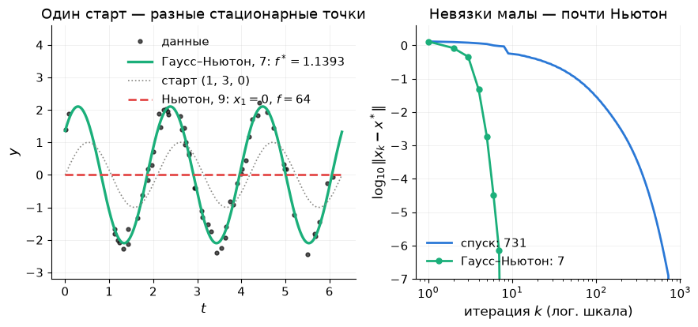

**Почему Ньютон ушёл в нуль, а Гаусс–Ньютон — нет.** У модели $x_1\sin(x_2t+x_3)$ есть стационарные точки с $x_1=0$: при нулевой амплитуде производные по частоте и фазе обращаются в нуль автоматически, а производная по амплитуде зануляется, когда $\sin(x_2t+x_3)$ ортогонален данным. Таких точек бесконечно много, и из $(1,3,0)$ полный гессиан — с членом $S$, который вдали от решения *не* мал, — ведёт Ньютона именно туда: нуль градиента найден, $f=\tfrac12\lVert y\rVert^2\approx64$, модель бесполезна. У Гаусса–Ньютона такого соблазна нет: его шаг всегда вниз по $f$. Отброшенный член не только дорог, но и вреден вдали от решения.

**Когда брать Гаусса–Ньютона:** нелинейный МНК с малыми невязками или хорошо линеаризуемой моделью, хорошее начальное приближение, $J$ полного ранга, и не хочется считать вторые производные.

### 5.3. Левенберг–Марквардт

**Зачем.** Гаусс–Ньютон может сделать слишком большой шаг, разойтись из плохого старта и сломаться, если $J^\top J$ вырождена — как при $x_1=0$, где два столбца $J$ нулевые. Лечение — тот же сдвиг, что в §3.4:

$$
\boxed{\;(J_k^\top J_k+\lambda_kI)\,p_k=-J_k^\top r_k,\qquad\lambda_k\ge0\;}
$$

(в масштабированном варианте вместо $I$ берут $\operatorname{diag}(J^\top J)$, чтобы сдвиг не зависел от единиц измерения параметров). Это **метод Левенберга–Марквардта** (*Levenberg–Marquardt*); в формуле лекции $B_k=J^\top J+\lambda_kI$, $\alpha_k=1$.

**Откуда берётся.** Добавим к линейному МНК штраф за длину шага: $\min_p\lVert J_kp+r_k\rVert^2+\lambda\lVert p\rVert^2$. Условие минимума $J^\top(Jp+r)+\lambda p=0$ — та же система. Иначе говоря, шаг минимизирует линейную модель невязок, но не уходит далеко от $x_k$ — остаётся в шаре $\lVert p\rVert\le\Delta$, где этой модели ещё можно верить; чем больше $\lambda$, тем меньше шар.

**Предельные случаи.** При $\lambda\to0$ — Гаусс–Ньютон. При $\lambda\to\infty$ система превращается в $\lambda p\approx-J^\top r$, то есть $p\approx-\tfrac1\lambda\nabla f$ — градиентный спуск с маленьким шагом $1/\lambda$. Левенберг–Марквардт **интерполирует** между быстрым, но хрупким Гауссом–Ньютоном и медленным, но надёжным спуском: вместо длины шага $\alpha$ (как у Армихо) метод подкручивает $\lambda$.

**Алгоритм.** Старт $x_0$, $\lambda_0=10^{-3}\max_i(J^\top J)_{ii}$. На каждом шаге: вычислить $r$, $J$, $f=\tfrac12\lVert r\rVert^2$; решить систему с $\lambda$; получить $x_{\text{new}}=x_k+p$ и $f_{\text{new}}$; сравнить фактическое уменьшение с предсказанным линейной моделью $L(p)=\tfrac12\lVert r+Jp\rVert^2$ — **отношение выигрыша**

$$
\rho=\frac{f-f_{\text{new}}}{L(0)-L(p)} .
$$

Если $\rho>0$, шаг принять; при $\rho>0.75$ модель хороша — уменьшить $\lambda$ (например, втрое), при $\rho<0.25$ — увеличить (вдвое). Если $\rho\le0$, шаг отвергнуть, $\lambda$ удвоить и решить систему заново. Остановка: $\lVert J^\top r\rVert_\infty<\varepsilon_1$ или $\lVert p\rVert<\varepsilon_2(\lVert x\rVert+\varepsilon_2)$.

**Свойства.** $J^\top J+\lambda I\succ0$ при $\lambda>0$, даже если $J^\top J$ вырождена; метод гораздо устойчивее Гаусса–Ньютона, работает из плохого старта и при больших невязках; когда Гаусс–Ньютон и так хорош, Левенберг–Марквардт может быть чуть медленнее; $\lambda$ настраивается сам по $\rho$. Это стандарт для подгонки кривых: в SciPy — `scipy.optimize.least_squares(..., method="lm")`, на синусе — $7$ вычислений невязки и тот же ответ. Локальность никуда не делась: из $20$ случайных стартов ДЗ 2 демпфированный Гаусс–Ньютон приходит к глобальному $f^\ast=1.1393$ в $12$ случаях, остальные — в локальные минимумы с другой частотой; быстрый локальный метод не отменяет мультистарта, но делает каждый старт дешёвым.

**Одной строкой.** Гаусс–Ньютон — это Ньютон для суммы квадратов с гессианом $J^\top J$ (бесплатная половина, всегда спуск, почти квадратичная скорость при малых невязках); Левенберг–Марквардт — Гаусс–Ньютон со сдвигом $\lambda I$, который сам балансирует между Гауссом–Ньютоном и градиентным спуском.

## 6. Таблица заполнена: три задачи, пять методов

| Метод | Что решает | $B_k$ | Что нужно | Цена шага | Сходимость | Розенброк из $(-1.2,1)$ |
|---|---|---|---|---|---|---|
| Ньютон для уравнений | $F(x)=0$ | якобиан $J_F$ | $F$, $J_F$ | $O(n^3)$ | квадратичная вблизи корня | — |
| градиентный спуск | $\min f$ | $I$ | $\nabla f$ | $O(n)$ | линейная, $\propto\kappa$ | $13\,756$ |
| Ньютон | $\min f$ через $\nabla f=0$ | $\nabla^2f(x_k)$ | $\nabla f$, $\nabla^2f$, решение системы | $O(n^3)$ | квадратичная вблизи; вдали может уйти | $7$ (с Армихо — $22$) |
| BFGS | $\min f$ | $H_k^{-1}$ по секущему уравнению | $\nabla f$ | $O(n^2)$ | сверхлинейная | $34$ (SciPy — $33$) |
| L-BFGS, память $m$ | $\min f$ | то же, $m$ последних пар | $\nabla f$ | $O(mn)$ | линейная, множитель много лучше спуска | $36$ (SciPy) |
| Гаусс–Ньютон | $\min\tfrac12\lVert r\rVert^2$ | $J^\top J$ | $r$, $J$ | $O(mn^2)$ | почти квадратичная при малых невязках | синус: $7$ против $731$ у спуска |
| Левенберг–Марквардт | $\min\tfrac12\lVert r\rVert^2$ | $J^\top J+\lambda I$ | $r$, $J$ | $O(mn^2)$ | надёжная: от линейной до квадратичной | синус: $7$ вычислений $r$ |

**Биография цепи.** Одна и та же выпуклая квадратичная задача, $N=40$, $80$ переменных, останов по $\lVert\nabla E\rVert\le10^{-6}$:

| Лекция | Метод | Итераций | Что нового |
|---|---|---|---|
| 1 | солвер как чёрный ящик | — | постановка задачи |
| 4 | градиентный спуск, шаг $1/L$ | $10\,575$ | $\propto\kappa=681$ |
| 5 | Ньютон | $1$ | модель точна: один `np.linalg.solve` |
| 5 | BFGS, точный шаг | $20$ | не больше числа различных собственных чисел гессиана |
| 5 | L-BFGS, память 5 (SciPy) | $75$ | $O(mn)$ памяти — пригоден и при $N=10^5$ |

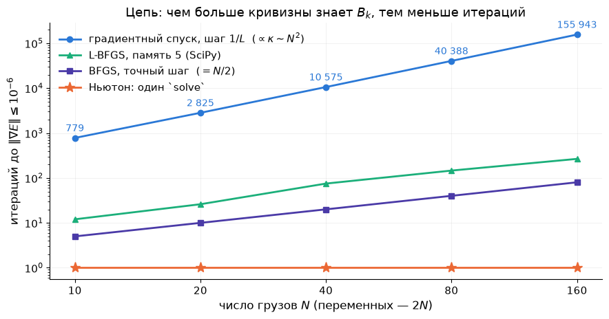

Спуск растёт как $N^2$ (за $\kappa$), BFGS — как $N/2$ (точный поиск на квадратичной), L-BFGS — примерно как $N$, Ньютон — константа. При $N=160$ спуск делает $155\,943$ итерации и около $10$ секунд, Ньютон — миллисекунды. Но Ньютон хранит и решает систему $2N\times2N$: при $N=10^5$ останутся только L-BFGS и спуск.

**Одной строкой.** Ньютон — линеаризуй и реши; Ньютон для оптимизации — Ньютон для $\nabla f=0$ с гессианом; BFGS — Ньютон с кривизной, выученной из градиентов; Гаусс–Ньютон — Ньютон для суммы квадратов с $J^\top J$; Левенберг–Марквардт — Гаусс–Ньютон со сдвигом $\lambda I$. Чем больше кривизны знает $B_k$, тем меньше итераций и дороже каждая: $O(n)$, $O(mn)$, $O(n^2)$, $O(n^3)$ за шаг.

## 7. Что это даёт численно

- **Диагноз по графику** $\log\lVert\nabla f(x_k)\rVert$: прямая — метод первого порядка, читайте $\kappa$ (Л4, §5); кривая загибается всё круче — квази-Ньютон работает; обрыв — ньютоновская область. Горб в начале у Ньютона — модель врала, нужен Армихо.
- **Стационарная точка — ещё не минимум**, и Ньютон этого не проверяет: собственные числа гессиана в найденной точке (Л4, §3) — обязательный финальный шаг.
- **`scipy.optimize.minimize`**: `BFGS` по умолчанию (градиент — аналитический через `jac=` или конечные разности); `L-BFGS-B` — когда переменных тысячи. **Подгонка кривых** — всегда `scipy.optimize.least_squares` (внутри Левенберг–Марквардт), а не `minimize` суммы квадратов: структура $J^\top J$ стоит нескольких порядков скорости, а $\lambda$ страхует от плохого старта.
- **ДЗ 3**: вы напишете направление Ньютона с регуляризацией, шаг по Армихо, обновление BFGS и шаг Гаусса–Ньютона сами и воспроизведёте числа этой лекции на Розенброке, цепи и синусе. Сцена «Ньютон против спуска» на [интерактивной странице](https://claude.ai/artifact/9NaEBdf8cjpnMbYEdW8Zy2) показывает те же $13\,756$ / $7$ / $22$ / $34$ из любого старта.

## 8. Итоги лекции

1. Все методы лекции — одна формула $x_{k+1}=x_k-\alpha_kB_k^{-1}\nabla f(x_k)$; отличается только то, что $B_k$ знает о кривизне (введение, раздел 6).
2. Ньютон — «линеаризуй и реши»: для уравнения $F=0$ с якобианом, для минимума — с гессианом, потому что минимум — это $\nabla f=0$; тот же шаг — минимум квадратичной модели. Длину шага задаёт модель, координаты метод не замечает (раздел 2).
3. Вблизи минимума ошибка возводится в квадрат: $\lVert e_{k+1}\rVert\le\frac M{2m}\lVert e_k\rVert^2$ — число верных цифр удваивается, $7$ итераций на Розенброке (раздел 3).
4. Вдали модель врёт: Ньютон приходит в сёдла и максимумы ($36\,\%$ стартов на Химмельблау), а при индефинитном гессиане может шагнуть вверх; правило Армихо чинит длину шага ($22$ итерации), сдвиг $\tau I$ — седловую модель (раздел 3).
5. Секущее уравнение $B_{k+1}s_k=y_k$ измеряет кривизну разностью градиентов; BFGS — обновление ранга два, сохраняющее $\succ0$ при $s^\top y>0$; сходимость сверхлинейная, $34$ итерации без единой второй производной; L-BFGS помнит $m$ пар — метод для миллиона переменных (раздел 4).
6. Гаусс–Ньютон — Ньютон для суммы квадратов с гессианом $J^\top J$ (бесплатная половина): всегда спуск, $7$ итераций против $731$; Левенберг–Марквардт — Гаусс–Ньютон со сдвигом $\lambda I$, который по отношению выигрыша $\rho$ сам балансирует между Гауссом–Ньютоном и градиентным спуском; на цепи $10\,575\to20\to1$ (разделы 5–6).

## 9. Что дальше

**Лекция 6** — глобализация: как выбирать длину шага и радиус доверия модели так, чтобы любой из сегодняшних методов сходился из любого старта, и метод сопряжённых градиентов. **Лекция 7** — как считать производные: конечные разности и алгоритмическое дифференцирование, CasADi всерьёз.

**ДЗ 3** выдаётся сегодня, срок — 21 октября: градиентный спуск, Ньютон, BFGS и Гаусс–Ньютон — реализация и сравнение на задачах этой лекции ([карточка](../../homeworks/hw03.md), [ноутбук](../../homeworks/hw03.ipynb)). **ДЗ 2** — срок сегодня.

**Литература к лекции.** Diehl, гл. 5–6 (Newton-type methods, local convergence); Nocedal & Wright, §3.3 (Newton), гл. 6 (quasi-Newton, BFGS), §7.2 (L-BFGS), §10.1–10.3 (least squares, Gauss–Newton, Levenberg–Marquardt); Boyd & Vandenberghe, §9.5 (Newton's method); Поляк, гл. 1 (метод Ньютона и квазиньютоновские методы).

## 10. Семинар: свой Ньютон и BFGS против SciPy

Весь семинар — за ноутбуком [`seminar05.ipynb`](seminar05.ipynb) (~30 минут), только numpy и scipy. Пишем методы сами по формулам лекции, каждое число сверяем с конспектом и со SciPy.

| Мин | Часть |
|-----|------|
| 12 | **Часть 1 — Ньютон.** Чистый Ньютон за десять строк: $7$ итераций, таблица ошибок, выброс итерации 2; вопрос залу: `minimize(method="BFGS")` без единой второй производной — $33$ итерации, как?; добавляем Армихо — $22$ |
| 18 | **Часть 2 — BFGS и Гаусс–Ньютон.** Секущее уравнение на квадратичной: два обновления — и $H_2=Q^{-1}$ (упражнение 11.5); BFGS на Розенброке — $34$ итерации и $54$ вызова против $33$ и $40$ у SciPy, и почему; соревнование «из какого старта BFGS сойдётся быстрее всех?»; Гаусс–Ньютон на синусе ДЗ 2 — $7$ против $731$ у спуска и против Ньютона в $x_1=0$ |

Дома: 11.0–11.4, 11.6, 11.8–11.10; 11.5 и 11.7 — повторение семинара. Затем демонстрации (a)–(d) в `demo05.ipynb`.

## 11. Упражнения

Для разбора на занятии и самостоятельно. У каждой задачи курсивом — её суть одной фразой. Подробный разбор с проверкой кодом — ноутбук [`exercises05.ipynb`](exercises05.ipynb), краткие ответы — [`exercises05.md`](exercises05.md).

**11.0. Разминка — счёт руками.** Шесть пунктов по минуте. *Суть: шаг Ньютона, секущая и структура МНК — на бумаге, без компьютера.*

- (а) $f(x)=\tfrac12(x_1^2+9x_2^2)-x_1-9x_2$. Сделайте один шаг Ньютона из $(0,0)$. Куда попали? Проверьте, что $\nabla f=0$.
- (б) $\sqrt2$ методом Ньютона для $F(x)=x^2-2$ из $x_0=1$: выпишите $x_1,x_2,x_3$ и число верных цифр каждого.
- (в) Метод секущих для $f(x)=x^4$: по точкам $x_0=1$, $x_1=0.5$ оцените $f''$ через $y/s$ и сравните с $f''(0.5)=3$ и $f''(1)=12$.
- (г) $f=\tfrac12\lVert r\rVert^2$, $r(x)=(x_1-1,\ x_1x_2)$. Выпишите $J$, $J^\top J$ и полный $\nabla^2f$. Какой член отбрасывает Гаусс–Ньютон и когда он равен нулю?
- (д) Повторение Л4: $\kappa$ гессиана Розенброка в $(1,1)$ по следу и определителю ($\operatorname{tr}=1002$, $\det=400$). Почему это число не влияет на метод Ньютона?
- (е) $B=\operatorname{diag}(1,-1)$. Для $g=(1,0)$ и для $g=(0,1)$ найдите $p=-B^{-1}g$ и знак $g^\top p$: спуск или подъём?

**11.1. Два прочтения шага Ньютона.** *Суть: минимум модели и нуль линеаризованного градиента — одна формула; координаты она не видит.*

- (а) Покажите, что $\nabla m_k(p)=0$ и линеаризация $\nabla f(x_k+p)\approx0$ дают один и тот же $p$.
- (б) Докажите аффинную инвариантность: при $x=Au$ градиент и гессиан переходят в $A^\top\nabla f$ и $A^\top\nabla^2f\,A$, а шаги связаны как $A\tilde p=p$ (§2.2).
- (в) Градиентный спуск такой инвариантностью не обладает: покажите на $f=\tfrac12(x_1^2+25x_2^2)$ и замене $u_2=5x_2$, что шаг $-\alpha\nabla\tilde f$ в $u$ не равен пересчитанному шагу $-\alpha\nabla f$ в $x$.

**11.2. Квадратичная сходимость в $n$ измерениях** (домашняя). *Суть: ошибка Ньютона — это ошибка модели, а она квадратична.*

- (а) Докажите теорему §3.1 в $n$ измерениях. План: $e_{k+1}=\nabla^2f(x_k)^{-1}\big(\nabla^2f(x_k)e_k-g_k\big)$; по формуле Ньютона–Лейбница $g_k=\int_0^1\nabla^2f(x^\ast+te_k)\,e_k\,dt$; расстояние от $x_k$ до $x^\ast+te_k$ равно $(1-t)\lVert e_k\rVert$. Укажите, где используется липшицевость гессиана и где — $\nabla^2f\succeq mI$.
- (б) Для Розенброка оцените $M$ (норму производной гессиана по $x$ в окрестности $(1,1)$) и $m=\lambda_{\min}=0.3994$. Чему равен радиус шара, в котором теорема гарантирует сходимость?
- (в) Сравните $C=M/2m$ с измеренными $C_k=\lVert e_{k+1}\rVert/\lVert e_k\rVert^2$ по таблице §3.2. Почему оценка настолько пессимистична?

**11.3. Сломай метод.** *Суть: у Ньютона есть порог старта, за которым он расходится; демпфирование снимает порог.*

- (а) Для $f=\ln\cosh x$ выпишите итерацию и найдите численно порог $x_0^\ast$, при котором $x_1=-x_0$ (2-цикл). Ответ $\approx1.0886$.
- (б) То же для решения $\arctan x=0$ методом Ньютона: порог $\approx1.3917$.
- (в) Объясните по картинке §2.3, почему ниже порога метод сходится, а выше — расходится.
- (г) Добавьте к шагу правило Армихо для $f=\ln\cosh x$. Сходится ли метод из $x_0=5$? За сколько итераций?

**11.4. Ньютон на седловой модели и демпфирование.** *Суть: при индефинитном гессиане «минимум модели» — седло, и шаг может вести вверх.*

- (а) $f=x_1^2-x_2^2+x_2^4/4$: найдите стационарные точки и их тип. Покажите, что из любой точки с $x_2^2<1/3$ шаг Ньютона ведёт в седло $(0,0)$.
- (б) Для Розенброка проверьте: $\det\nabla^2f=80\,000\,(x_1^2-x_2+0.005)$, так что гессиан индефинитен при $x_2>x_1^2+0.005$. Приведите точку, где $g^\top p>0$ для ньютоновского $p$.
- (в) Почему вблизи минимума демпфированный Ньютон принимает $\alpha=1$ и сохраняет квадратичную сходимость? Подсказка: Армихо с $c<1/2$ и квадратичная модель, которая точна в пределе.

**11.5. BFGS руками.** *Суть: два обновления на квадратичной $2\times2$ восстанавливают $Q^{-1}$ целиком.* Разбирается на семинаре.

- (а) $f=\tfrac12(x_1^2+50x_2^2)$, $x_0=(50,1)$, $H_0=I$. Первый шаг — градиентный с точным $\alpha=\lVert g\rVert^2/g^\top Qg$ (Л4, §4.4). Выпишите $s_0$, $y_0=Qs_0$ и проверьте $s_0^\top y_0>0$.
- (б) Вычислите $H_1$ по формуле BFGS и проверьте $H_1y_0=s_0$.
- (в) Сделайте второй шаг $p_1=-H_1g_1$ с точным поиском и получите $H_2$. Убедитесь, что $H_2=Q^{-1}$ и что $x_2=0$.

**11.6. Свойства обновления BFGS** (домашняя). *Суть: симметрия, секущее уравнение и положительная определённость — всё проверяется подстановкой.*

- (а) Проверьте $H_{k+1}y_k=s_k$ прямой подстановкой в формулу §4.3.
- (б) Докажите: если $H_k\succ0$ и $s_k^\top y_k>0$, то $H_{k+1}\succ0$. Подсказка: для любого $z\ne0$ запишите $z^\top H_{k+1}z=w^\top H_kw+\rho_k(s_k^\top z)^2$ с $w=z-\rho_k(s_k^\top z)y_k$ и разберите случай $w=0$.
- (в) Почему на выпуклой функции $s^\top y>0$ при любом шаге, а на невыпуклой — нет? Приведите пример с $f=-x^2$.

**11.7. Гаусс–Ньютон.** *Суть: половина гессиана бесплатна, всегда $\succeq0$ и даёт спуск; вторая половина вдали от решения вредна.* Разбирается на семинаре.

- (а) Выведите $\nabla f=J^\top r$ и $\nabla^2f=J^\top J+\sum r_i\nabla^2r_i$ для $f=\tfrac12\lVert r\rVert^2$.
- (б) Покажите, что шаг Гаусса–Ньютона — решение линейного МНК $\min_p\lVert Jp+r\rVert^2$, и что при полном столбцовом ранге $J$ он — направление спуска.
- (в) Для синуса $r_i=x_1\sin(x_2t_i+x_3)-y_i$ выпишите столбцы $J$. Что происходит с $J$ при $x_1=0$ и почему там стационарные точки? Почему Ньютон из $(1,3,0)$ пришёл в такую точку, а Гаусс–Ньютон — нет?
- (г) Для линейных невязок $r=Ax-b$ покажите, что один шаг Гаусса–Ньютона из любой точки даёт решение линейного МНК.
- (д) Реализуйте Левенберга–Марквардта по алгоритму §5.3 (правило $\rho$) и запустите на синусе из старта ДЗ 2 №1 (`starts[0]`). Сравните с демпфированным Гауссом–Ньютоном: число итераций, число отвергнутых шагов, куда пришли.

**11.8. Прочитайте график.** Три метода стартовали с $\lVert e_0\rVert=1$ и дали ошибки: (А) $0.98,\ 0.96,\ 0.94,\dots$; (Б) $0.3,\ 0.05,\ 3\cdot10^{-3},\ 10^{-5},\ 10^{-9}$; (В) $0.5,\ 0.1,\ 10^{-2},\ 10^{-4},\ 10^{-8},\ 10^{-16}$. *Суть: тип сходимости читается по отношениям соседних ошибок — повторение Л4, §6.*

- Определите тип каждой последовательности и назовите метод из таблицы раздела 6, который так себя ведёт.
- Сколько итераций понадобится каждому, чтобы дойти до $10^{-12}$?

**11.9. Цепь: квази-Ньютон на квадратичной** (с кодом). *Суть: BFGS с точным шагом конечен на квадратичной, а с одним лишь Армихо хрупок.*

- (а) Запустите `bfgs` из `l5helpers.py` на цепи $N=10,20,40,80$ с точным шагом (`Q=H`). Сколько итераций? Почему не больше числа *различных* собственных чисел гессиана (их у $\operatorname{diag}(DK,DK)$ ровно $N$)?
- (б) Тот же метод с Армихо: для каких $N$ из $10,20,40,80$ он сходится за $10\,000$ итераций, а для каких нет? Распечатайте длины принятых шагов на последних итерациях и опишите, что сломалось. Почему условие кривизны Вольфе из §4.3 это чинит?
- (в) `minimize(method="L-BFGS-B", options={"maxcor": 5})` на $N=40,80,160,400$: таблица итераций и времени против `np.linalg.solve`.

**11.10. Демпфированный Ньютон из разных стартов** (с кодом). *Суть: правило Армихо убирает выбросы, но не меняет предел.*

- (а) Запустите чистый и демпфированный Ньютон на Розенброке из 10 случайных стартов в $[-2,2]\times[-1,3]$ (`rng = np.random.default_rng(2026)`). Сравните число итераций и наибольшую ошибку по пути.
- (б) Запустите оба на Химмельблау из тех же стартов. Куда приходит каждый? Отличается ли доля минимумов у демпфированного метода?

## Вопросы для самопроверки

1. Запишите формулу лекции и назовите $B_k$ для спуска, Ньютона, BFGS и Гаусса–Ньютона. Что у них общего и чем они платят за кривизну?
2. Что такое квадратичная модель $m_k(p)$, что означает каждое из трёх её слагаемых и почему её минимум — это шаг Ньютона? Что здесь $p$?
3. Как из метода Ньютона для уравнений получается метод Ньютона для оптимизации, и почему тот же шаг даёт квадратичная модель? Какое из двух прочтений объясняет, почему метод приходит в сёдла?
4. Проведите одномерное доказательство квадратичной сходимости. Что именно возводится в квадрат, откуда берутся $M$ и $m$ и почему из оценки нельзя узнать область сходимости?
5. Как записывается правило Армихо и что означает каждый его член? Почему вблизи минимума демпфированный Ньютон принимает $\alpha=1$?
6. Что такое индефинитный гессиан, почему при нём шаг Ньютона может вести вверх и как это лечит сдвиг $\tau I$?
7. Что такое секущее уравнение, сколько у него решений при $n>1$ и как BFGS выбирает одно? Какое условие на $(s,y)$ сохраняет положительную определённость и как его обеспечивает условие Вольфе?
8. Какую часть гессиана отбрасывает Гаусс–Ньютон, почему она бесплатна и почему её отсутствие делает метод всегда-спуском? Откуда берётся система Левенберга–Марквардта, что происходит при $\lambda\to0$ и $\lambda\to\infty$ и как $\lambda$ меняется по отношению выигрыша $\rho$?
